<p align="center">
  
</p>
<h3 align="center">
  <strong>3D Subsurface Ocean Temperature Reconstruction</strong><br>
  <small>Satellite Surface AI &bull; North Indian Ocean &bull; In-Situ Argo Validation</small>
</h3>

<p align="center">
  <a href="https://www.python.org/"></a>
  <a href="https://pytorch.org/"></a>
  <a href="https://fastapi.tiangolo.com"></a>
  <a href="web/"></a>
  <a href="docs/backend.md#6-training"></a>
  <br>
  <a href="docs/architecture.md"></a>
  <a href="docs/backend.md"></a>
  <a href="docs/backend.md#7-evaluation"></a>
  <a href="tests/"></a>
  <br>
  <a href="LICENSE"></a>
</p>

<p align="center">
  Daily 3D ocean temperature (15 depths, 0 &ndash; 1,000&nbsp;m) for the Arabian Sea and Bay of Bengal,<br>
  estimated from satellite surface observations alone and validated against GLORYS reanalysis and in-situ Argo floats.
</p>

<p align="center"></p>

<details open>
<summary><strong>Table of Contents</strong></summary>

1. [Why it matters](#why-it-matters)
2. [What it does](#what-it-does)
3. [Results](#results)
4. [Data](#data)
5. [Model](#model)
6. [A look inside](#a-look-inside)
7. [Getting started](#getting-started)
8. [Engineering quality](#engineering-quality)
9. [Limitations and roadmap](#limitations-and-roadmap)
10. [Acknowledgements and license](#acknowledgements-and-license)

</details>

<p align="center"></p>

<p align="center">
  <strong>0.98&deg;C pooled RMSE</strong> across the thermocline (50&ndash;200&nbsp;m), 33% below climatology &bull;
  <strong>0.73 anomaly correlation</strong> (ridge regression 0.53) &bull;
  <strong>two unseen test years</strong> and <strong>5,512 Argo float profiles</strong> &bull;
  trains in 20 minutes on a laptop GPU
</p>

<p align="center">
  <a href="docs/images/overview.png">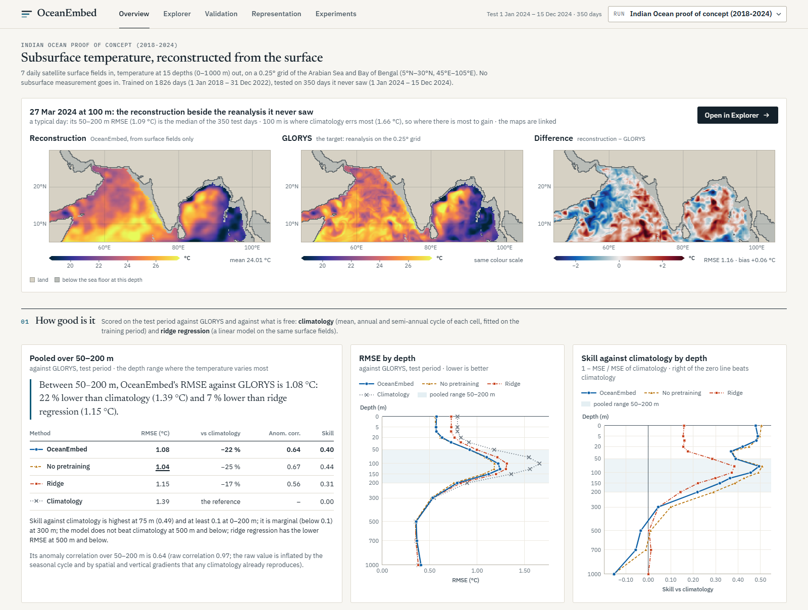</a>
  <br>
  <sub>A typical test day at 100&nbsp;m: reconstructed from the surface (left), the GLORYS reanalysis it never saw (centre), and the difference (right).</sub>
</p>

<p align="center"></p>

## Why it matters

Subsurface temperature drives ocean heat content, stratification, marine heatwaves, cyclone intensification and fisheries.
It is measured by Argo floats, moorings and ships, which leave most of the ocean unsampled on any given day:
over the two test years, 5 512 float profiles fell inside a domain of about 12 000 ocean grid cells — fewer than eight a day.

Satellites do the opposite. They see every cell every day, but only its surface. The surface still carries a signature of
what lies beneath: a raised sea level means a deeper thermocline and warmer water at 100 m; eddies, salinity fronts and
wind mixing all leave marks.

OceanEmbed learns that link. The task: *estimate the three-dimensional
ocean temperature using only surface satellite observations, daily, at 0.25°, and validate it against independent data.*

## What it does

<details>
<summary><strong>Architecture flowchart</strong></summary>

<p align="center">
  <a href="docs/images/flowchart.png">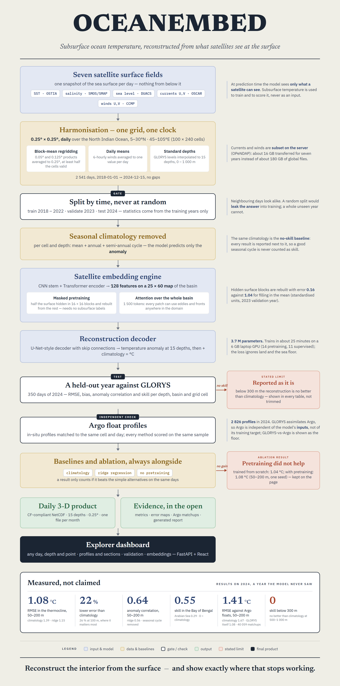</a>
  <br>
  <sub><b>End-to-end architecture flowchart</b>: from raw satellite ingestion and physical regridding to encoder-decoder training, multi-baseline validation against 5,512 Argo profiles, and delivery.</sub>
</p>

</details>

<p align="center">
  <a href="docs/images/pipeline.png">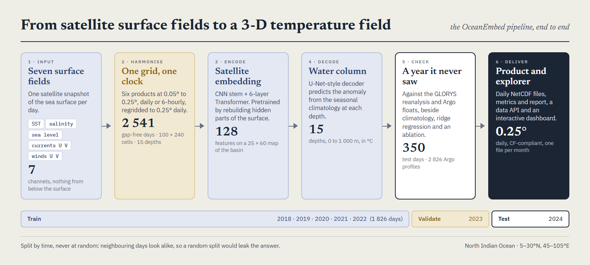</a>
  <br>
  <sub><b>The six pipeline stages</b>: surface satellite fields &rarr; 0.25&deg; grid harmonisation &rarr; latent embedding &rarr; 3D anomaly decoding &rarr; Argo validation &rarr; CF-compliant NetCDF delivery.</sub>
</p>

| Step | What happens |
|---|---|
| **1. Input** | Daily satellite fields of the sea surface. Seven are harmonised (temperature, salinity, sea level anomaly, currents U and V, winds U and V); the final model needs only two: **sea surface temperature and sea level anomaly**. |
| **2. Harmonise** | Six products at different resolutions and time steps are brought to one 0.25° daily grid: 100 × 240 cells, 5 098 gap-free days (2011 – 2024). |
| **3. Encode** | A CNN + Transformer encoder compresses each day's surface into a *satellite embedding*: 128 features on a 25 × 60 map of the basin. |
| **4. Decode** | A U-Net-style decoder predicts the temperature *anomaly* from the seasonal climatology at 15 standard depths. |
| **5. Check** | Two whole unseen years are scored against the GLORYS reanalysis and Argo floats, always beside climatology, ridge regression and a per-pixel network. |
| **6. Deliver** | Daily CF-compliant NetCDF files, metrics and a generated report, released model weights, a data API, and an interactive dashboard. |

Everything runs from one command and one config file.

## Results

Scored on **2023 and 2024, two years the model never saw** (715 days; trained on 2011 – 2021, checkpoints chosen on 2022).

<p align="center">
  <a href="docs/images/results.png">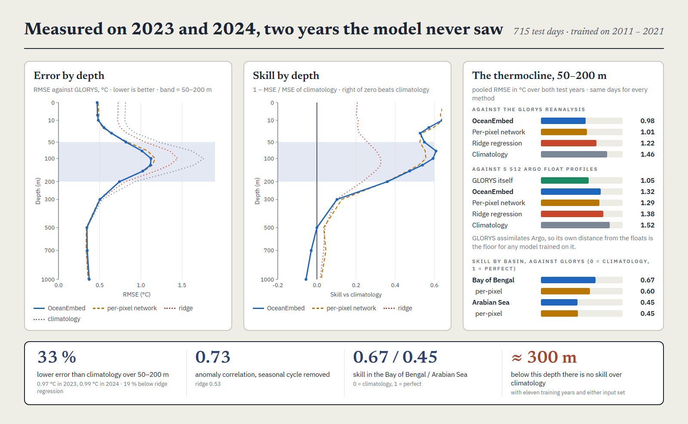</a>
</p>

**The thermocline, 50 – 200 m** — where temperature varies most and the surface says least:

| Method | RMSE vs GLORYS (°C), 2023 / 2024 | Both years | Anomaly correlation | Skill vs climatology | RMSE vs Argo floats (°C) |
|---|---|---|---|---|---|
| **OceanEmbed** | **0.97 / 0.99** | **0.98** | **0.73** | **0.55** | **1.32** |
| Per-pixel network (no spatial context) | 0.98 / 1.04 | 1.01 | 0.71 | 0.52 | 1.29 |
| Ridge regression | 1.28 / 1.15 | 1.22 | 0.53 | 0.30 | 1.38 |
| Climatology (no skill) | 1.52 / 1.39 | 1.46 | – | 0 | 1.52 |
| GLORYS reanalysis itself | – | – | – | – | 1.05 |

What the numbers say:

- **33 % lower error than climatology** over 50 – 200 m, 36 % at 100 m, and 19 % below ridge regression, on both test years.
- **It holds against observations**: against 5 512 Argo profiles (77 388 matchups) the reconstruction beats ridge regression and climatology; the per-pixel network is level with it.
- **Two satellite fields are enough.** Sea surface temperature and sea level anomaly reproduce the result of all seven inputs; without sea level the thermocline skill collapses.
- **The basins differ**: skill is 0.67 in the Bay of Bengal and 0.45 in the Arabian Sea.
- **Simple per-pixel models come close.** Boosted trees with no spatial context tie the attention model overall (0.99 against 0.99 °C over three seeds); seeing the whole basin wins in the Bay of Bengal and loses in the Arabian Sea.
- **Skill ends near 300 m.** Below that no model beats climatology, with five or eleven training years, with or without input history.
- **The reference is not the truth.** GLORYS itself is 1.05 °C from the floats over 50 – 200 m, which is the floor for any model trained on it.

<details>
<summary><strong>Research findings: seeds, confidence intervals, model families, input attribution</strong></summary>

Every claim above was checked with repeated training seeds, block-bootstrap confidence intervals and stronger baselines. Notes: [model-family benchmark](docs/research/benchmark.md), [seeds and baselines](docs/research/r1_rigour.md), [long period](docs/research/r2_long_period.md), [input attribution](docs/research/r3_attribution.md), [ARMOR3D benchmark](docs/research/r4_armor3d.md), [physical metrics](docs/research/r5_physical.md), [input selection](docs/research/final_inputs.md), [live nowcast](docs/research/live_nowcast.md).

Model families under one protocol (eleven training years, three seeds, thermocline RMSE in °C over both test years):

| Family | Whole domain | Arabian Sea | Bay of Bengal |
|---|---|---|---|
| CNN + Transformer (OceanEmbed) | 0.989 ± 0.010 | 1.018 | **0.938** |
| Boosted trees, per pixel | 0.990 ± 0.002 | **0.983** | 1.001 |
| Per-pixel network | 1.004 ± 0.004 | 0.996 | 1.015 |
| Plain U-Net | 1.011 ± 0.017 | 1.026 | 0.985 |
| Random forest, per pixel | 1.035 ± 0.002 | 1.013 | 1.076 |
| Ridge regression | 1.207 | 1.150 | 1.306 |
| Climatology | 1.459 | 1.350 | 1.649 |

| Finding | Evidence |
|---|---|
| No model family wins outright | the Transformer and boosted trees tie over the whole domain (difference 0.001 °C); the Transformer is best in the Bay of Bengal, boosted trees in the Arabian Sea, both established |
| The gain over simple references is large and robust | every non-linear family is 0.2 °C below ridge regression and 0.45 °C below climatology, on both test years and all seeds |
| More training years help, with diminishing returns | thermocline error with 2, 5 and 11 training years: 1.15, 1.04 and 1.00 °C |
| Sea level is the indispensable input | retraining without it costs 0.04 °C for the spatial model and 0.27 °C for a per-pixel network; with SST alone the error rises by 0.28 °C |
| Masked pretraining gives no benefit | 5 seeds: 1.064 ± 0.016 °C with it, 1.052 ± 0.015 °C without; the released model is trained end to end |
| Several days of input history do not help | 3 or 7 days of history change the error by less than its uncertainty and bring no skill below 300 m |
| Products that use the floats do far better against the floats | against Argo in 2024: ARMOR3D 0.63, GLORYS 1.08, OceanEmbed 1.41 °C (five-year model); ARMOR3D and GLORYS themselves differ by 1.20 °C on the grid |
| It carries over to physical quantities | depth of the 20 °C isotherm: 13.8 m RMSE against 17.6 m for climatology; 0 – 300 m heat content error 29 % lower (five-year model) |

</details>

<details>
<summary><strong>RMSE and skill at every depth</strong></summary>

RMSE in °C against GLORYS over the 715 test days. Skill = 1 − MSE / MSE of climatology.

| Depth (m) | OceanEmbed | Per-pixel network | Ridge | Climatology | Skill (OceanEmbed) |
|---|---|---|---|---|---|
| 0 | 0.47 | 0.48 | 0.73 | 0.81 | 0.67 |
| 5 | 0.47 | 0.49 | 0.72 | 0.81 | 0.66 |
| 10 | 0.48 | 0.48 | 0.72 | 0.81 | 0.64 |
| 20 | 0.55 | 0.54 | 0.75 | 0.84 | 0.57 |
| 30 | 0.64 | 0.64 | 0.83 | 0.94 | 0.53 |
| 50 | 0.82 | 0.84 | 1.05 | 1.22 | 0.55 |
| 75 | 1.01 | 1.08 | 1.35 | 1.62 | 0.61 |
| 100 | 1.12 | 1.17 | 1.45 | 1.76 | 0.59 |
| 125 | 1.12 | 1.14 | 1.35 | 1.65 | 0.54 |
| 150 | 1.02 | 1.03 | 1.18 | 1.41 | 0.47 |
| 200 | 0.74 | 0.74 | 0.81 | 0.93 | 0.36 |
| 300 | 0.50 | 0.50 | 0.50 | 0.53 | 0.10 |
| 500 | 0.35 | 0.34 | 0.34 | 0.35 | 0.00 |
| 700 | 0.35 | 0.34 | 0.34 | 0.34 | −0.03 |
| 1000 | 0.37 | 0.36 | 0.36 | 0.36 | −0.06 |

</details>

A vertical section through both basins on one test day shows the reconstruction as a water column rather than a map:

<p align="center">
  <a href="docs/images/section.png">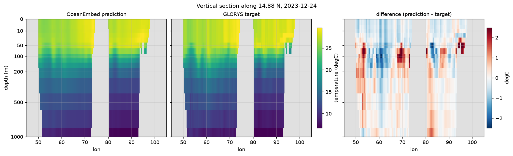</a>
  <br>
  <sub>Vertical section along 15&deg;N across both basins: reconstruction (left), GLORYS (centre), and difference (right).</sub>
</p>

### How the results are checked

| Question | How it is answered |
|---|---|
| Is it better than knowing the season? | Every score is shown beside the **climatology** fitted on the training years. |
| Is the deep model needed? | A **ridge regression** and a **per-pixel network** on the same inputs are scored on the same days. |
| Is it luck? | Training is repeated with **several seeds**, and intervals come from a **block bootstrap** over test days, because daily errors stay correlated for weeks. |
| Does the pretraining help? | The same network is trained **with and without masked pretraining**; it did not help, so the released model does not use it. |
| Is the correlation real? | The **anomaly correlation** removes the climatology from both sides; the raw correlation is shown only for reference because seasons and depth inflate it. |
| Does it hold against observations? | **Argo profiles** are interpolated to the standard depths (no extrapolation, no interpolation across large gaps), matched to the same cell and day, and every method is scored on the identical sample. |
| Where does it fail? | Metrics are computed per depth, per basin, per grid cell and per day. |

One caveat is stated wherever Argo appears: GLORYS assimilates Argo, so the floats are independent of the model's *inputs* but not of its training target.

## Data

All inputs are open products. The target is used only to train and to score; it is never an input. The pipeline harmonises all seven surface fields; the released model uses sea surface temperature and sea level anomaly.

| Variable | Product | Source | Native grid | Brought to 0.25° daily by |
|---|---|---|---|---|
| Sea surface temperature | OSTIA L4 | Copernicus Marine | 0.05°, daily | 5 × 5 block mean |
| Sea surface salinity | SMOS / SMAP multi-observation | Copernicus Marine | 0.125°, daily | 2 × 2 block mean |
| Sea level anomaly | DUACS altimetry | Copernicus Marine | 0.125°, daily | 2 × 2 block mean |
| Surface currents U, V | OSCAR v2.0 | NASA PO.DAAC | 0.25°, daily | bilinear |
| Surface winds U, V | CCMP v3.1 | NASA PO.DAAC | 0.25°, 6-hourly | daily mean, bilinear |
| Temperature (target) | GLORYS12 reanalysis | Copernicus Marine | 1/12°, 36 levels used | 3 × 3 block mean, interpolation to 15 depths |
| Independent check | Argo float profiles | Argo GDAC (argopy) | profiles | same cell, same day |

- **Domain:** 5 – 30°N, 45 – 105°E. **Depths (m):** 0, 5, 10, 20, 30, 50, 75, 100, 125, 150, 200, 300, 500, 700, 1000.
- **Split by time, never at random:** train 2011 – 2021, validate 2022, test 2023 and 2024. Neighbouring days look alike, so a random split would leak the answer.
- **Efficient downloads:** currents and winds are subset on NASA's servers (OPeNDAP), a few hundred kilobytes per day instead of 33 MB global files. Downloads are resumable and logged.
- **Synthetic twin:** an analytic ocean with eddies, a thermocline and fake floats, written in the same file formats, lets the whole pipeline and test-suite run with no accounts.

## Model

<p align="center">
  <a href="docs/images/architecture.png">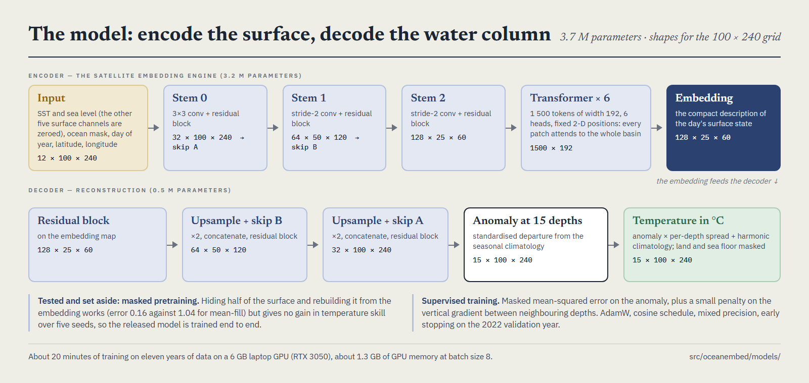</a>
</p>

- **Inputs:** standardised sea surface temperature and sea level anomaly (chosen on the validation year; the other five surface channels are switched off), the ocean mask, day of year (sin, cos), latitude and longitude.
- **Encoder (the embedding engine):** a three-stage CNN stem brings the 100 × 240 grid down to 25 × 60; six Transformer blocks let each of the 1 500 patches attend to the whole basin; the result is a 128-feature embedding map.
- **Masked pretraining, tested and set aside:** hiding half of the surface and rebuilding it from the embedding works (error 0.16 against 1.04 for mean-fill) but did not improve temperature skill over five seeds, so the released model is trained end to end.
- **Decoder:** upsampling with skip connections to the standardised anomaly at 15 depths; the harmonic climatology (mean + annual + semi-annual cycle per cell and depth) is added back.
- **Loss:** masked mean-squared error that ignores land and cells below the sea floor, plus a small vertical-gradient term.
- **Size and cost:** 3.7 M parameters; about 20 minutes of training on eleven years of data on a 6 GB laptop GPU. The weights are in [`models/final/`](models/final/MODEL_CARD.md).

<a id="a-look-inside"></a><a id="the-dashboard"></a>
## A look inside

A React app served by a FastAPI data API. Every number on screen is computed from the data; nothing is hard-coded. The main pages are for someone who wants the temperature field and needs to know how far to trust it; the research behind the model has its own area.

<table>
<tr>
<td width="50%" valign="top"><a href="docs/images/explorer.png">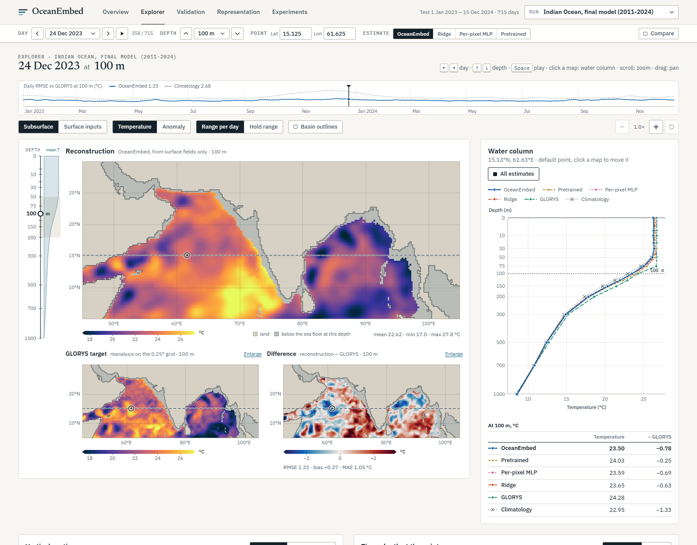</a><br><sub><b>Explorer.</b> Any day, depth and point: linked maps with a depth rail, the vertical profile, a section and a time&ndash;depth view.</sub></td>
<td width="50%" valign="top"><a href="docs/images/live.png">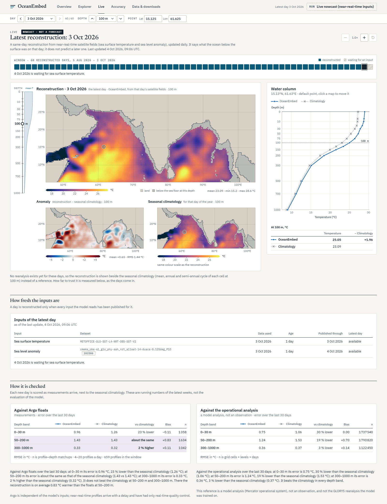</a><br><sub><b>Live.</b> The latest day reconstructed from near-real-time satellite fields, with the age of each input and a running check against new observations.</sub></td>
</tr>
<tr>
<td width="50%" valign="top"><a href="docs/images/validation.png">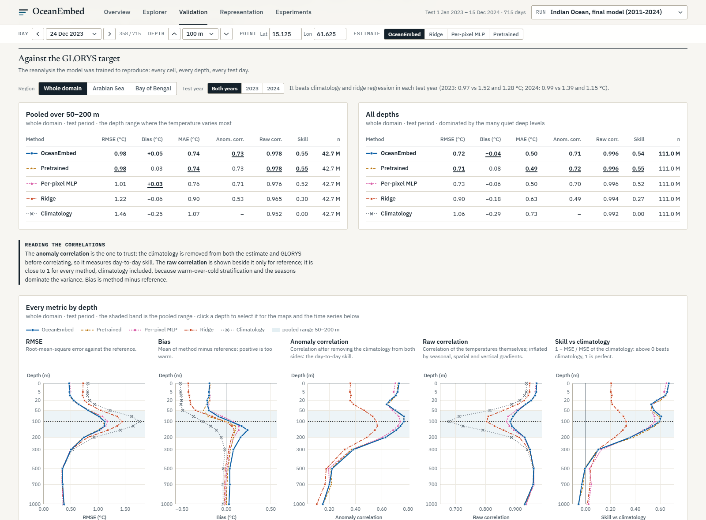</a><br><sub><b>Accuracy.</b> Error, bias and skill against the seasonal climatology by depth, basin and test year, as tables, maps and daily series.</sub></td>
<td width="50%" valign="top"><a href="docs/images/validation-argo.png">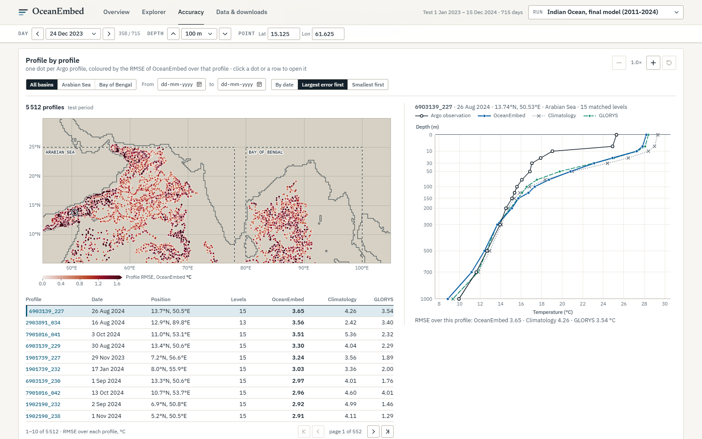</a><br><sub><b>Checked against floats.</b> Map of the 5,512 Argo profiles of the test years, sortable by error, each one openable against the reconstruction.</sub></td>
</tr>
<tr>
<td width="50%" valign="top"><a href="docs/images/experiments.png">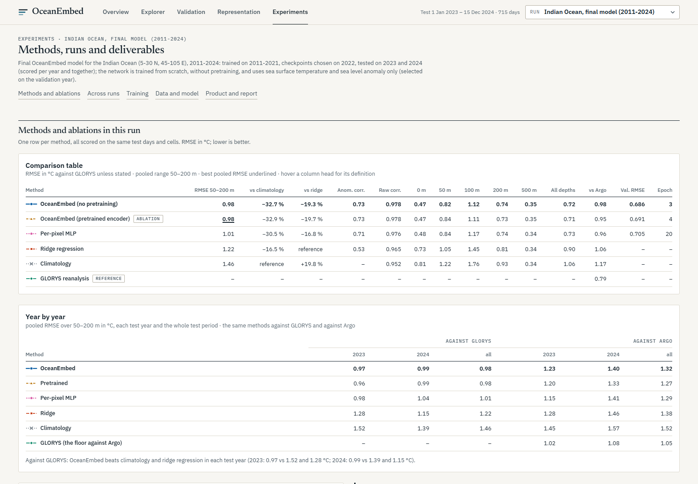</a><br><sub><b>Data &amp; downloads.</b> Period, grid and depths, which satellite fields the model uses, the NetCDF product and the released model.</sub></td>
<td width="50%" valign="top"><a href="docs/images/explorer-compare.png">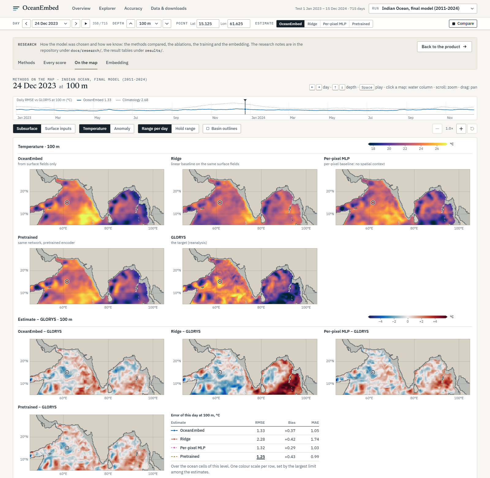</a><br><sub><b>Research: methods on the map.</b> Every estimate beside the reanalysis on one colour scale, with the differences and the day&rsquo;s error table.</sub></td>
</tr>
<tr>
<td width="50%" valign="top"><a href="docs/images/representation.png">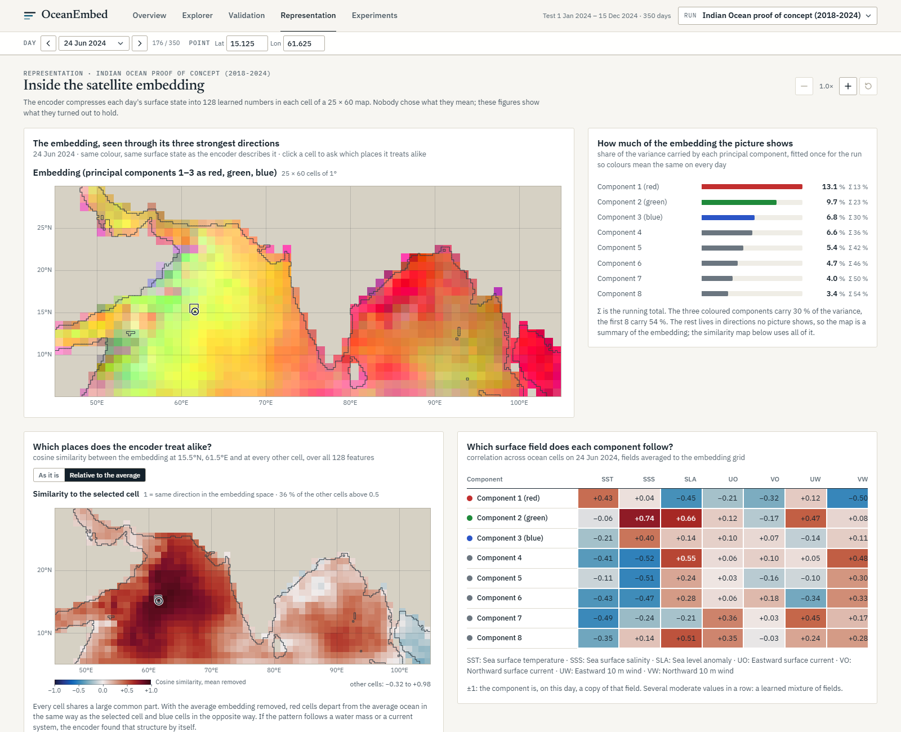</a><br><sub><b>Research: the embedding.</b> What the 128-feature embedding encodes: principal components, similarity between places, and which surface field each component follows.</sub></td>
<td width="50%" valign="top"></td>
</tr>
</table>

### Live mode

`oceanembed live update` keeps a rolling 60-day window up to date from near-real-time satellite products and reconstructs each new day with the released model. It is a same-day reconstruction (a nowcast), updated daily, not a forecast.

- **Inputs:** near-real-time sea surface temperature (published about two days late) and sea level anomaly (same day). The newest seven days are re-fetched on every update, because near-real-time maps get corrected.
- **Does the switch of inputs hurt?** Over 182 days where both versions exist, the reconstruction's error against the reanalysis is 1.03 °C with near-real-time inputs and 1.04 °C with reprocessed ones: no measurable loss.
- **Running check:** each update scores the window against newly published Argo profiles and the operational ocean analysis. In the first 30 days the reconstruction beat the seasonal climatology near the surface (0.96 against 1.26 °C vs Argo) and was level with it in the thermocline against the floats (1.43 °C for both), where the inherited reanalysis bias dominates.
- A daily scheduled run is described in [docs/runbook.md](docs/runbook.md); details in [docs/research/live_nowcast.md](docs/research/live_nowcast.md).

## Getting started

**One click:** double-click `start.bat` (or run it from the project root). It sets up `.venv`, builds the dashboard if needed, starts the server on a free port and opens your browser. It never installs system software; if Python 3.12 or Node.js is missing it says so and stops.

Requirements: Python 3.12, Node 20+, and an NVIDIA GPU for training (6 GB is enough; the dashboard and the released model also run on CPU).

```powershell
# 1. environment (CUDA build of PyTorch first)
py -3.12 -m venv .venv
.\.venv\Scripts\python.exe -m pip install torch --index-url https://download.pytorch.org/whl/cu126
.\.venv\Scripts\python.exe -m pip install -e .[dev]

# 2. the whole pipeline on the synthetic ocean, no accounts needed (about 45 min)
.\.venv\Scripts\oceanembed.exe run-all --config configs/synthetic.yaml

# 3. the dashboard
cd web; npm install; npm run build; cd ..
.\.venv\Scripts\oceanembed.exe serve          # http://127.0.0.1:8000
```

**Use the released model** without retraining: the weights, statistics and baselines are in [`models/final/`](models/final/MODEL_CARD.md), and `predict --weights` reconstructs any period for which the surface fields have been downloaded and harmonised.

**Real data** needs free Copernicus Marine and NASA Earthdata accounts. Try the three-month trial first, then the full runs:

```powershell
.\.venv\Scripts\oceanembed.exe run-all --config configs/poc_trial.yaml    # 2024-01 to 2024-03, about 0.6 GB
# the full period, 2011 to 2024: download, harmonise, statistics (the data store)
.\.venv\Scripts\oceanembed.exe download --config configs/poc_long.yaml
.\.venv\Scripts\oceanembed.exe harmonize --config configs/poc_long.yaml
.\.venv\Scripts\oceanembed.exe stats --config configs/poc_long.yaml
# the released model, trained and evaluated on that store
.\.venv\Scripts\oceanembed.exe run-all --config configs/final.yaml
```

The step-by-step guide is in [docs/runbook.md](docs/runbook.md). What can be deleted afterwards, how much space each folder takes and how to rebuild everything from a fresh clone are in [docs/reproduce.md](docs/reproduce.md). The measured results are kept in [`results/`](results/README.md), so they survive deleting the data.

<details>
<summary><strong>Command-line interface</strong></summary>

All commands take `--config <yaml>`.

| Command | What it does |
|---|---|
| `synth` | write the synthetic raw products at native resolutions |
| `download` | download real products (Copernicus Marine, PO.DAAC, Argo); resumable |
| `harmonize` | raw files → one Zarr store on the 0.25° daily grid |
| `stats` | training-period statistics and the harmonic climatology |
| `pretrain` | masked-surface pretraining of the encoder |
| `train` | supervised 15-depth reconstruction (from scratch or from the pretrained encoder) |
| `baseline` / `train-mlp` | fit the ridge regression and the per-pixel network baselines |
| `embed` | export the embedding maps |
| `predict` | write the NetCDF product, one file per month (`--weights models/final` uses the released model) |
| `evaluate` | metrics against GLORYS for every method |
| `validate-argo` | collocate Argo profiles and score every method |
| `report` | figures and a markdown report |
| `run-all` | the whole chain; `--skip-existing` resumes |
| `serve` | the data API and the dashboard |
| `live update` / `live status` / `live input-shift` | the near-real-time rolling window, its state, and the input-shift check |
| `export-results` / `export-weights` | write the small result files and the released weights kept in the repository |
| `research r1` … `r5`, `final-inputs`, `benchmark` | seeds and baselines, long period, input attribution, ARMOR3D benchmark, physical metrics, input selection, model-family benchmark |

</details>

<details>
<summary><strong>Data API</strong></summary>

`oceanembed serve` exposes a read-only API under `/api` (OpenAPI docs at `/api/docs`): runs and their metadata, daily
fields as JSON or binary float32 volumes, profiles, sections, time series, metrics against GLORYS and Argo, error maps,
Argo profiles with filtering and paging, embeddings and their similarity, training curves, and the NetCDF product.
Reference: [docs/api.md](docs/api.md).

</details>

<details>
<summary><strong>Folders</strong></summary>

```
configs/            final.yaml (released model) · poc_long.yaml (2011-2024 data) · poc.yaml (2018-2024) · poc_trial.yaml · synthetic.yaml
src/oceanembed/
  data/             providers (synthetic, Copernicus Marine, PO.DAAC, Argo), regridding, harmonisation, statistics, dataset
  models/           encoder, masked pretraining, reconstruction decoder, baselines
  train/            pretraining and supervised loops, losses
  eval/             streaming metrics, GLORYS evaluation, Argo validation, report
  infer/            NetCDF product, embedding export
  research/         multi-seed runner, block bootstrap, attribution, benchmark and physical-metric studies
  api/              FastAPI data API
  cli.py            the `oceanembed` command
web/                React + TypeScript dashboard (canvas map renderer, typed API client)
app/                earlier Streamlit dashboard, kept as a fallback
tests/              pytest suite, runs on a tiny synthetic grid
docs/               architecture, backend and frontend references, API, runbook, reproduction guide, research notes
results/            metrics, report and research summaries of the final run (small, tracked)
models/final/       released weights, statistics, baselines and the model card
```

</details>

## Engineering quality

- **Tested:** 343 Python tests (regridding against analytic answers, providers with mocked network, the full chain on a tiny grid, every API endpoint, the bootstrap against hand-computed cases) and 203 UI tests.
- **Reproducible:** one config file per run; every figure and number is produced by a command; results and weights are kept in the repository and the data can be rebuilt from a fresh clone.
- **Honest by construction:** baselines and ablations are part of the pipeline; negative results (pretraining, input history, deep skill) are reported; synthetic runs are labelled as demonstrations everywhere.
- **Careful with data:** temporal split, statistics from training years only, mask-aware losses and metrics, an identical sample for every method in the Argo comparison.
- **Runs on a laptop:** mixed precision, about 1.3 GB of GPU memory, streaming metrics that never hold the test year in memory.

## Limitations and roadmap

**Limitations**

- No skill below about 300 m on daily time scales, with any model, input set or training length tried.
- Per-pixel boosted trees tie the attention model overall and beat it in the Arabian Sea; the spatial model earns its place in the Bay of Bengal.
- Trained on a reanalysis, and inherits its bias against Argo (GLORYS is about 0.4 – 0.5 °C warmer than the floats over 50 – 200 m in both test years). Products that ingest the floats, such as ARMOR3D, are far closer to them.
- A surface cold bias of 0.1 – 0.2 °C in the test years, which are warmer than the training period.
- One region and two test years; the released model is a single training run (seed-to-seed spread about 0.01 °C).
- No uncertainty estimate on the predictions.

**Roadmap**

- A correction towards Argo to remove the inherited reanalysis bias.
- Uncertainty estimates on the predictions.
- Other basins.

## Acknowledgements and license

- **[Copernicus Marine Service](https://marine.copernicus.eu)** (OSTIA, multi-observation salinity, DUACS, GLORYS12) for high-resolution satellite products and global ocean reanalysis.
- **[NASA PO.DAAC](https://podaac.jpl.nasa.gov)** (OSCAR surface currents, CCMP winds) for physical surface observation datasets.
- The international **[Argo Programme](https://argo.ucsd.edu)** and **[argopy](https://argopy.readthedocs.io/)** for global in-situ profiling float measurements.

Distributed under the **MIT License**. See [`LICENSE`](LICENSE) for details.

<p align="center"></p>

<p align="center">
  Designed &amp; Developed by <a href="https://github.com/SumanthMamidi-MNS">Sumanth Mamidi</a>
</p>
