# OceanEmbed backend reference

Everything that is not the browser UI: data download and harmonisation, models, training, evaluation,
the run folder, the CLI and the read-only data API. Written against the code in `src/oceanembed/`;
where it names a number it says where the number comes from.

Contents: [1 At a glance](#1-at-a-glance) | [2 Diagram](#2-diagram) | [3 Module map](#3-module-map) |
[4 Data layer](#4-data-layer) | [5 Model](#5-model) | [6 Training](#6-training) | [7 Evaluation](#7-evaluation) |
[8 Outputs](#8-outputs) | [9 CLI](#9-cli) | [10 Data API](#10-data-api) | [11 Configuration](#11-configuration) |
[12 Testing and quality](#12-testing-and-quality) | [13 Measured results](#13-measured-results) |
[14 Known limits and gotchas](#14-known-limits-and-gotchas)

## 1. At a glance

| | |
|---|---|
| **What it does** | Turns 7 daily satellite surface fields into temperature at 15 depths (0-1000 m) on a 0.25 deg grid of the North Indian Ocean, then scores itself against GLORYS and Argo floats. |
| **Stack** | Python >= 3.12, PyTorch (CUDA wheel installed first, torch unpinned), xarray / Zarr v3 / NetCDF4, Typer CLI, pydantic v2 config, FastAPI + uvicorn. No database: files on disk. |
| **Entry points** | `oceanembed <command> --config <yaml>` (`[project.scripts]` -> `oceanembed.cli:app`), `oceanembed run-all`, `oceanembed serve` (data API + built web UI). |
| **Data** | `data/raw/` (real), `data/raw_synthetic/`, `data/processed/<run>.zarr` + `<run>_stats.nc`. Git-ignored. Override root with `OCEANEMBED_DATA_ROOT`. |
| **Outputs** | `outputs/<run>/` (checkpoints, logs, NetCDF products, metrics, embeddings, figures, report). Git-ignored. Override with `OCEANEMBED_OUTPUTS_ROOT`. |
| **Grid** | 100 lat x 240 lon x 15 depths, 0.25 deg, daily; 5-30 N, 45-105 E ([`grid.py`](../src/oceanembed/grid.py)). |
| **Period (real run)** | 2018-01-01 .. 2024-12-15 = 2 541 days; train 2018-22 (1 826 d), val 2023 (365 d), test 2024 (350 d). |
| **Model** | CNN stem + Transformer encoder, U-Net-style decoder: 3 741 423 parameters (counted by instantiating the default `ModelConfig`); embedding map 128 x 25 x 60. |
| **Cost** | Measured on the real run: pretraining 14 min + supervised training 11 min on a 6 GB laptop GPU (RTX 3050), measured on the 2018-2022 training set; batch 8 with fp16 autocast peaks near 1.3 GB GPU memory. |
| **Run it** | `oceanembed run-all --config configs/synthetic.yaml` (no logins) or `configs/poc.yaml` (real; free CMEMS + Earthdata accounts, about 15 GB of downloads). Always from the project root. |

## 2. Diagram

```mermaid
flowchart LR
  subgraph SRC["Sources"]
    CMEMS["CMEMS: SST, SSS, SLA, GLORYS"]
    PODAAC["NASA PO.DAAC: OSCAR, CCMP"]
    ARGOSRC["Argo profiles (ERDDAP via argopy)"]
    SYNW["Synthetic world (analytic truth)"]
  end
  subgraph PROV["providers (data/providers)"]
    PC["cmems.py"]
    PP["podaac.py (OPeNDAP subset, granule fallback)"]
    PA["argo.py"]
    PS["synthetic.py"]
  end
  CMEMS --> PC
  PODAAC --> PP
  ARGOSRC --> PA
  SYNW --> PS
  PC --> RAW
  PP --> RAW
  PS --> RAW
  PA --> ARGOPQ
  RAW["data/raw/product/product_YYYYMM.nc (native grid)"]
  ARGOPQ["data/raw/argo/argo_YYYYMM.parquet"]
  RAW --> HARM["harmonize: regrid, daily mean, vertical interp"]
  HARM --> ZARR[("data/processed/run.zarr")]
  ZARR --> STATS["stats: train-split mean/std, harmonic climatology"]
  STATS --> STATSNC[("run_stats.nc")]
  ZARR --> DS["dataset.py: OceanDataset / SurfaceOnlyDataset"]
  STATSNC --> DS
  DS --> PRE["pretrain: masked surface autoencoder"]
  PRE --> CK1["pretrain.pt"]
  CK1 --> TRN["train: reconstruction (fine-tune encoder)"]
  DS --> TRN
  DS --> TRS["train --no-pretrained --tag scratch"]
  DS --> BASE["baseline: ridge"]
  TRN --> CK2["recon.pt"]
  TRS --> CK3["recon_scratch.pt"]
  BASE --> CK4["ridge.joblib"]
  CK2 --> EMB["embed: embeddings.zarr"]
  CK2 --> PRED["predict: oceanembed_T_YYYYMM.nc"]
  CK3 --> PRED
  CK4 --> PRED
  PRED --> EVAL["evaluate: vs GLORYS"]
  ZARR --> EVAL
  ARGOPQ --> VAL["validate-argo: collocate, score"]
  PRED --> VAL
  EVAL --> REP["report: figures + report.md"]
  VAL --> REP
  EVAL --> RUN
  VAL --> RUN
  REP --> RUN
  EMB --> RUN
  PRED --> RUN
  RUN[("outputs/run/ (run folder)")]
  RUN --> DA["data_access.py (read-only loaders)"]
  ZARR --> DA
  DA --> API["api/: FastAPI (Store, routes, ETag, NaN to null)"]
  API --> BR["Browser: web/dist React app"]
```



The Streamlit proof-of-concept app (`app/`) reads the same run folder through the same `data_access.py`.

## 3. Module map

Paths are relative to `src/oceanembed/`. "-" = none.

| File | Responsibility | Key functions / classes | Inputs | Outputs |
|---|---|---|---|---|
| [`__init__.py`](../src/oceanembed/__init__.py), `data/__init__.py`, `data/providers/__init__.py`, `eval/__init__.py`, `infer/__init__.py`, `models/__init__.py`, `train/__init__.py` | Package markers (only the top one holds `__version__ = "0.1.0"`) | - | - | - |
| [`config.py`](../src/oceanembed/config.py) | Pydantic config models, YAML loader, derived paths, product defaults | `Config`, `load_config`, `default_products`, `STANDARD_DEPTHS`, `SURFACE_VARS` | YAML, env `OCEANEMBED_DATA_ROOT` / `OCEANEMBED_OUTPUTS_ROOT` | `Config` object |
| [`grid.py`](../src/oceanembed/grid.py) | Canonical grid, depths, basin boxes | `Grid`, `build_grid`, `daily_axis`, `BASINS` | `Config` | lat/lon/depth arrays, basin masks |
| [`runmeta.py`](../src/oceanembed/runmeta.py) | Self-description of a run | `build_run_meta`, `write_run_meta`, `read_run_meta`, `data_source` | `Config` | `outputs/<run>/run_meta.json` |
| [`cli.py`](../src/oceanembed/cli.py) | Typer app, `run-all` orchestration, `serve` | `app`, `_step_plan`, `run_all`, `serve` | YAML + flags | calls the modules below |
| [`data_access.py`](../src/oceanembed/data_access.py) | Read-only loaders of a run folder (no UI code), cached | `list_runs`, `load_prediction`, `load_target`, `load_climatology`, `load_profile`, `load_section`, `load_embeddings`, `embedding_pca_rgb`, `prediction_methods`, `available_dates`, `load_metrics_*` | `outputs/<run>`, harmonised Zarr, stats file | xarray / pandas / dict objects |
| [`data/providers/base.py`](../src/oceanembed/data/providers/base.py) | Provider protocol, month iteration, raw paths, dataset-by-date choice, transfer ledger | `Provider`, `make_provider`, `months`, `raw_file`, `source_for_range`, `log_transfer`, `MissingCredentialsError`, `ALL_PRODUCTS` | `Config` | `data/raw/_download_log.jsonl` lines |
| [`data/providers/cmems.py`](../src/oceanembed/data/providers/cmems.py) | CMEMS month-by-month server-side subset | `CmemsProvider.fetch`, `subset_kwargs`, `credentials_available` | CMEMS login | `raw/<product>/<product>_YYYYMM.nc` |
| [`data/providers/podaac.py`](../src/oceanembed/data/providers/podaac.py) | OSCAR / CCMP day by day: OPeNDAP subset, granule fallback, parts, retries | `PodaacProvider`, `parse_dmr`, `index_runs`, `build_constraint` | Earthdata login | raw monthly NC, `raw/_parts/` |
| [`data/providers/argo.py`](../src/oceanembed/data/providers/argo.py) | Argo profiles (argopy), QC filter, TLS and NetCDF-3 workarounds, optional INCOIS grid | `ArgoProvider`, `fetch_argo_box`, `tidy_profiles`, `load_argo`, `load_incois_gridded` | ERDDAP (no login) | `raw/argo/argo_YYYYMM.parquet` |
| [`data/providers/synthetic.py`](../src/oceanembed/data/providers/synthetic.py) | Writes fake raw products in the real layout and native grids | `SyntheticProvider`, `generate_all` | `Config.synthetic` | same raw files as real |
| [`data/providers/synthetic_world.py`](../src/oceanembed/data/providers/synthetic_world.py) | Analytic ocean (land, eddies, thermocline, SSS, winds, geostrophic currents) | `SyntheticWorld`, `is_land`, `bathymetry`, `pressure_to_depth` | (lat, lon, time) | fields on any grid |
| [`data/regrid.py`](../src/oceanembed/data/regrid.py) | Coordinate standardisation, separable block-mean / bilinear regrid, daily mean, vertical interpolation | `standardize`, `regrid_horizontal`, `to_daily`, `interp_to_depths`, `to_celsius`, `crop` | xarray objects | float32 arrays on target grid |
| [`data/harmonize.py`](../src/oceanembed/data/harmonize.py) | Raw -> harmonised Zarr | `harmonize`, `process_variable`, `open_harmonized` | raw monthly files | `data/processed/<run>.zarr` |
| [`data/stats.py`](../src/oceanembed/data/stats.py) | Train-split mean/std, harmonic climatology, anomaly std | `compute_stats`, `Stats`, `harmonic_design`, `n_terms_for_span` | Zarr | `data/processed/<run>_stats.nc` |
| [`data/dataset.py`](../src/oceanembed/data/dataset.py) | Torch datasets, normalisation, de-normalisation | `OceanDataset` (`preload`, `denormalize`), `SurfaceOnlyDataset`, `make_dataset`, `INPUT_CHANNELS` | Zarr + stats | batches `x`, `y`, `mask`, `sv`, `t`, `index` |
| [`models/blocks.py`](../src/oceanembed/models/blocks.py) | Shared conv blocks | `ResBlock`, `Up`, `groups_for` | tensors | tensors |
| [`models/encoder.py`](../src/oceanembed/models/encoder.py) | CNN stem + Transformer -> embedding map | `OceanEncoder`, `sincos_2d`, `EncoderOutput` | `(B,12,H,W)` (+ visible map) | `emb`, `skip1`, `skip2` |
| [`models/mae.py`](../src/oceanembed/models/mae.py) | Masked surface autoencoder | `MaskedAutoencoder`, `PretrainDecoder`, `block_mask` | `x`, `sv` | masked loss, per-channel sums |
| [`models/recon.py`](../src/oceanembed/models/recon.py) | Embedding -> 15-depth anomaly decoder | `ReconModel`, `ReconDecoder`, `load_encoder_state`, `param_groups` | `(B,12,H,W)` | `(B,15,H,W)` standardised anomaly |
| [`models/baselines.py`](../src/oceanembed/models/baselines.py) | Climatology and ridge predictors | `ClimatologyBaseline`, `RidgeBaseline`, `fit_ridge`, `rmse_per_depth` | train dataset | `ridge.joblib` |
| [`models/pixel_mlp.py`](../src/oceanembed/models/pixel_mlp.py) | Per-pixel MLP baseline (research R1) | `PixelMLP`, `load_pixel_mlp` | `(B,12,H,W)` | `(B,15,H,W)` |
| [`train/losses.py`](../src/oceanembed/train/losses.py) | Masked losses | `masked_mse`, `vertical_gradient_loss`, `reconstruction_loss` | pred, target, mask | scalars |
| [`train/utils.py`](../src/oceanembed/train/utils.py) | Seed, device, LR schedule, JSONL logger, loaders, crop | `set_seed`, `cosine_warmup`, `JsonlLogger`, `make_loader`, `random_crop` | - | - |
| [`train/pretrain.py`](../src/oceanembed/train/pretrain.py) | Pretraining loop | `run_pretrain`, `validate` | datasets (train, val) | `checkpoints/pretrain.pt`, `logs/pretrain.jsonl` |
| [`train/train.py`](../src/oceanembed/train/train.py) | Supervised loop, early stopping | `run_train`, `recon_ckpt_name`, `validate` | datasets, `pretrain.pt` | `recon[_tag].pt`, `logs/train[_tag].jsonl` |
| [`train/mlp.py`](../src/oceanembed/train/mlp.py) | MLP training on a random point sample | `run_train_mlp` | datasets | `mlp.pt` |
| [`research/r1.py`](../src/oceanembed/research/r1.py) | R1 runner: train + score every (method, seed), resumable | `run_r1`, `run_job`, `plan_jobs`, `evaluate_to_file` | config, main run's ridge | `research/r1/<method>/seed<k>/` |
| [`research/bootstrap.py`](../src/oceanembed/research/bootstrap.py) | Moving-block bootstrap over days from per-day sums, paired differences, decorrelation time | `block_counts`, `metrics_from_daily`, `paired_difference`, `decorrelation_time` | `(F,T,D)` sums | arrays |
| [`research/r1_report.py`](../src/oceanembed/research/r1_report.py) | R1 summary, tables, figures | `make_r1_report`, `build_summary` | `eval.npz` files | `summary.json`, `summary.md`, `figures/` |
| [`research/armor3d.py`](../src/oceanembed/research/armor3d.py) | ARMOR3D month-by-month CMEMS subset (resumable, ledger entry), regridding with the GLORYS rules | `download_armor`, `subset_kwargs`, `regrid_month` | CMEMS login | `data/raw/armor3d/armor3d_YYYYMM.nc` |
| [`research/r4.py`](../src/oceanembed/research/r4.py), [`r4_report.py`](../src/oceanembed/research/r4_report.py) | R4: regridded ARMOR3D vs Argo matchups and the grid, block-bootstrap summary, figures | `run_r4`, `regrid_all`, `argo_table`, `stream_grid`, `make_r4_report` | `argo_matchups.parquet`, predictions, Zarr | `research/r4/`, `data/processed/<run>_armor3d/` |
| [`research/physical.py`](../src/oceanembed/research/physical.py) | Derived quantities (isotherm depth, layer integral, heat content), terciles, seasons | `isotherm_depth`, `layer_integral`, `heat_content`, `derived_fields` | `(D, ...)` temperature | arrays |
| [`research/r5.py`](../src/oceanembed/research/r5.py), [`r5_report.py`](../src/oceanembed/research/r5_report.py) | R5: streaming per-day sums for derived quantities and strata, report | `run_r5`, `make_r5_report` | predictions, Zarr, stats | `research/r5/` |
| [`research/common.py`](../src/oceanembed/research/common.py) | Bootstrap scoring and number formatting shared by the R4 / R5 reports | `score_series`, `paired`, `interval` | per-day sums | dicts |
| [`infer/predict.py`](../src/oceanembed/infer/predict.py) | Checkpoint loading, predictors, degC conversion, CF-1.8 NetCDF writer | `load_recon_model`, `model_predictor`, `predict_batch`, `predict_to_netcdf`, `expected_product_files` | checkpoint, surface dataset | `predictions/**/oceanembed_T_YYYYMM.nc` |
| [`infer/embed.py`](../src/oceanembed/infer/embed.py) | Embedding export | `export_embeddings`, `embedding_path` | encoder weights, split | `embeddings/embeddings.zarr` |
| [`eval/metrics.py`](../src/oceanembed/eval/metrics.py) | Streaming sums-based metrics | `MetricAccumulator`, `metrics_from_sums`, `skill_score`, `point_metrics` | pred / ref arrays | metric dicts |
| [`eval/evaluate.py`](../src/oceanembed/eval/evaluate.py) | All methods vs GLORYS on a split | `evaluate_split`, `load_methods`, `method_label` | checkpoints, Zarr | `metrics/metrics_glorys.json`, `maps_glorys.nc` |
| [`eval/argo_validation.py`](../src/oceanembed/eval/argo_validation.py) | Argo interpolation, collocation, scoring, optional INCOIS | `validate_argo`, `interp_profile`, `collocate`, `max_gap` | Argo parquet, checkpoints | `metrics/metrics_argo.json`, `argo_matchups.parquet` |
| [`eval/report.py`](../src/oceanembed/eval/report.py) | Figures and `report.md` | `make_report`, `write_markdown`, `fig_*` | metrics files | `figures/*.png`, `report.md` |
| [`api/app.py`](../src/oceanembed/api/app.py) | App factory: CORS, GZip, error handlers, SPA serving, warm-up thread | `create_app`, `create_app_from_env`, `default_outputs_root` | outputs root, `web/dist` | FastAPI app |
| [`api/store.py`](../src/oceanembed/api/store.py) | Run registry, validation, byte-bounded LRU, colour ranges, point series | `Store`, `Run`, `ByteLRU`, `ApiError`, `robust_range` | run folders | numpy arrays, dicts |
| [`api/deps.py`](../src/oceanembed/api/deps.py) | `{run}` dependency, ETag / 304, cache headers | `run_dep`, `make_etag`, `reply`, `reply_bytes`, `CACHE_CONTROL` | request | response helpers |
| [`api/encode.py`](../src/oceanembed/api/encode.py) | NaN -> null JSON encoding | `NaNSafeJSONResponse`, `clean`, `array_to_list` | payloads | JSON bytes |
| [`api/schemas.py`](../src/oceanembed/api/schemas.py) | Pydantic response models (drive `/api/docs`) | response classes | - | OpenAPI schema |
| [`api/metrics.py`](../src/oceanembed/api/metrics.py) | Metrics JSON -> metric-major shape, experiments rows | `reshape_metrics`, `experiment_rows`, `method_infos` | metrics JSONs | dicts |
| [`api/routes_runs.py`](../src/oceanembed/api/routes_runs.py) | Run list / detail / dates / mask / training / experiments / compare / report / figures / product | `router` | `Store` | JSON, PNG, NetCDF |
| [`api/routes_fields.py`](../src/oceanembed/api/routes_fields.py) | Fields, ranges, surface, profile, section, timeseries, embeddings | `router` | `Store` | JSON or float32 bytes |
| [`api/routes_metrics.py`](../src/oceanembed/api/routes_metrics.py) | Metrics, error maps, Argo matchups and profiles | `router` | `Store` | JSON |
| `api/__init__.py` | Re-exports `create_app` | - | - | - |

## 4. Data layer

### Sources

All six gridded products are subset to the domain plus a 0.5 deg halo (`download.halo_deg`) and then
harmonised. Dataset ids are those of [`configs/poc.yaml`](../configs/poc.yaml).

| Variable(s) | Product | Dataset id | Provider | Native resolution | Access route | Regrid to 0.25 deg daily |
|---|---|---|---|---|---|---|
| `sst` (`analysed_sst`) | OSTIA reprocessed L4 | `METOFFICE-GLO-SST-L4-REP-OBS-SST` | cmems | 0.05 deg, daily (stamped 12:00) | `copernicusmarine.subset`, one call per month | 5 x 5 block mean; K -> degC |
| `sss` (`sos`) | MULTIOBS SMAP/SMOS | `cmems_obs-mob_glo_phy-sss_my_multi_P1D` | cmems | 0.125 deg, daily | subset per month | 2 x 2 block mean |
| `sla` (`sla`) | DUACS L4 | `cmems_obs-sl_glo_phy-ssh_my_allsat-l4-duacs-0.125deg_P1D` | cmems | 0.125 deg (the PRD says 0.25), daily | subset per month | 2 x 2 block mean |
| `uo`, `vo` (`u`, `v`) | OSCAR L4 final v2.0 | `OSCAR_L4_OC_FINAL_V2.0` | podaac | 0.25 deg, daily, nodes on multiples of 0.25 | OPeNDAP per-day subset (below) | bilinear (half-cell offset) |
| `uw`, `vw` (`uwnd`, `vwnd`) | CCMP v3.1 | `CCMP_WINDS_10M6HR_L4_V3.1` | podaac | 0.25 deg, 6-hourly | OPeNDAP per-day subset | daily mean of the 4 samples, then bilinear |
| `temp` (`thetao`) | GLORYS12 reanalysis (target) | `cmems_mod_glo_phy_my_0.083deg_P1D-m` | cmems | 1/12 deg, daily; 36 of the 50 levels (<= 1100 m) requested | subset per month, `min_depth 0`, `max_depth 1100` | vertical linear interpolation to the 15 depths, then 3 x 3 block mean |
| Argo temperature | Argo profiles | argopy `erddap` source, `ds="phy"`, `mode="standard"` | argo | profiles | 15 deg boxes per month, QC flags 1 and 2 | not gridded; see section 7 |

Rule for the horizontal method ([`regrid.py`](../src/oceanembed/data/regrid.py)): block mean when the target/source step ratio
is > 1.5 on both axes, else NaN-aware bilinear. Both are `Wy @ field @ Wx.T`. A block-mean cell needs
>= 50 % (`harmonize.min_valid_fraction`) of its nominal native cells valid; a bilinear cell needs >= 50 % of the
interpolation weight on valid neighbours. Vertical interpolation is linear; targets shallower than the
shallowest source level take that level's value, targets below the deepest source level are NaN.

A product may list several datasets with `start` / `end` (`DatasetSource`); each month uses the first dataset whose
window covers it, so switch-over dates must be month boundaries. The built-in default for `sss` switches from the
reprocessed dataset (to 2023-12-31) to the NRT one (from 2024-01-01); `poc.yaml` overrides it with the reprocessed
dataset only, so train and test see one SSS product.

### PO.DAAC route ([`podaac.py`](../src/oceanembed/data/providers/podaac.py))

- `download.podaac_mode: opendap` (default): for each day, one DAP4 request to NASA Hyrax
  (`opendap.earthdata.nasa.gov`, through the `earthaccess` session) asks only for the configured variables over the
  index ranges covering domain + halo. Layout and ranges are read once per product from the granule's DMR and its
  coordinate arrays (handles ascending / descending axes, 0-360 vs -180-180 longitude, a window crossing the seam as
  two runs). About 0.2 MB per OSCAR day and 0.75 MB per CCMP day instead of ~32 MB (runbook, measured on the trial).
- `granule`, or the automatic fallback: download the global granule, crop locally, delete it
  (`download.delete_global_granules`). Fallback triggers: an OPeNDAP refusal (HTTP 4xx or unusable layout) before any
  layout is known switches OPeNDAP off at once; otherwise OPeNDAP is switched off for the rest of the run after 3
  failures (refusals or exhausted retries).
- Resumability: every day is an atomic piece `raw/_parts/<product>_<YYYYMM>/<YYYYMMDD>.nc` (temp file + rename);
  existing pieces are skipped; `download.workers` (1-8, default 4) threads; transient errors (408, 425, 429, 5xx,
  network errors) retry `download.retries` (4) times with back-off starting at `retry_backoff_s` (2 s) and doubling.
  The monthly file is merged only when every available day exists, then the pieces are deleted. CMEMS and Argo
  resume at month level: an existing monthly file is skipped unless `download.overwrite`.
- Failures: if some days fail, the month raises `N of M day(s) failed`, finished days stay in `_parts/`, a re-run
  resumes. A month with no catalogue granules at all raises `no <product> granules found`.

### Transfer ledger

`data/raw/_download_log.jsonl`, one JSON line per completed download (`base.log_transfer`): `ts`, `product`,
`dataset`, `period`, `route` (`cmems_subset`, `opendap`, `granule`, `granule_fallback`, `argopy`), `bytes_written`,
`bytes_transferred`, `transfer_basis` (`wire` = measured compressed bytes, `file_size`, `unknown`), `seconds`. Never
credentials, user names or URLs (tests assert this).

### Credentials (existence checks only; values are never read, printed or stored)

| Service | Where the code looks |
|---|---|
| Copernicus Marine | env `COPERNICUSMARINE_SERVICE_USERNAME` + `..._PASSWORD`, or `~/.copernicusmarine/.copernicusmarine-credentials` (created by `copernicusmarine login`) |
| NASA Earthdata | env `EARTHDATA_USERNAME` + `EARTHDATA_PASSWORD`, or an entry for `urs.earthdata.nasa.gov` in `~/.netrc` / `~/_netrc` |
| Argo (ERDDAP) | none |

Missing credentials raise `MissingCredentialsError` before any network call; `oceanembed download` prints
`error: ...` and exits with code 2. `.gitignore` excludes `.env`, `.netrc`, `_netrc`, `.copernicusmarine/`.

### Canonical grid and harmonised Zarr

Grid ([`grid.py`](../src/oceanembed/grid.py)): lat 5.125 .. 29.875 (100 centres), lon 45.125 .. 104.875 (240 centres), depths
0, 5, 10, 20, 30, 50, 75, 100, 125, 150, 200, 300, 500, 700, 1000 m, time daily 00:00 UTC. `GridConfig` rejects a grid whose
H or W is not divisible by 4. Basin boxes (centre inside): `arabian_sea` 5-25 N, 45-78 E; `bay_of_bengal` 5-25 N, 80-100 E
(cells in neither box, e.g. north of 25 N, are in no basin score).

`data/processed/<run>.zarr` (Zarr v3, Blosc zstd level 3 + bitshuffle, written by `harmonize`, read with `consolidated=False`):

| Variable | Dims | Type | Chunks | Notes |
|---|---|---|---|---|
| `sst sss sla uo vo uw vw` | `(time, lat, lon)` | float32 | `(1, 100, 240)` | NaN over land and gaps; units degC, 1e-3 (PSU), m, m s-1 |
| `temp` | `(time, depth, lat, lon)` | float32 | `(1, 15, 100, 240)` | GLORYS on the 15 depths; NaN below sea floor / land |
| `mask` | `(depth, lat, lon)` | bool | default | valid in `temp` on >= 50 % of all days of the store |

Processing: month by month, in blocks of `harmonize.time_chunk` (8) days, so the 1/12 deg 3-D field is never
fully in memory. Days absent from the raw data stay NaN (a warning counts them). If `raw/argo_gridded/*.nc` exists
it is also regridded to `processed/<run>_argo_gridded.nc`. `harmonize` deletes and rebuilds an existing store.

### Statistics ([`stats.py`](../src/oceanembed/data/stats.py)), train split only

`data/processed/<run>_stats.nc`: `input_mean`, `input_std` per surface channel (over surface ocean points), `clim_coef`
`(5, depth, lat, lon)` (zlib 3), `anom_std` `(depth,)`; attributes `train_start`, `train_end`, `n_train_days`,
`n_harmonic_terms`.

```
T_clim(x, z, date) = c0 + c1 cos(phi) + c2 sin(phi) + c3 cos(2 phi) + c4 sin(2 phi)
phi = 2 pi (date - Jan 1 of its year) / (days in that year)        # leap years handled
```

Fitted per grid point and depth by streaming normal equations (two passes; pass 2 computes the anomaly std per depth
over valid points). Fewer than 180 train days: mean only (1 term); fewer than 548: mean + annual (3); else 5. Points
with fewer than 30 valid days get NaN coefficients. For the real run `n_harmonic_terms` is 5.

## 5. Model

### The 12 input channels (`INPUT_CHANNELS`, in order)

| # | Channel | Content |
|---|---|---|
| 0-6 | `sst, sss, sla, uo, vo, uw, vw` | `(raw - mean) / std` with the train-split surface-ocean mean/std; NaN or land -> 0 |
| 7 | `ocean_mask` | surface level of `mask` (1 = ocean) |
| 8, 9 | `doy_sin`, `doy_cos` | `sin / cos(2 pi (day_of_year - 1) / days_in_year)` |
| 10, 11 | `lat_norm`, `lon_norm` | latitude / longitude scaled to [-1, 1] over the grid |

Item targets: `y = (temp - climatology) / anom_std[depth]` (0 where invalid), `mask (15,H,W)` = static mask and finite
target, `sv (7,H,W)` = surface values really observed. De-normalisation (`OceanDataset.denormalize`):
`temp = climatology(date) + y * anom_std[depth]`; `predict_batch` then sets NaN outside the static mask. The model input is
12 channels; the encoder appends one internal "visible" channel (13 convolution inputs).

### Encoder ([`encoder.py`](../src/oceanembed/models/encoder.py)) with shapes for the 100 x 240 grid

| Stage | Operation | Output shape (B = batch) |
|---|---|---|
| input | 12 channels + visible (1 everywhere downstream) | `(B, 13, 100, 240)` |
| stem0 | conv 3x3 13 -> 32, ResBlock(32) | `skip1 (B, 32, 100, 240)` |
| stem1 | conv 3x3 stride 2 32 -> 64, ResBlock(64) | `skip2 (B, 64, 50, 120)` |
| stem2 | conv 3x3 stride 2 64 -> 128, ResBlock(128) | `(B, 128, 25, 60)` |
| tokens | 1x1 conv 128 -> 192, flatten, add fixed 2-D sin-cos positions | `(B, 1500, 192)` |
| Transformer | 6 pre-norm blocks, 6 heads, MLP ratio 4, SDPA attention | `(B, 1500, 192)` |
| projection | LayerNorm, linear 192 -> 128 | embedding `(B, 128, 25, 60)` |

ResBlock = (GroupNorm - SiLU - conv3x3) x 2 with a 1x1 shortcut when channels change. Parameters (default
`ModelConfig`, counted by instantiating): encoder 3 203 584; reconstruction decoder 537 839; total `ReconModel`
3 741 423. Pretraining model: encoder + 267 783-parameter decoder = 3 471 367.

### Masked pretraining ([`mae.py`](../src/oceanembed/models/mae.py))

- Mask: the image is tiled by `pretrain.block` x `block` (16 x 16 px) blocks; exactly `round(mask_ratio * n_blocks)`
  (50 %) blocks per sample are hidden (ragged border blocks are cropped).
- Only the 7 surface channels are hidden (set to 0). `ocean_mask`, day-of-year and lat/lon are never hidden.
- "Visible" channel: 0 inside hidden blocks, 1 elsewhere; downstream (`ReconModel`, embedding export) it is all ones,
  so one encoder interface serves both stages.
- Leakage guard: the encoder (and therefore its stem skips) only ever sees the masked input; the pretraining decoder
  receives the embedding map only, no skips, so the embedding itself must carry the surface state. Tested by
  `test_hidden_values_cannot_influence_the_prediction` and `test_masking_hides_only_surface_channels`.
- Pretraining decoder: ResBlock(128 -> 64), Up, ResBlock, Up (64 -> 32), ResBlock, GroupNorm, SiLU, 1x1 conv -> 7 channels.
- Loss: MSE (standardised units) over pixels that are hidden AND `sv` (ocean and observed). Validation also reports the
  mean-fill baseline (predict 0 = the train mean) per channel, with a fixed generator (seed 1234) so the hidden blocks
  are identical every epoch.

### Reconstruction decoder ([`recon.py`](../src/oceanembed/models/recon.py))

ResBlock(128 -> 128) on the embedding; Up to 50 x 120, concatenate `skip2`, ResBlock(128 -> 64); Up to 100 x 240,
concatenate `skip1`, ResBlock(64 -> 32); GroupNorm, SiLU, 1x1 conv 32 -> 15. Output: standardised temperature anomaly
`(B, 15, 100, 240)`. `Up` = nearest x2 upsample + 3x3 conv.

### Losses ([`losses.py`](../src/oceanembed/train/losses.py))

```
masked_mse(p, y, m)  = sum_m (p - y)^2 / max(1, count(m))                  # masked points never enter, even as NaN
vgrad(p, y, m)       = masked_mse(p[z+1]-p[z], y[z+1]-y[z], m[z+1] & m[z])  # adjacent depths, both valid
total                = masked_mse + vertical_grad_weight * vgrad            # weight 0.05
```

### Baselines ([`baselines.py`](../src/oceanembed/models/baselines.py))

Both are predictors `x (B,12,H,W) -> standardised anomaly (B,15,H,W)`, like the network.
- **Climatology:** anomaly 0, i.e. the harmonic climatology.
- **Ridge:** 11 features (channels 0-6 and 8-11; the constant mask channel is unused), one `sklearn.Ridge`
  (`alpha = 1.0`) per depth, fitted on a random subsample (`baseline.ridge_max_points` = 1 000 000, seed 0) of train-split
  ocean (day, pixel) samples with all 7 surface values observed, using only samples valid at that depth (depths with
  < 50 samples keep zero weights). Saved as `checkpoints/ridge.joblib`.

## 6. Training

| | Pretraining (`pretrain`) | Reconstruction (`train`) |
|---|---|---|
| Loop | [`pretrain.py`](../src/oceanembed/train/pretrain.py) | [`train.py`](../src/oceanembed/train/train.py) |
| Optimiser | AdamW; weight decay 0.05 on tensors with ndim >= 2, none on the rest | AdamW; weight decay 0.01 likewise; param groups per encoder / decoder |
| Learning rate | 3e-4 | decoder 3e-4; encoder 3e-4 x `encoder_lr_scale` (0.1) when pretrained, x 1.0 for the from-scratch ablation |
| Schedule | linear warm-up for 1 epoch, then cosine decay to 5 % of the base LR (per step; planned over all `epochs`) | same |
| Epochs (default) | 20 | 30 |
| Batch size | 8 (shuffled, last incomplete batch dropped) | 8 |
| Mixed precision | fp16 autocast + `GradScaler`, CUDA only (`amp: true`) | same |
| Gradient clip | 1.0 (global norm) | 1.0 |
| Selection | best epoch by val masked MSE; no early stopping | best epoch by val RMSE in degC; early stopping after `patience` = 8 epochs without improvement |
| Seed | 0 (`set_seed`); `--seed` overrides | 0; `--seed` overrides |
| Data | train and val splits preloaded into RAM (float32; ~2 GB for 2 train years, ~5 GB for 5) | same |
| Augmentation | optional `crop` (h, w multiple of 4), off in every shipped config | same |
| Logged (JSONL, one line per epoch) | `epoch`, `train_loss`, `val_loss`, `val_meanfill`, `val_mse_per_channel`, `val_meanfill_per_channel`, `lr`, `epoch_seconds`, `train_seconds`, `peak_gpu_mb` | `epoch`, `train_loss`, `val_loss`, `val_rmse`, `val_rmse_per_depth`, `lr_decoder`, `epoch_seconds`, `train_seconds`, `peak_gpu_mb` |
| Checkpoint | `checkpoints/pretrain.pt`: `model`, `config`, `epoch`, `metrics` | `recon.pt` (or `recon_<tag>.pt`): the same plus `pretrained`, `tag` |

- `set_seed` seeds python, numpy, torch and every CUDA device and sets cuDNN to deterministic kernels without benchmarking. On CPU
  the same seed gives bit-identical weights (tested). On CUDA it gives close, not identical, results: the backward passes of
  nearest-neighbour upsampling and of scaled-dot-product attention use atomic additions and fp16 autocast reductions are order
  dependent. `--seed` sets the initialisation, the batch order, the masking and the crop RNG together.
- Val RMSE in degC is computed as `(anomaly error) * anom_std[depth]`: the climatology cancels in prediction minus truth.
- `train` loads the encoder from `pretrain.pt` (error if missing) unless `--no-pretrained`; then the tag defaults to
  `scratch` so `recon.pt` is never overwritten.
- Ablation: `ablation: {no_pretrained: true, tag: scratch}` makes `run-all` add `train-ablation` and `predict-ablation`; the
  tag may not be `ridge` (reserved folder) and must match `^[A-Za-z0-9][A-Za-z0-9_.-]{0,30}$`.
- Hyper-parameters of the real run are the config defaults (`configs/poc.yaml` has no `model`, `pretrain` or `train` block).
  Epoch counts the run actually used are in `outputs/<run>/logs/*.jsonl` (not re-read for this file).

## 7. Evaluation

### Metrics ([`eval/metrics.py`](../src/oceanembed/eval/metrics.py))

`MetricAccumulator` keeps per grid point `(depth, lat, lon)` the running sums `n, sum x, sum y, sum x^2, sum y^2, sum xy,
sum |e|, sum e^2` (x = prediction, y = reference, e = x - y), skipping pairs where either is non-finite or masked. Sums
are additive, so chunking equals one pass and any grouping (all, one depth, a basin at one depth, one point) is a
reduction afterwards.

```
rmse = sqrt(sum e^2 / n)        bias = mean(x) - mean(y)        mae = sum |e| / n
corr = cov(x, y) / (std x * std y)       NaN if n < 3 or a variance <= 1e-12
skill_vs_clim = 1 - MSE_method / MSE_climatology      (1 perfect, 0 = as good as climatology, < 0 worse)
```

- `corr_raw`: correlation of temperatures (inflated by seasonal, horizontal and, when pooled, vertical gradients).
- `corr_anom`: correlation after removing the climatology from both prediction and reference; the day-to-day skill
  measure. Undefined (null) for the climatology itself.
- Pooled range: depths 50-200 m = 6 levels (50, 75, 100, 125, 150, 200).

### `evaluate` ([`evaluate.py`](../src/oceanembed/eval/evaluate.py))

Streams the split in batches of 8 days. Methods: `model` (`recon.pt`, required), every `recon_<tag>.pt` as
`model_<tag>`, `ridge` (if fitted), `climatology`. A point counts when the static mask and the GLORYS value are
finite. Per method, blocks `overall`, `pooled_50_200m`, `per_depth` (column-oriented), and the same under
`per_basin.{arabian_sea, bay_of_bengal}`. Also per-day, per-depth domain sums giving `daily_rmse`: `rmse`, `bias`,
`corr_anom` as `[day][depth]` (the daily `corr_anom` is the spatial pattern correlation over that day and depth),
and `pooled_rmse`, `pooled_bias`, `pooled_corr_anom` as `[day]`. Also `maps_glorys.nc` (see section 8).

### `validate-argo` ([`argo_validation.py`](../src/oceanembed/eval/argo_validation.py))

1. Load Argo for the split months (cached parquet; missing months are fetched, synthetic ones generated). Profiles
   outside the split's dates are dropped and counted.
2. **Vertical rule** per standard depth z on the profile's good-QC levels: an observation exactly at z is used;
   otherwise z must be bracketed by levels whose spacing is <= `max(10 m, 0.2 z)` (10 m up to 50 m, 20 m at 100 m,
   40 m at 200 m, 100 m at 500 m, 200 m at 1000 m) and is linearly interpolated; for z <= 5 m the shallowest level is used if
   within 10 m; never any extrapolation.
3. **Collocation:** the grid cell that contains the profile position (floor on cell edges) and the same UTC day.
   Dropped with counts: `outside_dates`, `outside_domain`, `land` (surface mask), plus `outside_period`.
4. **Fair-sample rule:** a (profile, depth) row is kept only if the observation, the static mask, GLORYS, the
   climatology and every method are finite there, so all methods are scored on the identical sample.
5. Scored per method and for `glorys` itself: `overall`, `pooled_50_200m`, `per_depth`, `per_basin`; bias is
   method minus Argo. Matchup columns: `profile_id, time, lat, lon, depth, obs, model, ridge, clim, [model_<tag>], glorys,
   basin, grid_lat, grid_lon` (the climatology column is `clim`, its key everywhere else is `climatology`).
6. Optional INCOIS gridded Argo: if `raw/argo_gridded/*.nc` exists, all methods are also scored against it
   (`gridded_argo` block; daily products same day, monthly products against the monthly model mean for fully covered
   months only); silently skipped when absent.

**Caveat (stored in the metrics metadata as `independence_note`):** Argo is independent of the model's inputs, but GLORYS
assimilates Argo and the model is trained on GLORYS, so the comparison is not independent of the training target.
GLORYS-vs-Argo is the floor any GLORYS-trained model faces.

## 8. Outputs

```
outputs/<run>/
  run_meta.json                      config snapshot, data_source, splits, grid, data paths (as the config gave them)
  checkpoints/
    pretrain.pt                      masked-autoencoder weights (best val masked MSE)
    recon.pt                         final model (best val RMSE degC)
    recon_<tag>.pt                   ablation, e.g. recon_scratch.pt
    ridge.joblib                     ridge coefficients per depth
  logs/
    pretrain.jsonl, train.jsonl      one JSON line per epoch
    train_<tag>.jsonl                ablation log
  predictions/
    oceanembed_T_<YYYYMM>.nc         main model, one file per month of the test split
    ridge/oceanembed_T_<YYYYMM>.nc   ridge baseline (reserved folder name)
    <tag>/oceanembed_T_<YYYYMM>.nc   ablation
  metrics/
    metrics_glorys.json              per method: overall, pooled_50_200m, per_depth, per_basin, plus daily_rmse, metadata
    maps_glorys.nc                   (depth, lat, lon): rmse_, bias_, corr_raw_, skill_vs_clim_ per method; corr_anom_ (not climatology); n_valid
    metrics_argo.json                same blocks vs Argo incl. glorys; profile counts, dropped counts, rule, independence note
    argo_matchups.parquet            one row per (profile, depth)
  embeddings/embeddings.zarr         (time, emb, y, x) float32 for the test split; lat(y), lon(x) = 4 x 4 block centres
  figures/                           rmse_profile, bias_profile, anomaly_corr_profile, skill_profile, rmse_profile_basins,
                                     rmse_maps, bias_maps, daily_rmse, example_day_100m, section_lat, argo_validation,
                                     training_curves (.png)
  report.md                          setup, tables, figures, limitations (banner when data_source is synthetic)
```

Outside the run folder: `data/raw/<product>/`, `data/raw/_parts/`, `data/raw/_granules/`, `data/raw/_download_log.jsonl`,
`data/processed/<run>.zarr`, `<run>_stats.nc`, optional `<run>_argo_gridded.nc`.
`run_meta.json` is (re)written by every command except `synth`, `download`, `harmonize`, `stats` (`run-all` writes it first).
The API lists only folders that contain it. `embeddings.zarr` uses the encoder of `recon.pt`, else `pretrain.pt`.

### NetCDF product ([`predict.py`](../src/oceanembed/infer/predict.py))

| | |
|---|---|
| Variable | `temperature(time, depth, lat, lon)` float32, `standard_name` `sea_water_potential_temperature`, `units` `degree_Celsius`, `cell_methods` `time: mean` |
| Fill | NaN stored as `_FillValue` 9.96921e36 outside the static ocean mask |
| Compression | NetCDF4, zlib level 4, shuffle, one chunk per day `(1, 15, 100, 240)` |
| Coordinates | `time` int32 `days since 1970-01-01 00:00:00` (axis T); `depth` (positive down, Z); `lat` (Y); `lon` (X) |
| Global attributes | `Conventions` CF-1.8, `title`, `institution`, `source`, `method` (`model` / `ridge`), `history`, `references`, `comment`, `data_source`, `run_name`, `model_checkpoint`, `model_checkpoint_epoch`, `model_pretrained_encoder`, `training_period`, `grid_resolution_deg`, `config` (JSON) |
| Inputs needed | surface fields from the harmonised store plus the stats file only; the target is never read, so any day in the store works. A partial month holds only the requested days and a later run overwrites the file. |
| Size | about 150 MB per method for a one-year test split (decisions.md) |

## 9. CLI

All commands take `--config / -c <yaml>` (must exist) except `serve`. `--device` is e.g. `cuda` or `cpu` (default auto).

| Command | Options | Reads | Writes |
|---|---|---|---|
| `synth` | `-v/--variable` (repeatable) | config (`provider: synthetic` required) | raw files in `data/raw_synthetic/` |
| `download` | `-v/--variable` from `sst sss sla currents winds temp argo` (default all) | config, credentials | raw files, ledger; exit 2 on missing credentials |
| `harmonize` | - | raw files | `processed/<run>.zarr` (rebuilt) |
| `stats` | - | Zarr | `processed/<run>_stats.nc` |
| `pretrain` | `--seed`, `--device` | Zarr, stats | `checkpoints/pretrain.pt`, `logs/pretrain.jsonl` |
| `train` | `--no-pretrained`, `--tag`, `--seed`, `--device` | Zarr, stats, `pretrain.pt` | `checkpoints/recon[_tag].pt`, `logs/train[_tag].jsonl` |
| `baseline` | - | Zarr, stats | `checkpoints/ridge.joblib`; prints val RMSE of ridge and climatology |
| `embed` | `--split` (test), `--checkpoint`, `--device` | checkpoint, Zarr | `embeddings/embeddings.zarr` |
| `predict` | `--split` or `--start` + `--end`, `--tag`, `--ridge`, `--device` | checkpoint (or ridge), Zarr, stats | `predictions/[ridge/\|<tag>/]oceanembed_T_<YYYYMM>.nc` |
| `evaluate` | `--split` (test), `--device` | checkpoints, Zarr | `metrics/metrics_glorys.json`, `maps_glorys.nc` |
| `validate-argo` | `--split` (test), `--device` | checkpoints, Zarr, Argo (downloads missing months) | `metrics/metrics_argo.json`, `argo_matchups.parquet` |
| `report` | `--date` (middle of test) | metrics files, Zarr, predictions, logs | `figures/*.png`, `report.md` |
| `run-all` | `--skip-existing`, `--device` | config | everything above |
| `research r1` | `--seeds`, `--methods`, `--mlp-seeds`, `--skip-existing/--no-skip-existing`, `--device` | config, Zarr, stats, `ridge.joblib` | `research/r1/<method>/seed<k>/` only |
| `research r1-report` | `--n-boot`, `--block-length`, `--seed` | `research/r1/**/eval.npz` | `research/r1/summary.{json,md}`, `figures/` |
| `research r4` | `--download/--no-download`, `--recompute`, `--n-boot`, `--block-length`, `--seed` | config, predictions, Zarr, stats, `argo_matchups.parquet`, CMEMS login (download only) | `data/raw/armor3d/`, `data/processed/<run>_armor3d/`, `research/r4/` |
| `research r5` | `--recompute`, `--mlp-seed`, `--n-boot`, `--block-length`, `--seed` | config, predictions, Zarr, stats, R1 `mlp.pt` (optional) | `research/r5/` only |
| `serve` | `--host` (127.0.0.1), `--port` (8000), `--outputs-root`, `--reload` | `outputs/` (exit 2 if missing) | serves the API; sets `OCEANEMBED_API_OUTPUTS_ROOT` for `--reload` |

`predict` argument rules: `--start` and `--end` together, not with `--split`; `--ridge` and `--tag` exclusive; tag `ridge` rejected.

**`run-all` order** (each step calls its own CLI function in-process; the chain stops at the first failure with a named
step and a non-zero exit code; prints a per-step timing summary; frees GPU memory between steps):

1. `synth` (provider synthetic) or `download` (real; all 7 products incl. Argo for the whole config period)
2. `harmonize`  3. `stats`  4. `pretrain`  5. `train`
6. `train-ablation` (if `ablation.no_pretrained`)
7. `baseline`  8. `embed` (test)  9. `predict` (test)  10. `predict-ridge`
11. `predict-ablation` (if `ablation.no_pretrained`)
12. `evaluate`  13. `validate-argo`  14. `report`

That is 14 steps with the ablation, 12 without. `--skip-existing` skips a step whose output files exist (it does not
detect stale outputs); the `download` check needs every monthly file of every product, Argo included.

### Research commands (stage R1)

`oceanembed research r1` and `research r1-report` (usage: [`usage.md`](usage.md)). Code in `research/`. Nothing outside
`outputs/<run>/research/r1/` is written (they load the config only; `run_meta.json` is not rewritten).

```
outputs/<run>/research/r1/
  <method>/seed<k>/            method in oceanembed | scratch | unet | mlp ; ridge, climatology use seed0
    pretrain.pt, pretrain.jsonl, pretrain.done.json     oceanembed only
    recon.pt (mlp.pt), train.jsonl, train.done.json     trained methods
    eval.npz                   per-day sufficient statistics of the test split vs GLORYS
    done.json                  written last: provenance, timings, parameter counts, best epochs
  summary.json, summary.md, figures/{rmse_by_depth,paired_differences,skill_by_depth}.png
```

- **Methods.** `oceanembed`: pretraining then fine-tuning, both with the seed. `scratch`: the same network with the encoder trained
  from scratch. `unet`: `model.arch = unet`, i.e. the same stem, embedding projection and decoder with the 6 Transformer blocks
  replaced by 4 residual conv blocks of width 192 at H/4 (3 731 055 parameters vs 3 741 423; the decoder is identical at 537 839),
  no pretraining. `mlp`: 11 features (the ridge features) to 15 depths, 3 hidden layers of 256 with SiLU (138 511 parameters), AdamW
  1e-3, batch 4096, up to 30 epochs, early stopping (patience 5) on the RMSE of a fixed 200 000-point validation sample, trained on
  1 000 000 random train (day, pixel) samples chosen by the seed; loss over the depths valid at each sample. `ridge`,
  `climatology`: loaded from the main run, scored once.
- **Evaluation file.** For the whole domain and each basin, raw and climatology-removed, the 8 sums of `eval/metrics.py`
  (`n, sx, sy, sxx, syy, sxy, sae, se2`) per test day and depth: `raw` and `anom` of shape `(region, field, day, depth)`, about 2 MB
  per job. Same valid sample and de-normalisation as `evaluate`; the report asserts all jobs share the same `n`, and tests check that
  ridge and climatology reproduce `metrics_glorys.json`.
- **Resumability.** A job with `done.json` is skipped. A job without it restarts at its first stage lacking a `*.done.json` marker
  (partial files of the unfinished stage are deleted first); scoring always reruns. `--no-skip-existing` also retrains.
- **Memory.** The runner preloads the train and validation splits once (about 7 GB for the real run) and reuses them for every
  training in the process; run nothing else heavy beside it.
- **Statistics** ([`r1_report.py`](../src/oceanembed/research/r1_report.py), [`bootstrap.py`](../src/oceanembed/research/bootstrap.py)).
  Per method: seed mean / SD (n - 1) / min / max of every metric (RMSE, bias, MAE, raw and anomaly correlation, skill) for each
  depth, the pooled 50-200 m range and all depths, for the domain and each basin. Test-day uncertainty: the per-day sums are averaged
  over seeds, then a moving-block bootstrap (overlapping blocks, no wrap-around, `ceil(T/L)` blocks truncated to `T` days, 2000
  replicates) resamples days; metrics are recomputed from the resampled sums and the 95 % interval is the 2.5-97.5 percentile range.
  Replicates are stored as day-count vectors, so one set of replicates is shared by all methods, depths, basins and metrics. Paired
  comparison `A - B`: formed inside each replicate (same days for both), with the percentile interval, whether it excludes 0, a
  two-sided bootstrap p-value, and, across seeds, whether the seed ranges overlap and a Welch t-test.
- **Block length.** Chosen from the data: the median over methods of the e-folding time of the autocorrelation of the daily pooled
  50-200 m MSE, capped at a quarter of the period (`--block-length` overrides). `summary.md` lists the e-folding and integrated
  autocorrelation times and how the interval half-widths change with the block length (1, 7, 15, 30, 45 days).

### Research commands (stages R4 and R5)

`oceanembed research r4` and `research r5` (usage: [`usage.md`](usage.md); results: [`research/r4_armor3d.md`](research/r4_armor3d.md),
[`research/r5_physical.md`](research/r5_physical.md)).

- **R4.** Downloads ARMOR3D (`cmems_obs-mob_glo_phy_my_0.125deg_P1D-m`, variable `to`, daily, 1993-01-01 to 2024-12-31, so the whole
  test year comes from one dataset) with the same subset-per-month / skip-existing / ledger pattern as the other CMEMS products;
  credentials are only checked when a month is missing. Each month is regridded with `harmonize.process_variable` (vertical linear
  to the 15 depths, then 2 x 2 block mean) on the product's own days into `data/processed/<run>_armor3d/`. The Argo scoring adds
  an `armor3d` column to the stored `validate-argo` matchups (same cell, day and depth) and keeps only rows where ARMOR3D is
  defined, so all six products are scored on identical rows; the grid pass streams the days and stores per-day, per-depth sums of
  every product against GLORYS and against ARMOR3D on the common sample (`grid_sums.npz`). The report is a block bootstrap over days.
- **R5.** `run_r5` streams the test split once (GLORYS, the three prediction products, the climatology and, if the R1 checkpoint
  exists, the per-pixel MLP run on the CPU), accumulating per-day sums of the derived quantities (definitions in
  [`physical.py`](../src/oceanembed/research/physical.py)) on a common sample and of the pooled 50-200 m temperature per stratum
  (`sums.npz`); the report turns them into tables and figures. Memory stays at a few fields.
- Neither stage writes under `checkpoints`, `metrics`, `predictions`, `embeddings`, `report.md` or `research/r1`.

## 10. Data API

Full payloads: [`api.md`](api.md); interactive docs at `/api/docs` (`/api/openapi.json`, `/api/redoc`). Start:
`oceanembed serve` -> `http://127.0.0.1:8000`. With `web/dist/index.html` built, the same server serves the React app at `/`
with a client-side-route fallback that never shadows `/api`.

**Conventions**
- Base `http://127.0.0.1:8000/api`; every route is `GET`; no authentication; localhost by default.
- NaN / inf are `null` ([`encode.py`](../src/oceanembed/api/encode.py)); float arrays are rounded to 3 decimals in float64 first.
- Dates are `YYYY-MM-DD`. A date outside the predicted range is 400; a gap inside it is 404.
- Depth: `depth` (metres, must equal a grid depth) or `depth_index` (0-based), exactly one; separate parameters because
  `depth=5` would be ambiguous between 5 m and index 5. Points `lat`/`lon` must lie inside the grid edges and snap to the
  nearest cell centre.
- Binary volumes: `format=f32` or `Accept: application/octet-stream` returns raw little-endian float32, C order, NaN preserved
  (`15*100*240*4 = 1 440 000` bytes per volume); metadata in readable `X-Shape`, `X-Dtype`, `X-Byte-Order`, `X-Kind`,
  `X-Method`, `X-Date`, `X-Depth-Index`, `X-Color-Range`, `X-Color-Diverging`, `X-Color-Range-Per-Depth`, `X-Has-Target`.
- Caching: run endpoints send `ETag` (hash of run name, `run_meta.json` mtime, path, query, `Accept`) and
  `Cache-Control: private, max-age=60, must-revalidate`; `If-None-Match` gets 304 before any data is read. `/api/health`,
  `/api/runs`, `/api/compare` are `no-store`. In-process byte-bounded LRU of opened days / series: 768 MB. The API never
  writes into a run folder.
- Errors: always `{"detail": "..."}`. 400 bad parameter (**including FastAPI validation errors, which are mapped from 422 to 400**), 404 unknown
  run / file / method or missing artefact (with a hint naming the missing step), 405 non-GET, 500 generic message (no
  stack trace). Run names must match `^[A-Za-z0-9][A-Za-z0-9_.-]{0,99}$` and be a direct child of the outputs root with a
  `run_meta.json`; file / figure names are accepted only if present in the directory listing.
- CORS: only `http://localhost:5173` and `http://127.0.0.1:5173` (`GET`, `HEAD`, `OPTIONS`; the `X-*` headers are exposed). GZip above 1 kB.
- `method=` (default `model`) on `/fields`, `/profile`, `/section`, `/timeseries`, product download: `model`, `ridge`, `model_<tag>`; a
  method without a product is 404 listing the available ones. `climatology` and `glorys` are not methods here (`kind=`).
- A start-up thread warms Zarr handles, statistics, the embedding PCA and the error maps; runs that are still being
  produced never give 500 (truncated product files are skipped).

**Endpoints** (28 routes plus the static / SPA fallback)

| Method | Path | Purpose | Key parameters |
|---|---|---|---|
| GET | `/api/health` | liveness, version, `n_runs`, `ui_built` | - |
| GET | `/api/runs` | summary of every run | - |
| GET | `/api/runs/{run}` | grid, basins, methods, field methods, config summary, products, counts | - |
| GET | `/api/runs/{run}/dates` | days with prediction / target / embedding | - |
| GET | `/api/runs/{run}/mask` | ocean mask per depth, packbits base64 | - |
| GET | `/api/runs/{run}/fields` | 2-D field or 15-level volume | `date`, `kind` (`prediction`, `target`, `climatology`, `difference`, `anomaly_pred`, `anomaly_target`), `depth` / `depth_index`, `format`, `method` |
| GET | `/api/runs/{run}/ranges` | period-wide colour ranges per depth | `samples` (24, 2..60) |
| GET | `/api/runs/{run}/surface` | the 7 input fields of a day, physical units | `date` |
| GET | `/api/runs/{run}/profile` | vertical profile at the nearest cell | `date`, `lat`, `lon`, `method` |
| GET | `/api/runs/{run}/section` | depth x distance section | `date`, one of `lat` / `lon`, `method` |
| GET | `/api/runs/{run}/timeseries` | time x depth at a point + RMSE / bias by day | `lat`, `lon`, `method` |
| GET | `/api/runs/{run}/embeddings/dates` | days with an embedding (test split) | - |
| GET | `/api/runs/{run}/embeddings` | PCA components of the embedding map, 0..1 | `date`, `n_components` (3, 1..8) |
| GET | `/api/runs/{run}/embeddings/similar` | cosine similarity of one cell to all cells | `date`, `lat`, `lon`, `center` |
| GET | `/api/runs/{run}/metrics/glorys` | metrics vs GLORYS, metric-major | - |
| GET | `/api/runs/{run}/metrics/argo` | metrics vs Argo | - |
| GET | `/api/runs/{run}/metrics/maps/index` | which metric / method maps exist | - |
| GET | `/api/runs/{run}/metrics/maps` | one error map at one depth | `metric`, `method`, `depth` / `depth_index` |
| GET | `/api/runs/{run}/argo/matchups` | columnar matchups, deterministic down-sampling | `max_points` (20000, 100..1e6) |
| GET | `/api/runs/{run}/argo/profiles` | profile list with per-method RMSE: filter, sort, page | `basin`, `start`, `end`, `lat_min/max`, `lon_min/max`, `sort`, `order`, `method`, `limit` (5000, max 50000), `offset`, `around` |
| GET | `/api/runs/{run}/argo/profiles/{profile_id}` | one profile vs every method | - |
| GET | `/api/runs/{run}/training` | training / pretraining curves from the logs | - |
| GET | `/api/runs/{run}/experiments` | methods / ablation comparison table | - |
| GET | `/api/compare` | experiment tables of up to 8 runs | `runs` (comma-separated) |
| GET | `/api/runs/{run}/report` | `report.md` text and figure list | - |
| GET | `/api/runs/{run}/figures/{name}` | one PNG | - |
| GET | `/api/runs/{run}/product` | product file list incl. ridge / ablation products | - |
| GET | `/api/runs/{run}/product/{file}` | download one monthly NetCDF | `method` |

`kind` for `difference` is prediction minus target; temperature colour ranges always come from the main model and the
target (1st-99th percentile) so panels of different methods share a scale; diverging ranges are symmetric about 0.

## 11. Configuration

One YAML per run, validated by [`config.py`](../src/oceanembed/config.py) (`extra="forbid"`: an unknown key is an error; splits must lie
inside `time`, be ordered and not overlap). Relative `paths` resolve against the current directory, so run from the
project root.

| Section | Keys that matter (defaults) |
|---|---|
| top level | `run_name` (also the output / store name), `label`, `description` (display text for the API), `provider` (`synthetic` default, or `real`) |
| `paths` | `data_root` (`data`), `outputs_root` (`outputs`), `raw_dir` (`raw`), `processed_dir` (`processed`); env vars override the two roots |
| `grid` | `lat_min/max` 5 / 30, `lon_min/max` 45 / 105, `resolution` 0.25, `depths` (15 standard); H and W divisible by 4 |
| `time`, `split` | `time.start/end`; `split.train/val/test` as `[start, end]` |
| `products` | per product: `provider` (`cmems` / `podaac`), `datasets` (`id`, optional `start`/`end`), `variables` (canonical -> raw name), `coords`, `min_depth`/`max_depth`; a partial override merges onto `default_products()` |
| `download` | `halo_deg` 0.5, `overwrite` false, `podaac_mode` `opendap`, `workers` 4, `retries` 4, `retry_backoff_s` 2.0, `delete_global_granules` true |
| `argo` | `source` `erddap` (or `gdac`), `max_depth_m` 1100, `qc_flags` [1, 2], `box_deg` 15 |
| `harmonize` | `time_chunk` 8, `min_valid_fraction` 0.5 |
| `model` | `in_channels` 12, `emb_dim` 128, `dim` 192, `depth` 6, `heads` 6, `mlp_ratio` 4.0, `stem_channels` 64, `n_depths` 15, `arch` `transformer` (`unet` = residual convolutions instead of attention, research R1) |
| `pretrain` | `epochs` 20, `batch_size` 8, `lr` 3e-4, `weight_decay` 0.05, `warmup_epochs` 1, `grad_clip` 1, `mask_ratio` 0.5, `block` 16, `amp`, `seed` 0, `crop` null |
| `train` | `epochs` 30, `batch_size` 8, `lr` 3e-4, `encoder_lr_scale` 0.1, `weight_decay` 0.01, `warmup_epochs` 1, `grad_clip` 1, `vertical_grad_weight` 0.05, `patience` 8, `amp`, `seed` 0, `crop` null, `num_workers` 0 |
| `baseline` | `ridge_alpha` 1.0, `ridge_max_points` 1 000 000, `seed` 0 |
| `mlp` | `hidden` 256, `layers` 3, `max_points` 1 000 000, `val_points` 200 000, `epochs` 30, `batch_size` 4096, `lr` 1e-3, `weight_decay` 1e-4, `patience` 5 (research R1 only) |
| `ablation` | `no_pretrained` false, `tag` `scratch` |
| `synthetic` | `seed` 7, `argo_profiles_per_month` 150, `native_resolution`, `n_eddies_per_100_deg2_year` |

Shipped configs (all four enable the ablation):

| | `synthetic` | `poc` | `poc_trial` | `test_tiny` |
|---|---|---|---|---|
| Provider / raw folder | synthetic / `raw_synthetic` | real / `raw` | real / `raw` | synthetic / `raw_synthetic` |
| Grid | 100 x 240 | 100 x 240 | 100 x 240 | 16 x 24 (8-12 N, 72-78 E) |
| Period | 2021-01-01 .. 2023-12-31 | 2018-01-01 .. 2024-12-15 | 2024-01-01 .. 2024-03-31 | 2022-01-01 .. 2022-03-01 |
| Train / val / test | 2021-22 / H1 2023 / H2 2023 | 2018-22 / 2023 / 2024-01-01 .. 12-15 | 46 d / 14 d / 31 d | 40 d / 10 d / 10 d |
| Pretrain epochs | 12 | 20 (default) | 20 (default) | 1 (batch 2, block 4) |
| Train epochs | 40 | 30 (default) | 30 (default) | 1 (batch 2) |
| Model size | default (3.7 M) | default | default | `emb_dim 16`, `dim 32`, `depth 2`, `heads 2`, `stem_channels 16` |
| Purpose | pipeline demo, not skill | the real run | plumbing check only (mean-only climatology) | pytest |

## 12. Testing and quality

`.\.venv\Scripts\python.exe -m pytest --collect-only -q` collects **219 tests** in 12 files (collection only; not run for this file).

| File | Tests | What it covers |
|---|---|---|
| `test_api.py` | 40 | every endpoint, validation and error shape, 304 / ETag, binary format, unfinished / partial runs (no 500), ETag and CORS, OpenAPI coverage, SPA fallback |
| `test_pipeline.py` | 22 | synthetic raw layout, Zarr structure, mask, regrid against truth, harmonic fit (leap years), dataset contract, dataloader workers |
| `test_providers.py` | 23 | month clipping, dataset-by-date, CMEMS request args and ledger, credentials, Argo tidy / retry / NetCDF-3 fallback, INCOIS loader, CLI errors |
| `test_models.py` | 21 | shapes, positional embeddings, block mask, no-leakage test, masked losses, parameter groups, overfit sanity checks |
| `test_products.py` | 18 | one full `run-all` on the tiny config: every contract file, `--skip-existing`, stop-on-failure, NetCDF structure, metrics vs direct numpy, Argo matchups, report |
| `test_podaac.py` | 18 | OPeNDAP index runs, DAP4 constraints, retry back-off, resume, atomic parts, fallback and switch-off, no secrets in ledger |
| `test_regrid.py` | 17 | block mean, bilinear, NaN rules, daily mean, vertical interpolation |
| `test_config.py` | 17 | shipped configs load, validation rules, env overrides, grid, basins, ablation keys |
| `test_dashboard.py` | 13 | the Streamlit app and its data layer (not the React app) |
| `test_argo_validation.py` | 11 | interpolation rule, gap tolerance, no extrapolation, collocation, basins, gridded plan |
| `test_metrics.py` | 10 | streaming equals one-shot, merge, reductions, NaN and constant series, skill |
| `test_training.py` | 9 | preload equals lazy, ridge, climatology baseline, `predict_batch`, CLI chain, crop |

All tests use temporary data / outputs roots (`OCEANEMBED_DATA_ROOT`, `OCEANEMBED_OUTPUTS_ROOT`) and synthetic data; none touch
the network. `conftest.py` provides a session-wide `synth -> harmonize -> stats` fixture and one tiny `run-all` on CPU.
The React app has its own tests (`npm test`, Vitest).

- Lint ([`pyproject.toml`](../pyproject.toml)): ruff, line length 100, target py312, rules `E, F, I, UP, B`; `E501` ignored under
  `src/oceanembed/api/*`; bugbear treats `fastapi.Depends` / `Query` as immutable defaults.
- Pytest: `testpaths = tests`, `-q`, `pythonpath = ["."]` (so tests import `app.data_access`), Deprecation / Future / User warnings ignored.

```powershell
.\.venv\Scripts\python.exe -m ruff check .
.\.venv\Scripts\python.exe -m ruff format --check .
.\.venv\Scripts\python.exe -m pytest
```

## 13. Measured results

Real run `poc`, test year 2024 (350 days), single seed, pooled over 50-200 m (source: [`phases.md`](phases.md), README).

**Against GLORYS**

| Method | RMSE degC | Anomaly corr. | Skill vs climatology |
|---|---|---|---|
| OceanEmbed (pretrained) | 1.08 | 0.64 | 0.40 |
| No pretraining (ablation) | 1.04 | 0.67 | 0.44 |
| Ridge regression | 1.15 | 0.56 | 0.31 |
| Climatology | 1.39 | - | 0 |

**Against Argo** (2 826 profiles, 40 059 matchups; pooled 50-200 m RMSE degC)

| OceanEmbed | No pretraining | Ridge | Climatology | GLORYS itself (the floor) |
|---|---|---|---|---|
| 1.41 | 1.41 | 1.53 | 1.67 | 1.08 |

- RMSE by depth, model / climatology: 0 m 0.57 / 0.79; 50 m 0.92 / 1.18; 100 m 1.22 / 1.66; 200 m 0.79 / 0.89; 300 m 0.53 / 0.55;
  500-1000 m 0.36-0.41 / 0.35-0.38.
- Pooled skill by basin: Bay of Bengal 0.55, Arabian Sea 0.29. Surface cold bias -0.3 degC (climatology -0.5).
- Pretraining: masked-surface error 0.16 vs 1.04 for mean-fill.
- Data: 6 products x 84 monthly files, about 14.7 GB raw; 2 541 gap-free harmonised days.

**Performance numbers that exist in the docs** (not re-measured here)

| Item | Value | Source |
|---|---|---|
| Training | pretraining 862 s (best epoch 18), supervised 683 s (best epoch 6 of 14, 44 s/epoch), no-pretraining ablation 605 s (best epoch 4 of 12) on a 6 GB GPU (RTX 3050) | training logs of the `poc` run |
| GPU memory | ~1.3 GB peak at batch 8, fp16 (synthetic runs) | decisions.md |
| Epoch time, synthetic full grid | 17-18 s (730 train days) | runbook.md |
| Full `run-all` synthetic, from scratch | 2 547 s | phases.md |
| Pre-run estimate for the real run after download | 1.5-2 h in total | runbook.md (an estimate, scaled from synthetic) |
| Harmonise | trial 118 s (3 months); full period estimated 30-55 min | runbook.md |
| OPeNDAP request | about 2.2 s per day, 0.2 / 0.75 MB | runbook.md, decisions.md |
| API: day read | about 10 ms per method | decisions.md |
| API: `/ranges` | cold 2-5 s (<= 8 s for `samples=60`), about 15 ms cached | api.md |
| API: point time series | cold about 1 s per point (netCDF4 directly; xarray lazy indexing took ~4 s for 184 days), cached afterwards | api.md, decisions.md |
| API: product date index, 3 methods | about 50 ms (about 3 s before using netCDF4 directly) | decisions.md |
| API: `/embeddings/similar` | a few ms | api.md |

## 14. Known limits and gotchas

- **No skill below about 300 m**: at 300 m the model is 0.53 vs 0.55 degC for climatology, and indistinguishable deeper.
- **Single training seed**, no uncertainty estimates, no temporal context (one day of input).
- **Pretraining gave no measurable gain**: from scratch scored 1.04 vs 1.08 degC (GLORYS) and tied on Argo (1.41); a multi-seed
  study would be needed to say more. The pretrained encoder is kept as the documented design (decisions.md).
- **The target limits the score**: GLORYS is 1.08 degC from Argo over 50-200 m in 2024 (warm bias +0.5-0.8 degC at 100-150 m), and
  GLORYS assimilates Argo, so the Argo comparison is not independent of the training target.
- **Known data quirks left unfiltered**: two GLORYS cells south of Socotra near 0 degC at 318-454 m; SSS capped at 40 in the Persian Gulf.
- **Version pins**: `zarr>=3` (Zarr v3 stores, `consolidated=False`), `erddapy<3` and `pandas<3` (argopy 1.3 breaks with erddapy 3),
  `streamlit>=1.64`, Python >= 3.12; torch deliberately unpinned so the CUDA wheel installed first is not replaced.
- **Windows TLS**: aiohttp (used by argopy) can fail `unable to get local issuer certificate`; `argo.py` sets `SSL_CERT_FILE` to the
  `certifi` bundle when the variable is unset. If you set it to something else, unset it.
- **Argo reader fallback**: ERDDAP returns classic NetCDF-3; netCDF4's in-memory reader rejects some tiny valid responses, so
  `_netcdf3_fallback` re-opens them with scipy. A 404 for an empty box is treated as "no profiles"; other failures retry 4 times (5 s doubling).
- **`run-all` downloads Argo too**: its `download` step fetches all 7 products for the whole config period (84 months of Argo), although
  `validate-argo` itself only needs the test months; for a manual download, leave out `-v argo` (runbook).
- **Relative paths resolve from the project root**: config paths (`data`, `outputs`) are relative to the current directory, so run
  pipeline commands from the project root. The readers are more forgiving: `data_access` anchors relative paths of `run_meta.json`
  at the project root recovered from the run folder, and the API's default outputs root is `<project root>/outputs` computed from
  the location of `api/app.py` (parents[3]), which assumes the source tree / editable install; elsewhere pass `--outputs-root`.
- **OneDrive**: the project folder is synced; `data/` (~15-20 GB), `outputs/` and `.venv/` (~5 GB) should be excluded or sync paused.
- **`--skip-existing` does not detect stale outputs**; delete a step's output to redo it.
- **`harmonize` and `embed` delete and rebuild** their stores; `predict` overwrites monthly files in place, and a partial month contains
  only the requested days.
- **Mask definition**: a cell is ocean at a depth if GLORYS is valid there on >= 50 % of all days of the store; basin scores ignore cells
  outside the two boxes.
- **Synthetic results are never skill**: every synthetic output carries a note and the report a banner.
- **Not in the API**: day fields of climatology / GLORYS as a `method`, prediction outside the NetCDF product (the API never runs
  the model), ridge profiles at arbitrary points.
