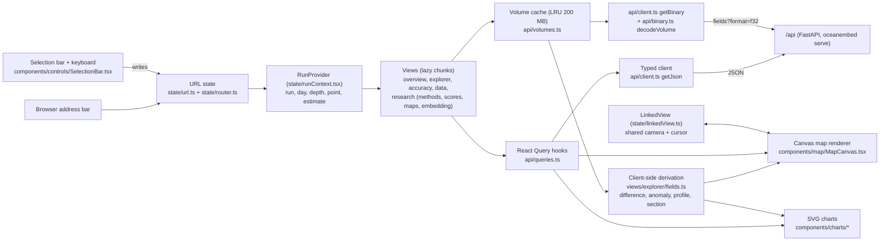

# Frontend — OceanEmbed dashboard

Reference for the browser application in [`web/`](../web). Every statement here was checked against the
code; where an older document differs, the code wins. Full design system: [design.md](design.md).
API reference: [api.md](api.md).

## 1. At a glance

| | |
|---|---|
| **What** | A read-only single-page app over the finished runs in `outputs/`, one run at a time. It is the product's front end: see the temperature field for a day, a depth and a place, know how far to trust it, download it. The research material (method comparisons, ablations, training, embedding) is kept apart in one secondary area. |
| **Stack** | React 19.3, TypeScript 5.9 (strict), Vite 8.3, TanStack React Query 5.104, markdown-to-jsx 9.10, bundled fonts (`@fontsource`). Tests: Vitest 5 + Testing Library + jsdom. Lint: ESLint 10 + typescript-eslint. |
| **Not used** | No chart, map or router library, no CSS framework, no state library. Maps are a canvas renderer, charts are SVG components, routing is a small URL store. |
| **Views** | Primary navigation: **Overview** `/` — what it gives you, how accurate, where not to trust it. **Explorer** `/explore` — any day, depth, point. **Accuracy** `/accuracy` — error against GLORYS and Argo next to the seasonal climatology. **Data & downloads** `/data` — inputs, grid, NetCDF files, the model, the report. (**Live** `/live` is reserved and not listed yet.) Secondary, from the colophon: **Research** `/research`, `/research/scores`, `/research/maps`, `/research/embedding` — methods and ablations, every score for every method, methods on the map, the embedding. |
| **Data** | Same-origin `GET /api/...` only (FastAPI, `oceanembed serve`). JSON through React Query; daily 3-D fields as raw little-endian float32 (1.44 MB per volume) kept in a 200 MB client-side LRU. |
| **State** | Everything selectable lives in the URL: `/<view>?run=&date=&depth=&lat=&lon=` plus per-view options (and `est=` on the Research pages). |
| **Run (dev)** | `oceanembed serve --reload` (API on :8000) and `cd web; npm install; npm run dev` (Vite on :5173, proxies `/api`). |
| **Run (built)** | `cd web; npm run build`, then `oceanembed serve` serves `web/dist` at `http://127.0.0.1:8000/`. |
| **Size** | Current `web/dist` (gzip of each file): 198 kB JS + 10 kB CSS in total over 24 JS files (one entry, the rest loaded on demand); about 129 kB to first paint of the Overview (entry 98 kB + CSS 10 kB + Overview and shared chunks). The Research pages are their own chunks and are not loaded by the product views. Fonts 233 kB woff2. `architecture.md` records "about 180 / 125 / 230 kB". |
| **Speed** | Depth scrub and day step re-colour arrays already in memory (no request). Playback ticks every 180 ms (600 ms with reduced motion). Cold API costs from [api.md](api.md): `/ranges` 2–5 s once per run, `/timeseries` about 1 s per new point; on the two-year run (715 test days) `/ranges` takes about 12 s cold and `/timeseries` about 4 s per new point. Both are loaded in the background: the maps keep their limits and say "period limits loading…", the time–depth panel shows its skeleton, and day and depth stepping stay at one frame (measured medians 14 ms per depth step, 12–21 ms per day step with four estimates loaded). |
| **Checks** | `npm run lint`, `npm run typecheck`, `npm test` (14 files, 186 tests, all passing), `npm run build`. |

## 2. Data flow

## 3. Views

Two groups (`group` in `VIEWS`, [url.ts](../web/src/state/url.ts)). **Primary**: what a user of the product needs;
these are the top navigation. **Research**: how the model was chosen; linked from the colophon and from Data &
downloads, never from the top navigation.

| Route | View (file) | Question it answers | Main figures | Controls | API endpoints |
|---|---|---|---|---|---|
| `/` | Overview ([Overview.tsx](../web/src/views/overview/Overview.tsx)) | What do I get, how accurate is it, where should I not trust it? | Evidence panel (reconstruction, GLORYS, difference: three linked maps); error over the pooled range (computed sentence, two-row table: reconstruction and seasonal climatology, per test year); error by depth; basin bars; the limit by depth; Argo bars with the floor and the independence note | Test-year switch. "Open in Explorer" carries its day and depth. No selection bar | `/metrics/glorys`, `/metrics/argo`, `/fields` (f32) |
| `/explore` | Explorer ([Explorer.tsx](../web/src/views/explorer/Explorer.tsx)) | What does the reconstruction look like on any day, at any depth and point? | Timeline with daily RMSE; reconstruction / GLORYS / difference maps with depth rail; surface inputs; water-column profile; vertical section; time–depth | Selection bar (day, depth, point, play); fields, quantity, vectors, colour range, basin outlines, zoom; enlarge; section direction; time–depth quantity | `/fields` (f32), `/ranges`, `/metrics/glorys`, `/surface`, `/timeseries` |
| `/live` | reserved | The same-day reconstruction (not built) | — | Not listed in the navigation; the route opens the Overview while `LIVE_ENABLED` is false | — |
| `/accuracy` | Accuracy ([Accuracy.tsx](../web/src/views/accuracy/Accuracy.tsx)) | How far can I trust a value, by depth, basin, place, day and year? | The computed answer (error against climatology, where to use it, where not); pooled and all-depth tables; five metric profiles with table twin; basin profiles; error maps; three daily series; day × depth field; Argo map, paged list, opened profile, density scatter, per-depth metrics. Reconstruction and climatology only (plus GLORYS against Argo) | Selection bar (day, depth, point); region; test year; metric; daily scope; daily score; Argo basin, dates, order, pager; scatter series and colour | `/metrics/glorys`, `/metrics/maps/index`, `/metrics/maps`, `/metrics/argo`, `/argo/profiles`, `/argo/profiles/{id}`, `/argo/matchups` |
| `/data` | Data & downloads ([Data.tsx](../web/src/views/data/Data.tsx)) | What goes in, on which grid and period, and how do I take the fields away? | Period, splits, grid and depth levels; data-products table with "used by the model" / "available, not used"; monthly NetCDF product files; the model in four lines and where the released weights are; report figures and text | Report open / close; figure lightbox | `/product`, `/report`, plus download and figure URLs from those payloads |
| `/research` | Research · Methods ([Research.tsx](../web/src/views/research/Research.tsx)) | Which method wins, in each year and across runs, and how was the model trained? | Methods and ablations table with the computed headline; year-by-year table against GLORYS and Argo; pooled bars with the per-pixel-network and ablation verdicts; RMSE and skill by depth for every method; method diagram; cross-run bars and table; training stage table and curves; model configuration; baseline and ablation NetCDF fields | Run toggles for the comparison | `/experiments`, `/metrics/glorys`, `/metrics/argo`, `/compare`, `/training`, `/product`, `/fields` (f32), `/surface`, `/embeddings` |
| `/research/scores` | Research · Every score ([ResearchScores.tsx](../web/src/views/research/ResearchScores.tsx)) | The Accuracy page for every method | The Accuracy sections with ridge, the per-pixel network and the ablation in every table, chart, map and Argo figure | Selection bar with the estimate; otherwise as Accuracy | as Accuracy |
| `/research/maps` | Research · On the map ([ResearchMaps.tsx](../web/src/views/research/ResearchMaps.tsx)) | How do the methods differ on a given day? | The Explorer, opening in Compare: every estimate beside GLORYS, every difference, the day's RMSE, bias and MAE; profile with every estimate | Selection bar with the estimate and Compare; otherwise as Explorer | as Explorer |
| `/research/embedding` | Research · Embedding ([Embedding.tsx](../web/src/views/research/Embedding.tsx)) | What does the embedding hold? | PCA-RGB map; explained-variance bars; cosine-similarity map; component × field correlation table; eight component maps; surface fields; pretraining recovery bars | Selection bar (day limited to embedding days, point); similarity measure; zoom | `/embeddings?n_components=8`, `/embeddings/similar`, `/surface`, `/training` |

Every view also depends on the shell's four requests: `/runs`, `/runs/{run}`, `/runs/{run}/dates`,
`/runs/{run}/mask`.

### Product views and Research views share components

- The run context ([runContext.tsx](../web/src/state/runContext.tsx)) derives a **method scope** from the route:
  `product` on the primary views, `research` on the Research pages.
- `scoped(keys)` (`scopeMethods`) keeps `model`, `climatology`, `glorys` and the observations in the product scope
  and every method in the research scope. The accuracy sections and the Overview pass their method lists through
  it, so the same component is the Accuracy page and Research · Every score.
- `fieldMethods` holds only the product in the product scope, so the Explorer has no estimate selector, no Compare
  and a profile without baselines; in the research scope it holds every method with day fields.
- Every Research page starts with `ResearchHead`: one sentence on what the area is, the repository paths of the
  research notes (`docs/research/`) and result tables (`results/`), tabs for the four pages, "Back to the product".

### What moved where

| Earlier | Now |
|---|---|
| Overview: table of every method, RMSE and skill by depth for every method, per-pixel-network and ablation notes, method strip | Research · Methods |
| Overview: evidence panel, basins, Argo, limits | Overview (reconstruction against the seasonal climatology only; the limit by depth is computed) |
| Explorer: estimate selector, Compare | Research · On the map |
| Validation (every method) | Accuracy (reconstruction and climatology); Research · Every score (every method) |
| Representation | Research · Embedding |
| Experiments: methods, ablations, year by year, across runs, training, model configuration | Research · Methods |
| Experiments: data products, NetCDF product files, report | Data & downloads |
| Experiments: baseline and ablation NetCDF files | Research · Methods |

### Overview

- The day and depth of the URL are ignored. `chooseEvidence` picks them from `/metrics/glorys` (rule in section 9)
  and the figure's subtitle states why. A run without metrics falls back to the default day and depth.
- Temperature maps use the API's per-depth hint; the difference map uses the 99th percentile of |difference| of
  that level, computed in the browser.
- Chapter 01, how accurate: `accuracyHeadline` over the pooled range, a table of the reconstruction and the
  seasonal climatology (one RMSE column per test year, the difference in percent, the anomaly correlation),
  `yearStability`, `correlationSentence`, RMSE by depth, basin bars with `basinSentence`.
- Chapter 02, where not to trust it: `trustLimits` (the depths without skill, from the per-depth skill of the
  metrics) set as the lead, two fixed limits with no numbers, and the Argo panel (pooled range when the payload has
  pooled Argo metrics, else all depths; GLORYS labelled "the floor"; the API's independence note).
- Two test years: a "Test year" switch (`yr`) scopes every figure of the page to one year (`scopeToYear`).
- The header names the inputs the model uses (`used_by_model`), not the number of surface products.
- No other method appears: the method lists pass through `scoped`, and the page imports nothing from
  `lib/research.ts`.

### Explorer

- One `useDayVolumes` call loads the float32 volumes of the day: the reconstruction, climatology and, if the day
  has one, the GLORYS target. (On Research · On the map: the selected estimate and the other field methods.)
- Difference, anomaly, level statistics, the profile and the vertical section are computed from those arrays
  ([fields.ts](../web/src/views/explorer/fields.ts)); only the time–depth plot is a request (`/timeseries`).
- **Playback**: a timer advances only when the next day is already in memory (`peekDay`), otherwise it
  prefetches it. It wraps to the first day at the end. Neighbours at +1, +2, +3 and −1 days are always prefetched.
- **Hold range**: forced on during playback. Limits come from `/ranges` (requested only when holding); where the
  API has no period range, limits only widen. Held limits are kept per quantity, depth and method set.
- While another day loads, the previous one stays on screen dimmed, and map titles name the estimate that is
  actually drawn (`day.primary`).
- Surface-inputs mode: when the run does not use every surface product, each field carries a "model input" or
  "not used by the model" chip.

### Accuracy

- Opens with the computed answer: `accuracyHeadline` and `trustLimits` (not on the Research twin).
- A run with several test years has a "Test year" switch (`yr`) in the GLORYS section and in the Argo section
  (one state): tables, by-depth charts, basin profiles and the Argo counts follow it; error maps and daily series
  cover the whole period.
- Every table, chart and map shows the reconstruction and the climatology (the Argo figures also GLORYS).
- Clicking a depth in a metric profile, a day in a daily chart or a cell of the day × depth field writes the
  shared selection.
- Error maps: one linked map per method on the API's shared range. The note under a map and the pointed ends of
  its colour bar come from `range_info`. Climatology has no skill or anomaly-correlation map.
- Daily series: three stacked charts (RMSE, bias, spatial anomaly correlation) at the selected depth or pooled
  (`ds=pooled`). The day × depth field offers RMSE, RMSE minus climatology's, bias and correlation (`dh`).
- Argo ([validation-argo.png](images/validation-argo.png)): `/argo/profiles` is called twice per filter set,
  once with `limit=50000` for the map and once with `limit=10` for the list page. A profile opened from the map
  clears `ap`, so the list request sends `around=<id>` and lands on its page; if the filters exclude it (404) the
  first page is requested. Using the pager or a filter sets `ap`, which takes precedence.

### Data & downloads

- No selection bar. Period, splits and day counts come from the run summary; grid, basins and depth levels from
  the run detail.
- The data-products table marks each surface product "used by the model" or "available, not used".
- Only the product's NetCDF files are listed (`ProductSection show="product"`); the baseline and ablation files
  are on Research · Methods.
- "Released weights" is text: the weights and the model card are in the repository under `models/final/`; the API
  has no endpoint for them.
- The report text is rendered by a separate chunk (`ReportMarkdown`, 28 kB gzip) loaded only when "Read the
  report" is pressed; raw HTML in the markdown is not parsed.

### Research · Methods

- The methods table underlines the best pooled RMSE; above it the Research headline (`headline`: against
  climatology and ridge regression); beside the bars the per-pixel-network sentence (`mlpSentence`) and the ablation
  verdict (`ablationFindings`).
- "Year by year": pooled RMSE of every method in each test year and over the whole period, against GLORYS and
  against Argo (shown only when the metrics have `per_year`).
- "Every method by depth": RMSE and skill against climatology, with `depthSkill`.
- The method diagram ([MethodDiagram.tsx](../web/src/views/research/MethodDiagram.tsx)) shows real fields of the
  selected day: first surface input the model reads, embedding as RGB, reconstruction at the selected depth.
- Cross-run comparison defaults to the first eight evaluated runs; a subset is stored as `cmp=a.b`. Cross-run
  panels carry per-run "synthetic" / "short training" chips instead of the automatic tag.
- The pretraining panel says when it applies to the ablation only.

### Research · On the map

- The Explorer component in the research scope. **Compare** is on unless `sbs=0`: one row of every estimate plus
  GLORYS on one scale, one row of every difference on one symmetric scale (the largest limit among the methods),
  one colour bar per row, and a table of the day's RMSE, bias and MAE with the lowest RMSE underlined. With five
  panels or more (four estimates and GLORYS) the maps wrap into rows of three.
- With Compare off: the selected estimate against GLORYS, titled with that method's name.

### Research · Embedding

- If the selected day has no embedding, the nearest embedding day is shown and the caption says so.
- Clicking any embedding map snaps the shared point to that embedding cell centre; its footprint is outlined on
  every map of the view.
- Similarity is computed by the API over all features. "As it is" uses a fixed 0–1 viridis scale; "relative to
  the average" (`sim=rel`, `center=true`) uses a fixed −1…1 diverging scale. The query is skipped for a land cell.
- Component × field correlations are computed in the browser: fields block-averaged to the embedding grid, then
  Pearson over ocean cells ([embedding.ts](../web/src/lib/embedding.ts)).
- Pretraining bars: `1 − val_mse / val_meanfill` per channel at the kept epoch, from `/training`. When the main
  model is trained from scratch the section is titled "The pretraining task (ablation only)".
- Fields the model does not use are flagged "unused" in the correlation table and "not an input" on the surface
  maps; the caption says a correlation with them was not built into the embedding.

## 4. Source map

| Path under [`web/src/`](../web/src) | Responsibility | Key exports |
|---|---|---|
| `main.tsx`, `App.tsx` | Entry: fonts, CSS, `applyTheme()`, query client; run resolution, global shortcuts, lazy views, top-level states | `App` |
| `api/client.ts` | Fetch layer, errors | `getJson`, `getBinary`, `buildUrl`, `runPath`, `ApiError`, `errorMessage` |
| `api/binary.ts` | float32 and packbits decoding | `decodeVolume`, `decodeFloat32LE`, `levelOf`, `decodePackedMask`, `Volume` |
| `api/volumes.ts` | LRU of daily volumes, day loading, prefetch | `VolumeCache`, `volumeCache`, `useDayVolumes`, `loadDay`, `peekDay`, `prefetchDay`, `MAIN_METHOD` |
| `api/queries.ts` | One React Query hook per endpoint, query client | `createQueryClient`, `useRuns`, `useRun`, `useDates`, `useOceanMask`, `useRunRanges`, `useGlorysMetrics`, `useArgoProfiles`, ... |
| `api/schema.d.ts`, `api/openapi.json`, `api/types.ts` | Generated types, committed spec snapshot, hand-narrowed types | `RunSummary`, `RunDetail`, `MetricsResponse`, `FieldKind`, ... |
| `state/url.ts`, `state/router.ts` | URL ⇄ state (pure), the view table, redirects of old paths, history store | `parseUrl`, `formatUrl`, `applyPatch`, `viewHref`, `VIEWS`, `PRIMARY_VIEWS`, `RESEARCH_VIEWS`, `isResearchView`, `LIVE_ENABLED`, `useUrlState`, `navigate` |
| `state/runContext.tsx` | Resolved run context for views, method scope | `RunProvider`, `useRunContext`, `defaultDepthIndex`, `scopeMethods`, `MethodScope` |
| `state/linkedView.ts`, `state/useLinkedView.ts` | Shared map camera and cursor outside React | `LinkedView`, `MAX_ZOOM`, `useLinkedView`, `useZoom` |
| `lib/theme.ts` | Colour and font tokens | `color`, `font`, `canvasFont`, `applyTheme` |
| `lib/colormaps.ts` | Colormaps and lookup tables | `getLut`, `colorizeField`, `sampleColormap`, `cssGradient`, `lutIndex` |
| `lib/methods.ts`, `lib/metricMeta.ts` | Identity per method; name, unit, domain, colormap per metric | `methodStyle`, `sortMethods`, `shortLabel`, `estimateRole`; `METRIC_META`, `metricDomain`, `METRIC_ORDER` |
| `lib/narrative.ts` | Computed sentences of the product views, caveats, defaults | `accuracyHeadline`, `trustLimits`, `yearStability`, `argoSentence`, `basinSentence`, `correlationSentence`, `chooseEvidence`, `runCaveats`, `defaultRun` |
| `lib/research.ts` | Method-comparison sentences, Research pages only | `headline`, `depthSkill`, `ablationFindings`, `mlpSentence`, `versus` |
| `lib/scales.ts`, `lib/geo.ts`, `lib/stats.ts` | Depth axis and ticks; grid geometry and coastline; numeric helpers | `depthFraction`, `depthBandEdges`, `niceTicks`; `makeGeom`, `cellAt`, `coastlineSegments`; `quantile`, `symmetricLimit`, `fieldStats` |
| `lib/format.ts`, `lib/dates.ts` | Number, unit and date formatting; default day | `fmt`, `fmtSigned`, `fmtInt`, `prettyUnits`; `fmtDate`, `defaultDateIndex`, `nearestDateIndex` |
| `lib/embedding.ts`, `lib/points.ts`, `lib/useSize.ts` | Embedding decoding; binned point layers; size and media hooks | `decodeEmbedding`, `decodeSimilarity`; `buildPointLayer`, `nearestPoint`; `useSize`, `useMediaQuery` |
| `components/map/` | Canvas map, map figure with read-out, colour bar, zoom buttons | `MapCanvas`, `MapFigure`, `MaskKey`, `Colorbar`, `ZoomControls` |
| `components/charts/` | SVG and canvas charts, tables, legends | `XYChart`, `MetricProfile`, `MetricsTable`, `MethodBars`, `DepthHeatmap`, `ScatterDensity`, `Legend`, `Swatch` |
| `components/controls/` | Selection bar, timeline, depth rail | `SelectionBar`, `SelectionBarSlot`, `Timeline`, `DepthRail` |
| `components/shell/Shell.tsx` | Sticky header, primary nav, run selector, honesty bands, bar slot, colophon with the Research link | `Shell`, `ViewLink`, `runLabel` |
| `components/ui/primitives.tsx` | Controls, containers, states, tables | `Segmented`, `Select`, `IconButton`, `Panel`, `Note`, `Loading`, `ErrorState`, `Empty`, `QueryState`, `DataTable`, `TableTwin` |
| `views/overview/`, `views/explorer/`, `views/accuracy/`, `views/data/` | The product's views; default export is the lazy view | `Overview`, `Explorer` (`ExplorerBody`), `Accuracy` (`AccuracyBody`), `Data` (`DataProducts`, `ProductSection`, `ReportSection`) |
| `views/research/` | The Research pages and their shared band | `Research`, `ResearchScores`, `ResearchMaps`, `Embedding`, `ResearchHead`, `MethodDiagram`, `TrainingSection` |
| `styles/` | `base.css` (non-colour tokens, shell), `components.css`, `views.css`, `overview.css`, `sections.css`, `fonts.css` | — |
| `**/*.test.ts(x)`, `test/setup.ts` | Vitest suites and jsdom setup | — |

`useHealth`, `useProfile` and `useSection` are exported by `queries.ts` but no view calls them: profiles and
sections are derived from the cached volumes.

## 5. State model

### URL parameters ([url.ts](../web/src/state/url.ts))

| Parameter | Meaning | Validation / format |
|---|---|---|
| path | View: `/`, `/explore`, `/accuracy`, `/data`, `/research`, `/research/scores`, `/research/maps`, `/research/embedding` (`/live` reserved) | Unknown path opens the Overview; old paths are redirected (below) |
| `run` | Run folder name | `[A-Za-z0-9][A-Za-z0-9_.-]*` |
| `date` | Selected day | Real ISO date; snapped to the nearest predicted day |
| `depth` | Selected depth, metres | 0–11000; snapped to the nearest level; written with 1 decimal at most |
| `lat`, `lon` | Selected water column | Both needed; must lie inside the grid; 3 decimals |
| `est` | Estimate shown where one method is shown, **Research pages only** | Must be one of the run's `field_methods`; omitted for `model`; dropped on every other view |

Per-view options (lower-case keys, values up to 120 characters; all omitted at their default):

| View | Key = values | Meaning |
|---|---|---|
| Explorer | `mode=surf` | Surface inputs instead of subsurface maps |
| | `q=anom` | Anomaly instead of temperature |
| | `td=temp\|anom` | Time–depth quantity when it differs from `q` |
| | `pall=0` | Profile shows only the selected estimate |
| | `sec=merid` | Meridional instead of zonal section |
| | `focus=target\|diff` | Which of the three maps is enlarged |
| | `basins=1` | Basin outlines |
| | `vec=uv` | U and V components instead of speed + arrows |
| Overview | `yr=<year>` | One test year instead of the whole test period |
| Accuracy, Research · Every score | `basin=<key>` | Region of the GLORYS tables and profiles |
| | `yr=<year>` | One test year instead of the whole test period |
| | `metric=<key>` | Metric of the error maps |
| | `ds=pooled` | Daily series over the pooled range |
| | `dh=gain\|bias\|corr` | Score of the day × depth field |
| | `ab`, `as`, `ae` | Argo basin, start day, end day |
| | `asort=worst\|best` | Argo list order by RMSE of the estimate |
| | `ap=<n>` | Explicit Argo list page (0-based) |
| | `prof=<id>` | Opened Argo profile |
| | `sm=<method>`, `sc=depth` | Scatter series and colouring |
| Research · On the map | `sbs=0` | Compare off (it is on by default there); plus the Explorer's options |
| Research · Embedding | `sim=rel` | Similarity with the mean embedding removed |
| Research · Methods | `cmp=a.b.c` | Runs in the cross-run comparison |

### Redirects of the earlier layout

Old links are rewritten in place (`history.replaceState`) when the app reads the address bar; `parseUrl` does the
mapping, so it is covered by the URL tests.

| Old link | Opens |
|---|---|
| `/validation?…` | `/accuracy?…` (options kept; `est` dropped) |
| `/experiments?…` | `/research?…` |
| `/representation?…` | `/research/embedding?…` |
| `/explore?…&sbs=1` or `/explore?…&est=<method>` | `/research/maps?…` |
| `/live` | `/` until the Live view ships |

### Rules

- **Shared across views:** run, date, depth, point. **Research pages only:** estimate (kept between Research
  pages, dropped when a link leaves them). **Dropped on a view change:** per-view options.
  **Dropped on a run change:** date, estimate and options (depth and point survive).
- **History:** a view change or a run change pushes an entry; every other change replaces the current entry,
  debounced by 180 ms ([router.ts](../web/src/state/router.ts)). The in-memory state updates synchronously. A view
  change scrolls to the top. The resolved default run is pinned into the URL with a replace.
- **Not in the URL:** playback, "hold range", map zoom and pan, hover, the table-twin metric, report open state.

### Defaults when the link names nothing

| Value | Rule | Code |
|---|---|---|
| Run | Highest score: has predictions (8) + real data (4) + trained ≥ 365 days (2) + evaluated (1); ties by most predicted days, then name | `defaultRun` |
| Day | Nearest to the middle of the predicted days that has both a GLORYS target and an embedding | `defaultDateIndex` |
| Depth | Level nearest the geometric mean of the pooled range (100 m for 50–200 m); middle level without metrics | `defaultDepthIndex` |
| Point | Ocean cell nearest the centre of the first basin whose column reaches the deepest level; else nearest surface ocean cell | `RunProvider` |
| Estimate | `model` (first of `field_methods`); always `model` outside Research | `RunProvider` |

### Keyboard

| Keys | Action | Where |
|---|---|---|
| `,` `.` | Previous / next day | Every view |
| `[` `]` | Shallower / deeper | Every view |
| `←` `→` `↑` `↓` | Day / depth | Explorer |
| `Space` | Play / pause | Explorer |
| `+` `−` `0` | Zoom in, out, reset | A focused map |
| Arrows, `Home`, `End`, `PageUp`, `PageDown` | Step (page = 7 days / 3 levels) | Focused timeline / depth rail |
| `Esc` | Close the figure lightbox | Data & downloads |

Shortcuts are ignored while typing in an input or select, or with Alt / Ctrl / Meta held.

## 6. Data access

- **Client** ([client.ts](../web/src/api/client.ts)): base is always `/api`. Empty parameters are not sent. A
  non-2xx becomes `ApiError(status, detail)` with the server's `detail`; a network failure is status 0 with a
  "start it with: oceanembed serve" message. `isMissing` (404) is treated as "artefact not available", not a failure.
- **Types:** `npm run gen:api` ([gen-api.mjs](../web/scripts/gen-api.mjs)) fetches `/api/openapi.json` from the
  running API (`OCEANEMBED_API`, default `http://127.0.0.1:8000`) and writes `api/openapi.json` (28 paths) and
  `api/schema.d.ts` (openapi-typescript). `api/types.ts` narrows the free-form dictionaries.
- **Snapshot test** ([openapi.test.ts](../web/src/api/openapi.test.ts)): scans `queries.ts` and `volumes.ts` for
  the paths they build and checks each is a GET operation of the snapshot, that every query parameter sent is
  declared, and that the narrowed schemas exist.
- **React Query policy** (`createQueryClient`): `staleTime` 60 s, `gcTime` 5 min, no refetch on window focus, one
  retry except for 4xx. Overrides: mask and `/ranges` stale after 10 min, `/timeseries` after 5 min. Hooks that
  change with the selection use `keepPreviousData`, so figures dim instead of blanking.
- **Query keys:** `["runs"]`, `["run", run]`, `["dates", run]`, `["mask", run]`, `["ranges", run]`,
  `["surface", run, date]`, `["timeseries", run, lat, lon, method]`, `["metrics", "glorys"|"argo", run]`,
  `["maps-index", run]`, `["map", run, metric, method, depth]`, `["matchups", run, maxPoints]`,
  `["argo-profiles", run, basin, start, end, sort, order, method, limit, offset|around]`, `["argo-profile", run, id]`,
  `["embedding", run, date, n]`, `["embedding-similar", run, date, lat, lon, center]`, `["training", run]`,
  `["experiments", run]`, `["compare", list]`, `["report", run]`, `["product", run]`. Hooks are disabled when the
  run summary says the artefact does not exist.
- **Binary volumes** ([binary.ts](../web/src/api/binary.ts)): `GET /fields?date=&kind=&format=f32[&method=]` with
  `Accept: application/octet-stream`. Body: little-endian float32, C order `(depth, lat, lon)`, NaN preserved.
  Headers read: `X-Shape`, `X-Dtype`, `X-Byte-Order`, `X-Kind`, `X-Date`, `X-Has-Target`, `X-Color-Range`,
  `X-Color-Diverging`, `X-Color-Range-Per-Depth`. A body that does not match the shape, dtype or byte order throws.
  Only the kinds `prediction`, `climatology` and `target` are requested.
- **Volume cache** ([volumes.ts](../web/src/api/volumes.ts)): key `run|date|kind|method` (target and climatology
  are shared between methods); least-recently-used eviction beyond 200 MB of decoded bytes; in-flight requests
  are shared; failed loads are not cached. A missing target (404) yields a day without target, not an error.
- **Mask:** `/mask` is packbits + base64 per depth, decoded to one byte per cell; the coastline is derived from
  the surface level at decode time.
- **Derived in the browser, and why:** difference, anomaly, level statistics (RMSE, bias, MAE of the day), basin-
  mean profile for the depth rail, water-column profile, vertical section, speed from U and V, component × field
  correlation, scatter binning. Three volumes of a day answer all of these, so changing depth, point, quantity or
  section direction costs no request, and the numbers on screen are computed from the same arrays as the maps.

## 7. Rendering

### Canvas map ([MapCanvas.tsx](../web/src/components/map/MapCanvas.tsx))

- **Projection:** plate carrée with square degrees; canvas height = plot width ÷ domain aspect, so the aspect is
  always true.
- **Raster:** the field is coloured through a 256-entry lookup table into a grid-sized offscreen canvas and drawn
  with nearest-neighbour scaling (no smoothing). NaN is transparent.
- **Neutrals:** land is a flat fill behind the raster; surface-ocean cells below the sea floor at the shown depth
  get a second neutral from the level mask.
- **Coastline:** cell edges between ocean and land of the surface mask; an optional white halo for fields that
  cover land. The embedding maps draw the full-resolution coastline over the coarse grid (`coastGeom`).
- **Other layers:** graticule on round degrees with °N / °E labels, dashed basin boxes with haloed labels, vector
  arrows (block-averaged on a screen lattice, length ∝ √speed, white on dark colours), Argo points in 24 colour
  bins (one path per bin, largest values last), section line, highlight box, ringed marker.
- **Linking:** every map of a group shares a `LinkedView` (zoom 1–12, centre, hover). Drag pans, double-click
  zooms (Shift: out), wheel zooms about the pointer in the Explorer and needs Ctrl / Cmd elsewhere. Hover draws a
  cross-hair and the hovered cell on a separate overlay canvas; `MapFigure` writes the read-out straight to the
  DOM. None of this re-renders React.
- **Drawing** is imperative and batched per animation frame; device-pixel-ratio aware.

### Charts

| Component | Used for | Notes |
|---|---|---|
| `XYChart` (SVG) | Depth profiles, daily series, training curves | One axis pair; snapping hover with tooltip; band, zero line, reference line; click picks a depth or day |
| `MetricProfile` | A metric by depth for several methods | Wraps `XYChart`; hides climatology for skill and anomaly correlation |
| `DepthHeatmap` (canvas + SVG) | Sections, time–depth, day × depth, RMSE by depth and epoch | Levels are bands, never interpolated; click picks x and depth |
| `ScatterDensity` (canvas + SVG) | Argo matchups | 72 × 72 bins; log count or mean depth; 1 : 1 line |
| `MethodBars` | Pooled RMSE, variance, recovery | Labelled bars on one zero-based axis |
| `MetricsTable`, `DataTable`, `TableTwin` | Tables and table twins | Best candidate underlined; GLORYS is never "best" |

**Depth axis convention:** depth increases downward on a square-root axis (`depthFraction`), surface at the top;
ticks are real levels, roundest first. Charts, depth rail and heat maps share it.

### Colormaps ([colormaps.ts](../web/src/lib/colormaps.ts))

cmocean maps (12 control points) and viridis (16), interpolated to 256 entries.

| Quantity | Colormap | Range |
|---|---|---|
| Temperature maps | `thermal` | API hint per depth (`X-Color-Range-Per-Depth`: 1st–99th percentile of main prediction ∪ GLORYS) |
| Temperature sections / time–depth | `thermal` | Whole-volume hint / `/timeseries` `color_range` |
| Anomaly | `balance` | Symmetric, 99th percentile of \|x\| over estimate and GLORYS, in the browser |
| Difference | `balance` | Symmetric, 99th percentile of \|x\| of the level; Compare: largest among methods |
| Any of the above with "hold range" | same | `/ranges` per depth (`temperature`, per-method `anomaly`, `difference`); else only widens |
| SST / salinity / SLA and U, V | `thermal` / `haline` / `balance` | `/surface` `color_range` |
| Current and wind speed | `speed` | 0 to the 99th percentile |
| RMSE, MAE maps; Argo profile dots | `amp` | API range from 0; dots 0 to the 95th percentile of profile RMSE |
| Bias map; daily bias, RMSE − climatology, spatial correlation | `balance` | Symmetric (API range, or 99th percentile) |
| Correlation maps, PCA components, raw similarity | `viridis` | API range / fixed 0–1 |
| Centred similarity | `balance` | Fixed −1…1 |
| Skill vs climatology | `curl` reversed | API range (symmetric; rule in [api.md](api.md)) |
| Matchup density / depth | `tempo` (log) / `deep` (√depth) | — |

**Range-exceeded notes:** for error maps the API's `range_info` drives a note ("9 % of the cells lie beyond the
colour scale (lowest −3.04)") and decides which ends of the colour bar are pointed.

### Method styles ([methods.ts](../web/src/lib/methods.ts))

| Method key | Short label | Colour | Dash array | Width | Marker |
|---|---|---|---|---|---|
| `model` | OceanEmbed | `#0B5FA5` | solid | 2.25 | circle |
| `model_<tag>` (1st ablation) | No pretraining / Pretrained / Ablation: tag | `#B8730A` | `5 3` | 1.75 | triangle |
| `model_<tag>` (2nd ablation) | Ablation: tag | `#8A4FB0` | `12 3 2 3` | 1.75 | triangle-down |
| `mlp` | API label ("Per-pixel MLP") | `#D95FA8` | `3 2` | 1.75 | pentagon |
| `ridge` | Ridge | `#C8431F` | `7 2.5 1.5 2.5` | 1.75 | square |
| `climatology` (`clim`) | Climatology | `#6B7680` | `1.5 3` | 1.75 | cross |
| `glorys` (`target`) | GLORYS | `#0E8A6A` | `10 3` | 1.75 | diamond |
| `obs` (`argo`) | Argo | ink `#14212B` | solid | 1.5 | open ring |

Legend order is the table's order. Aliases (`clim`, `prediction`, `target`, `argo`) are mapped by `canonicalMethod`.

## 8. Design system in brief

**Direction:** light "printed atlas": warm paper, blue-black ink, serif titles, figures framed as plates; the data
is the hero, cells are shown unsmoothed, everything is linked. Full rationale in [design.md](design.md).

| Group | Tokens | Source |
|---|---|---|
| Surfaces | `paper #F7F6F2`, `surface #FFFFFF`, `sunken #EFEDE6`, `rule #DDD9CE`, `ruleStrong #B4AFA2`, `grid #ECE9E1` | [theme.ts](../web/src/lib/theme.ts) |
| Text | `ink #14212B`, `ink2 #42515C`, `ink3 #5A6872` | theme.ts |
| Accent | `accent #0A5A78`, `accentStrong #06445C`, `accentSoft #DDEBF0` (one accent) | theme.ts |
| Status | `warn #F3BC3D` / `warnInk #2B1D00` (synthetic only); `cautionSoft #ECE9F4` / `cautionRule #6A5FA3` / `cautionInk #2B2552` (short training only); `danger #A3261C` / `dangerSoft #FAE9E6` (errors only) | theme.ts |
| Maps | `land #D6D1C4`, `seafloor #B9BCB7`, `coast #2E3B44` | theme.ts |
| Type | Newsreader (titles, computed headline), IBM Plex Sans (UI, body, charts), IBM Plex Mono (overlines, coordinates). Scale 11 / 12 / 13 / 14 / 15 px, h3 16, h2 20, h1 26. Root 16 px, 17 px from 1800 px, 19 px from 2300 px | theme.ts, [base.css](../web/src/styles/base.css) |
| Space | `--s1`…`--s9` = 4, 8, 12, 16, 24, 32, 48, 64, 96 px; radius 3 px; page max 1760 px; gutter `clamp(16px, 2.6vw, 44px)` | base.css |
| Motion | 120 ms control transitions, loading shimmer, playback; all removed with `prefers-reduced-motion` | base.css |

- **Selection bar:** one row docked in the sticky header (rendered through a portal into the shell's slot).
  Groups: Day (previous, select grouped by month, next, play, position), Depth, Point (lat / lon inputs stepping by
  the grid resolution), and on the Research pages Estimate (only when the run has more than one field method) and
  the Compare switch. Explorer and Accuracy show day, depth and point; Research · On the map and Every score add
  the estimate; Research · Embedding shows day and point; Overview, Data & downloads and Research · Methods have
  no bar.
- **Honesty treatments:**

| Treatment | Trigger | What appears |
|---|---|---|
| Synthetic band | `data_source == "synthetic"` | Amber striped band in the sticky header; "synthetic" tag after every figure title (CSS on `data-source`); caveat notes by the findings |
| Short-training flag | `0 < n_train_days < 365` | Violet-grey band with the day count (and "constant mean" when `n_harmonic_terms ≤ 1`); the same note by the findings |
| Climatology alongside | Always, on the product views | The seasonal climatology in every table, chart and bar set that shows the reconstruction |
| Every baseline alongside | Research pages | Ridge, the per-pixel MLP and the ablation in every such figure |
| Limit by depth | Per-depth skill in the metrics | The depths where the reconstruction is no better than the climatology, as the lead of the Overview's second chapter and at the top of Accuracy (`trustLimits`) |
| Anomaly vs raw correlation | Always | Anomaly correlation first; raw labelled as inflated, with an explanatory note |
| Argo floor | Argo metrics present | API independence note before any number; GLORYS row labelled "the floor", never "best" |
| Estimate naming | `est` ≠ `model` (Research) | Map, section and time–depth titles carry the method's name, not "Reconstruction" |
| Range-exceeded note | `range_info.exceeds_range` | Note under the error map; pointed colour-bar ends |
| Not the product | Extra products | Baseline and ablation NetCDF files labelled as such and listed on Research · Methods, not with the product |

- **States** ([primitives.tsx](../web/src/components/ui/primitives.tsx)): `Loading` (shimmer block of the figure's
  height), `Empty` / missing (dashed box with the API's own 404 hint, no retry), `ErrorState` (red-tinted, with
  retry), and a specific message when the API is unreachable. A disabled query renders as "not available for this
  run", never a spinner. An unknown `run` lists the available runs.
- **Accessibility:** skip link, landmarks, one `h1` per view; `role="img"` with a label on every map and chart;
  `role="slider"` with value text on timeline and depth rail; `aria-pressed` on toggles; visible 2 px focus ring;
  methods differ by dash and marker as well as colour; table twins for the per-depth charts.
- **Responsiveness** (breakpoints in the CSS): ≥ 1181 px full grids; ≤ 1180 px single-column panels and three
  metric charts per row; ≤ 1020 px the nav wraps under the wordmark and the evidence maps stack; ≤ 860 px point
  panels stack and the selection bar scrolls sideways; ≤ 620 px one compare map per row (≤ 600 px for the other
  small multiples).

## 9. Computed narrative ([narrative.ts](../web/src/lib/narrative.ts), [research.ts](../web/src/lib/research.ts))

Every sentence that states a result is built from the metrics payloads. The sentences of the product views
(Overview, Accuracy) are in `narrative.ts` and name only the seasonal climatology and the references; the
sentences that compare methods are in `research.ts`, which only the Research pages import. Constants: `TIE_PCT = 1`,
`SEED_PCT = 5`, `CLEAR_SKILL = 0.1`, `BIAS_NOTE = 0.1` °C, `MIN_TRAIN_DAYS = 365`, `MAX_DEPTH_SPANS = 3`.

| Function | Sentence | Inputs | Rules |
|---|---|---|---|
| `compare` / `describeComparison` | "22 % lower than climatology" | Two RMSEs | Difference under 1 % reads "about the same as" |
| `climatologyName` | "the seasonal climatology" / "the mean climatology" | `n_harmonic_terms` | "Seasonal" only when the fit has a seasonal cycle (more than one term) |
| `accuracyHeadline` | "Between 50–200 m the reconstruction differs from the GLORYS reanalysis by … °C RMSE (… in 2023, … in 2024): … % lower than the seasonal climatology (… °C)." | `pooled.{model, climatology}.rmse`, `per_year`, `pooled_range_m` | `beatsClimatology` only beyond the tie; styled as negative otherwise; no other method is named |
| `trustLimits` / `classifyDepths` | "Use it at …" and "At … it is no better than the seasonal climatology; at … the gain is marginal …" | `per_depth.skill_vs_clim.model` | Clear ≥ 0.1; marginal 0–0.1; none ≤ 0. No clear level at all: "do not rely on it" |
| `headline` (research.ts) | "Between 50–200 m, OceanEmbed's RMSE against GLORYS is …: … and …." | `pooled.{model, ridge, climatology}.rmse`, `pooled_range_m` | `beatsBaselines` only if lower than both beyond the tie; styled as negative otherwise |
| `correlationSentence` | Anomaly correlation with the raw one and why the raw one is inflated | `pooled.model.corr_anom`, `corr_raw` | Omitted if either is missing |
| `depthSkill` (research.ts) | Best depth, where skill is clear, marginal, absent, and where ridge wins | `per_depth.skill_vs_clim.model`, `per_depth.rmse.{model, ridge}` | Clear ≥ 0.1; marginal 0–0.1; none ≤ 0; ridge wins beyond the 1 % tie |
| `describeDepths` | "300 m and below", "0–30 m", "7 of the 15 levels between …" | Depth lists | Neighbours merge into ranges; more than 3 ranges become a count |
| `ablationFindings` (research.ts) | Verdict on pretraining with both numbers | `pooled.model.rmse` vs each `model_<tag>`, and the `pretrained` flag of both | Reads the pair as pretrained vs from scratch whichever is the main model. Under 5 % either way: "No measurable gain from pretraining" (trained once); above: "helps" / "does not help" |
| `yearsOf` / `scopeToYear` | (no sentence) one test year of a payload | `per_year` | Replaces `overall`, `pooled`, `per_depth`, `per_basin` and the Argo counts by that year's; daily series untouched |
| `yearStability` | "It beats the seasonal climatology in each test year (2023: …; 2024: …)." | `per_year.*.pooled` | Names the years it does not, if any; null for one test year. With `"all"` (Research) ridge regression is held to the same test and named |
| `mlpSentence` / `versus` (research.ts) | The network against the per-pixel MLP, pooled and by basin | `pooled.{model, mlp}`, `per_basin.*.pooled` | Under 5 % reads "level"; null without an MLP |
| `argoSentence` | Reconstruction vs climatology against Argo, GLORYS as the floor, shared bias | Argo `pooled` (else `overall`) blocks, profile and matchup counts | Bias sentence only if \|GLORYS bias\| ≥ 0.1 °C and both have the same sign. With `"all"` ridge regression is named too |
| `basinSentence` / `basinContrast` | Skill per basin, most skilful first | `per_basin.*.pooled` | Needs two basins with a skill value |
| `chooseEvidence` | Day and depth of the Overview evidence | `per_depth.rmse.climatology`, `daily.pooled_rmse.model` (else daily RMSE at that depth) | **Depth:** level inside the pooled range, never 0 m, with the largest climatology RMSE. **Day:** lower median of the test days by that error, among days with a target (and an embedding); ties by date |
| `runCaveats` | Synthetic and short-training notes | Run summary | From `data_source`, `n_train_days`, `n_harmonic_terms`; never from the run name |
| `climatologyText` | "mean and annual cycle" etc. | `n_harmonic_terms` | 1, 3 or 5 terms |

## 10. Build, run, test

| Script (`web/package.json`) | Command | Purpose |
|---|---|---|
| `npm run dev` | `vite` | Dev server on :5173 (strict port) |
| `npm run build` | `tsc -b --noEmit && vite build` | Type check, then bundle to `web/dist` (ES2022, no source maps) |
| `npm run preview` | `vite preview` | Serve the build on :4173 with the same proxy |
| `npm run typecheck` | `tsc -b --noEmit` | Strict TypeScript, unused locals and parameters are errors |
| `npm run lint` | `eslint . --max-warnings 0` | Hooks rules as errors, type-only imports, `eqeqeq`, no `console.log` |
| `npm test` | `vitest run` | jsdom, `src/**/*.test.{ts,tsx}` |
| `npm run gen:api` | `node scripts/gen-api.mjs` | Refresh `openapi.json` and `schema.d.ts` from the running API |

- **Dev proxy:** Vite forwards `/api` to `OCEANEMBED_API` (default `http://127.0.0.1:8000`), so the app calls
  same-origin `/api` in development and in production. `@` aliases `web/src`.
- **Serving the build:** with `web/dist/index.html` present, `oceanembed serve` serves it at `/`, hashed files
  under `/assets/` as immutable, `index.html` as `no-cache`, and falls back to `index.html` for client routes
  without shadowing `/api`.

| Test file | Tests | Covers |
|---|---|---|
| [lib/narrative.test.ts](../web/src/lib/narrative.test.ts) | 44 | Every computed sentence: the product's (accuracy, limits by depth, years, Argo, basins) and the Research ones (headline, ablation, per-pixel network, depth skill); the evidence rule, caveats, default run |
| [lib/helpers.test.ts](../web/src/lib/helpers.test.ts) | 33 | Depth scale, ticks, formatting, dates, default day, statistics, geometry, methods, metric axes, embedding helpers |
| [api/openapi.test.ts](../web/src/api/openapi.test.ts) | 28 | Client paths and parameters against the OpenAPI snapshot |
| [state/url.test.ts](../web/src/state/url.test.ts) | 13 | Parse, format, patch rules of the URL state; the routes of both groups; redirects of the earlier layout; the estimate confined to Research; the reserved Live route |
| [components/components.test.tsx](../web/src/components/components.test.tsx) | 13 | Segmented, error states, honesty bands, the primary navigation and the Research link in the colophon, charts, colour bar, depth rail |
| [api/volumes.test.ts](../web/src/api/volumes.test.ts) | 10 | Volume cache, methods, day loading, client errors |
| [views/explorer/fields.test.ts](../web/src/views/explorer/fields.test.ts) | 9 | Shared and held colour ranges, time–depth panels |
| [api/binary.test.ts](../web/src/api/binary.test.ts) | 8 | float32 decoding, headers, packbits mask |
| [lib/colormaps.test.ts](../web/src/lib/colormaps.test.ts) | 8 | Lookup tables, diverging centre, NaN handling |
| [lib/points.test.ts](../web/src/lib/points.test.ts) | 6 | Point binning, ordering, hit test, cell counts |
| [components/controls/SelectionBar.test.tsx](../web/src/components/controls/SelectionBar.test.tsx) | 5 | Stepping, no estimate on the product views, estimates in Research, groups per view |
| [views/accuracy/accuracy.test.ts](../web/src/views/accuracy/accuracy.test.ts) | 4 | Range-exceeded note, per-profile RMSE keys |
| [lib/inputs.test.ts](../web/src/lib/inputs.test.ts) | 3 | Which surface products the model uses |
| [state/scope.test.ts](../web/src/state/scope.test.ts) | 2 | Which methods a product view and a Research view show |

Total 186 tests in 14 files. There are no browser (end-to-end) tests; canvas drawing is not asserted.

## 11. Dependencies

| Runtime | Why |
|---|---|
| `react`, `react-dom` | UI |
| `@tanstack/react-query` | Request cache with loading, error and placeholder states per endpoint |
| `markdown-to-jsx` | Renders the generated `report.md`; its own lazy chunk |
| `@fontsource-variable/newsreader`, `@fontsource/ibm-plex-sans`, `@fontsource/ibm-plex-mono` | Fonts bundled locally (latin subsets): no request outside `/api` |

| Development | Why |
|---|---|
| `vite`, `@vitejs/plugin-react` | Dev server and bundler |
| `typescript`, `@types/react`, `@types/react-dom`, `@types/node` | Type checking |
| `eslint`, `@eslint/js`, `typescript-eslint`, `eslint-plugin-react-hooks`, `globals` | Linting |
| `vitest`, `jsdom`, `@testing-library/react`, `@testing-library/dom` | Unit and component tests |
| `openapi-typescript` | Generates `schema.d.ts` |

| Deliberately not used | Why |
|---|---|
| Chart library | A handful of chart types with one shared depth axis, method identity and hover; small SVG components keep them identical everywhere |
| Map / tile library | The data is a regular 100 × 240 grid drawn cell for cell; a tile stack would resample it and fetch external tiles |
| Router library | Nine flat routes and query-string state; `url.ts` + `router.ts` cover it with tested pure functions |
| CSS framework / CSS-in-JS | Plain CSS with tokens from `theme.ts` and `base.css` |

## 12. Known limits

- Light theme only (`color-scheme: light`); a dark theme would need every colormap pairing re-validated.
- Plate carrée projection: east–west scale error up to 13 % at 30°N.
- Charts and maps cannot be traversed point by point with the keyboard, and hover values are not exposed to
  assistive technology; tables, table twins and labelled summaries carry the numbers.
- The coastline is the model's 0.25° staircase, not the real coast.
- Wheel zoom needs Ctrl / Cmd outside the Explorer. Map zoom and pan are not stored in the URL.
- "Hold range" and playback are not in the URL, so a shared link opens with per-day ranges.
- The selection bar scrolls sideways below 860 px; side-by-side and small-multiple maps are small at laptop width.
- The held period range is a 1st–99th percentile over sampled days, so extreme days saturate.
- Raw similarity is fixed at 0–1, so negative values clip to the darkest colour.
- The Argo list shows ten profiles per page; the map requests at most 50 000 profiles.
- On the Research pages the estimate applies only where one method is shown; tables and by-depth charts there always show all methods. The product views have no estimate.
- Research is reachable only from the colophon and from Data & downloads.
- The Live route is reserved: `/live` opens the Overview until `LIVE_ENABLED` is switched on and its view exists.
- The test-year switch does not apply to error maps, daily series or the Explorer; a year is reached there by date.
- The first playback on a long run competes with the cold `/ranges` request and runs below its 5 frames per second
  until that request returns.
- Volumes are cached in memory only (200 MB); a reload fetches them again (the API answers with ETags).
- No end-to-end tests; no offline mode; the app needs the API on the same origin.

## 13. Legacy Streamlit app

- [`app/`](../app) is the earlier proof-of-concept dashboard: Streamlit + Plotly, dark theme, five pages
  (`Home.py` Overview, `pages/` 3-D Explorer, Profiles and Sections, Validation, Embeddings), tokens in
  `app/ui/theme.py`.
- It reads the same run folders through `app/data_access.py`, a re-export of `oceanembed.data_access`, the
  loaders the API also uses. It shares no code with `web/`.
- It is kept as a fallback and is not described by [design.md](design.md).
- Run from the project root: `.\.venv\Scripts\streamlit.exe run app/Home.py`.
