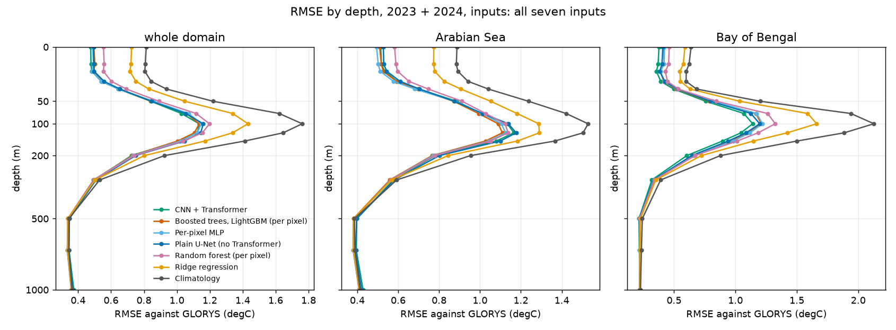

# Benchmark — the model families of the literature, under one protocol

Run `poc_long`: train 2011 – 2021, validate 2022, test **2023** and **2024**, reference GLORYS. Produced by
`oceanembed research benchmark --config configs/poc_long.yaml` and `benchmark-report`; full tables in
`outputs/poc_long/research/benchmark/summary.md` (copy in `results/research/benchmark/`).

Most published work on reconstructing subsurface temperature from satellite data uses tree ensembles. This stage adds them —
**gradient-boosted trees** (LightGBM) and a **random forest** — to the families already measured (climatology, ridge regression,
per-pixel MLP, CNN + Transformer) and re-trains the **plain U-Net** (same stem and decoder, the Transformer replaced by residual
convolutions) on the eleven-year data. Two input sets, as in the earlier results: all seven surface inputs, and SST + sea level
(the final model's inputs). Three seeds per trained family (the seed draws the training sample and seeds the model); ridge and
climatology are deterministic. Intervals are moving-block bootstraps over the test days (70-day blocks) shared by every family, so
differences are paired; a difference is *established* only if its paired 95 % interval excludes zero **and** the per-seed RMSE
ranges do not overlap.

The trees see exactly what the per-pixel MLP sees: the 7 standardised surface values (the dropped inputs zeroed), sin / cos of the
day of year and normalised latitude / longitude of one pixel, no neighbours, trained on the same kind of sample (about 1 M random
train points). Hyper-parameters were chosen on the validation year only, from a small grid on a smaller sample: boosted trees
63 leaves (grid 15 / 63 / 255), forest minimum leaf 5 and all features (grid 5 / 20 / 60 × 0.5 / 1.0, the best cell is at the edge
of the grid).

## Ranking, 50 – 200 m, RMSE in °C (seed mean ± SD)

All seven inputs:

| Rank | Family | 2023 | 2024 | Both years | Arabian Sea | Bay of Bengal |
|---|---|---|---|---|---|---|
| 1 | CNN + Transformer | 0.975 ± 0.007 | 1.004 ± 0.014 | 0.989 ± 0.010 | 1.018 ± 0.018 | **0.938 ± 0.007** |
| 2 | Boosted trees (LightGBM) | 0.966 ± 0.003 | 1.013 ± 0.001 | 0.990 ± 0.002 | **0.983 ± 0.002** | 1.001 ± 0.002 |
| 3 | Per-pixel MLP | 0.984 ± 0.002 | 1.024 ± 0.008 | 1.004 ± 0.004 | 0.996 ± 0.004 | 1.015 ± 0.006 |
| 4 | Plain U-Net | 0.992 ± 0.010 | 1.030 ± 0.025 | 1.011 ± 0.017 | 1.026 ± 0.028 | 0.985 ± 0.010 |
| 5 | Random forest | 1.030 ± 0.002 | 1.041 ± 0.001 | 1.035 ± 0.002 | 1.013 ± 0.001 | 1.076 ± 0.003 |
| 6 | Ridge regression | 1.270 | 1.138 | 1.207 | 1.150 | 1.306 |
| 7 | Climatology | 1.519 | 1.394 | 1.459 | 1.350 | 1.649 |

SST + sea level only (the final model's inputs):

| Rank | Family | 2023 | 2024 | Both years | Arabian Sea | Bay of Bengal |
|---|---|---|---|---|---|---|
| 1 | CNN + Transformer | 0.970 ± 0.009 | 1.002 ± 0.003 | 0.986 ± 0.003 | 1.010 ± 0.004 | **0.943 ± 0.002** |
| 2 | Boosted trees (LightGBM) | 0.970 ± 0.001 | 1.029 ± 0.001 | 0.999 ± 0.001 | **0.985 ± 0.001** | 1.025 ± 0.002 |
| 3 | Per-pixel MLP | 0.983 ± 0.001 | 1.038 ± 0.007 | 1.010 ± 0.003 | 0.993 ± 0.004 | 1.040 ± 0.004 |
| 4 | Random forest | 1.020 ± 0.002 | 1.049 ± 0.001 | 1.034 ± 0.001 | 1.010 ± 0.001 | 1.078 ± 0.002 |
| 5 | Ridge regression | 1.280 | 1.149 | 1.218 | 1.152 | 1.330 |
| 6 | Climatology | 1.519 | 1.394 | 1.459 | 1.350 | 1.649 |

Paired difference, family minus CNN + Transformer, both years (all seven inputs): boosted trees +0.001 [−0.015, +0.013] (tie);
per-pixel MLP +0.015 [+0.001, +0.026]; plain U-Net +0.022 [+0.014, +0.032]; random forest +0.046 [+0.016, +0.083] (established);
ridge +0.218 (established). By basin, boosted trees minus Transformer: Arabian Sea −0.035 [−0.064, −0.018] (established, trees better),
Bay of Bengal +0.063 [+0.004, +0.144] (established, Transformer better); with SST + sea level −0.025 and +0.083, both established.

## Training cost (per seed, one laptop: RTX 3050 6 GB, 16 logical CPU cores)

| Family | Training | Size | Hardware |
|---|---|---|---|
| Ridge regression | 3 min | 180 coefficients | CPU |
| Per-pixel MLP | 18 s | 138 511 parameters | GPU |
| Random forest | 4 min | 100 trees, 10.5 M nodes | CPU |
| Boosted trees | 5 min (+ about 9 min to predict two years) | about 5 800 trees (15 depths) | CPU |
| CNN + Transformer | 19 min | 3 741 423 parameters | GPU |
| Plain U-Net | 30 min (measured while other jobs shared the GPU and CPU; about 20 min is the unloaded figure) | 3 731 055 parameters | GPU |

## Findings

1. **No family wins outright over both years and the whole domain.** The CNN + Transformer and per-pixel boosted trees are tied
   (0.989 and 0.990 °C with all inputs; 0.986 and 0.999 °C with SST + sea level, difference not distinguishable from zero).
2. **The winner depends on the basin.** In the Bay of Bengal the Transformer is best and the margin over every per-pixel family is
   established; in the Arabian Sea boosted trees are best (established) and the Transformer is only third. This is the same
   two-sided picture as for the per-pixel MLP in R2, now with a stronger per-pixel model.
3. **Where the Transformer does not win:** the Arabian Sea (against boosted trees and the MLP), and the whole domain against
   boosted trees (a tie). Its advantage is spatial context, and it is confined to the Bay of Bengal.
4. **Boosted trees are the strongest per-pixel model** (0.990 against the MLP's 1.004 °C), a gain of 0.014 °C over the MLP with a
   very small seed spread; the random forest is clearly worse than both (1.035 °C) at the settings tried.
5. **The plain U-Net is slightly worse than the Transformer** (+0.022 °C over both years, interval excluding zero, but the seed
   ranges overlap, so not established over both years; established in 2023 and in the Bay of Bengal) and also slightly worse than
   the per-pixel models in the Arabian Sea.
6. **Every non-linear family beats ridge regression and climatology by a wide margin** (ridge +0.22, climatology +0.47 °C over the
   Transformer, established), so what separates the families is a few hundredths of a degree on a 1 °C error.
7. **No family has skill below about 300 m**: at 500 – 1 000 m all of them are within 0.008 °C of the climatology (0.343 – 0.355 against
   0.351 °C).
8. **Cost favours simple models**: the per-pixel MLP trains in seconds, the trees in minutes on the CPU, the Transformer in about
   20 minutes on the GPU; boosted trees need the longest to predict the two test years.

## Limits

- Three seeds; the seed spread of the tree models is small because the training samples are large draws from the same data, so
  their "established" labels rest mostly on the day-bootstrap interval.
- Hyper-parameters were tuned on a small grid and a smaller sample; the forest's best setting is at the edge of its grid, so a
  tuned forest could be better. The Transformer, MLP and U-Net use the settings of R1 / R2 without a per-family search.
- The forest fills depths below the sea floor with the climatological anomaly (it has no mask); the boosted trees train each depth on
  its valid points only.
- Scores are against GLORYS, not independent observations; the intervals describe test-day variability, not model-selection
  uncertainty.
- The SST + sea level table has no U-Net (the U-Net was run with all inputs only).
