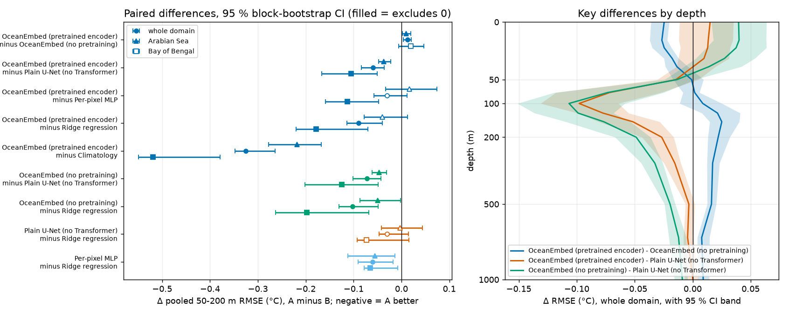

# R1 — rigour: seeds, stronger baselines, confidence intervals

Test year 2024 (350 days), reference GLORYS, North Indian Ocean. Produced by
`oceanembed research r1 --config configs/poc.yaml --seeds 0,1,2,3,4 --mlp-seeds 3` followed by
`oceanembed research r1-report --config configs/poc.yaml`; the full generated tables are in
`outputs/poc/research/r1/summary.md`.

## What was run

| Method | What it is | Seeds |
|---|---|---|
| OceanEmbed (pretrained) | CNN + Transformer encoder with masked pretraining, then the decoder; pretraining repeated for every seed | 5 |
| OceanEmbed (no pretraining) | the same network trained from scratch | 5 |
| Plain U-Net | the same stem and decoder with the Transformer replaced by four residual conv blocks (3.73 M vs 3.74 M parameters) | 5 |
| Per-pixel MLP | one small network (138 k parameters) on a single cell's 11 features: no spatial context at all | 3 |
| Ridge regression, climatology | deterministic | 1 |

Uncertainty is reported two ways: the spread across training seeds (mean ± SD), and a moving-block bootstrap over the
test days (2 000 replicates). Daily errors stay correlated for about six weeks (e-folding 37 – 45 days), so blocks of
42 days are used; 10 – 15 day blocks would understate the intervals by about a quarter. A difference between two
methods is called *established* only when the paired bootstrap interval excludes zero **and** the seed ranges do not
overlap.

## Thermocline, 50 – 200 m

| Method | RMSE °C, seed mean ± SD | 95 % interval over test days | Anomaly correlation | Skill vs climatology |
|---|---|---|---|---|
| OceanEmbed (no pretraining) | **1.052 ± 0.015** | 1.00 – 1.08 | 0.658 | 0.427 |
| OceanEmbed (pretrained) | 1.064 ± 0.016 | 1.01 – 1.10 | 0.651 | 0.413 |
| Per-pixel MLP | 1.094 ± 0.005 | 1.01 – 1.15 | 0.625 | 0.380 |
| Plain U-Net | 1.124 ± 0.031 | 1.05 – 1.18 | 0.610 | 0.345 |
| Ridge regression | 1.155 | 1.06 – 1.20 | 0.559 | 0.310 |
| Climatology | 1.390 | 1.31 – 1.42 | – | 0 |

By basin (RMSE °C, seed mean):

| Method | Arabian Sea | Bay of Bengal |
|---|---|---|
| OceanEmbed (no pretraining) | 1.089 | **0.988** |
| OceanEmbed (pretrained) | 1.099 | 1.007 |
| Per-pixel MLP | **1.083** | 1.120 |
| Plain U-Net | 1.136 | 1.112 |
| Ridge regression | 1.139 | 1.186 |
| Climatology | 1.317 | 1.527 |

## Findings

1. **The gain over climatology and ridge regression is real.** OceanEmbed is 0.33 °C below climatology and 0.09 – 0.10 °C
   below ridge regression over 50 – 200 m; both are established.
2. **Masked pretraining does not help.** The pretrained model is 0.013 °C *worse* than the from-scratch one (paired
   interval 0.004 to 0.020). The seed ranges overlap (Welch p = 0.24), so the honest statement is "no benefit", not
   "harmful". It does give a small gain in the top 30 m and a small loss at 100 – 300 m.
3. **The Transformer matters; a plain U-Net does not match it.** Replacing the Transformer by convolutions costs
   0.06 – 0.07 °C (established), and the U-Net is not distinguishable from ridge regression. It is also the least stable
   across seeds (SD 0.031).
4. **Most of the skill needs no spatial context.** A per-pixel MLP reaches 1.094 °C. OceanEmbed's advantage over it is
   0.03 – 0.04 °C and is **not established** for the whole domain (paired interval −0.058 to +0.011).
5. **Spatial context pays in the Bay of Bengal, not in the Arabian Sea.** In the Bay of Bengal OceanEmbed is about
   0.11 – 0.13 °C better than the MLP; in the Arabian Sea the MLP is level or slightly better.
6. **Near the surface the simplest non-linear model wins.** At 0 – 30 m the MLP has the lowest error (0.51 °C at the
   surface against 0.54 – 0.57 °C); at 75 – 100 m the Transformer models are 0.06 – 0.09 °C better than the MLP.
7. **No method has skill below about 300 m.** At 500 – 1 000 m every model is within 0.03 °C of climatology, and ridge
   regression and climatology are marginally best.
8. **A single run is not enough.** Seed-to-seed SD is 0.015 °C for the Transformer models and 0.031 °C for the U-Net; the
   day-sampling interval on a pooled RMSE is about ± 0.05 °C. The earlier single-seed numbers (1.08 and 1.04 °C) sit
   inside these ranges.

## What this changes

- The headline model should be the **from-scratch** network; pretraining is reported as a negative result.
- The claim "an embedding of the basin reconstructs the interior" is too strong. The supported claim is narrower:
  a non-linear point-wise mapping carries most of the skill, and basin-wide attention adds a measurable amount in the
  Bay of Bengal thermocline.
- The Arabian Sea / Bay of Bengal contrast and the depth dependence of the spatial-context gain are the most
  interesting results for a paper, and they call for the physical analysis planned in R5 (barrier layer and fresh-water
  stratification in the Bay of Bengal are the obvious hypotheses to test).

## Limits of R1

- One test year. Intervals describe sampling of days within 2024, not year-to-year variability.
- GPU training is close to but not exactly reproducible for a given seed.
- The MLP used three seeds; ridge and climatology are deterministic.
- All scores are against GLORYS; the Argo comparison was not repeated per seed.
