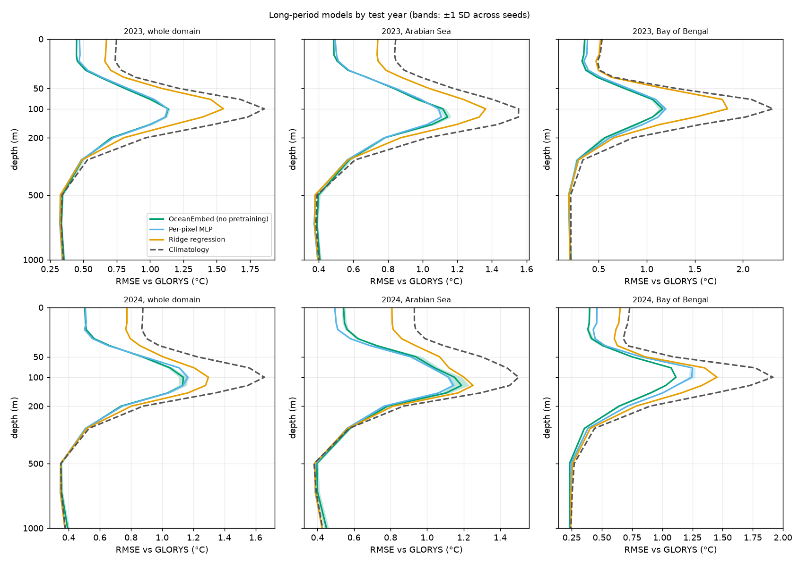
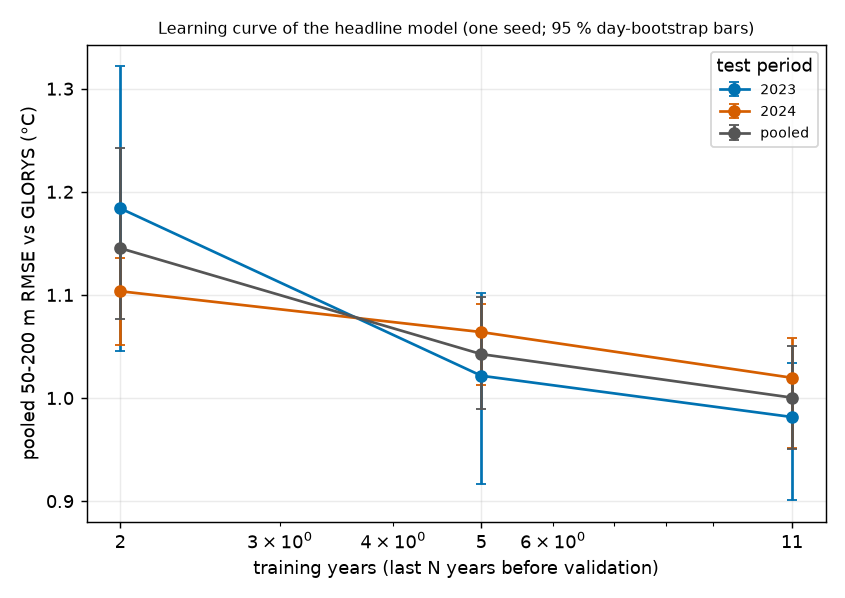

# R2 — eleven training years, two test years

Run `poc_long`: the same products and domain over 2011 – 2024. Train 2011 – 2021 (4 018 days), validate 2022,
test **2023** (365 days) and **2024** (350 days) separately. Produced by `oceanembed research r2 --config
configs/poc_long.yaml` and `r2-report`; full tables in `outputs/poc_long/research/r2/summary.md`.

The period starts in 2011 so that all of it lies in the satellite-salinity era. Models: the headline network
(CNN + Transformer, trained from scratch, 3 seeds), the per-pixel MLP (3 seeds), ridge regression and the harmonic
climatology, all fitted on 2011 – 2021. Intervals are moving-block bootstraps over the days of each test year
(70-day blocks, from the measured decorrelation time).

## Thermocline, 50 – 200 m, against GLORYS

| Method | 2023 RMSE °C | 2024 RMSE °C | Both years | Skill vs climatology (2023 / 2024) | Anomaly correlation (2023 / 2024) |
|---|---|---|---|---|---|
| **OceanEmbed (no pretraining)** | **0.975 ± 0.007** | **1.004 ± 0.014** | **0.989 ± 0.010** | 0.59 / 0.48 | 0.76 / 0.69 |
| Per-pixel MLP | 0.984 ± 0.002 | 1.024 ± 0.008 | 1.004 ± 0.004 | 0.58 / 0.46 | 0.76 / 0.67 |
| Ridge regression | 1.270 | 1.138 | 1.207 | 0.30 / 0.33 | 0.54 / 0.56 |
| Climatology | 1.519 | 1.394 | 1.459 | 0 | – |

By basin, both years pooled: Arabian Sea — OceanEmbed 1.018, MLP 0.996, ridge 1.150, climatology 1.350;
Bay of Bengal — OceanEmbed 0.938, MLP 1.015, ridge 1.306, climatology 1.649.

## More training data (same test year, 2024)

| Method | 5 training years (R1) | 11 training years | Change |
|---|---|---|---|
| OceanEmbed (no pretraining) | 1.052 ± 0.015 | 1.004 ± 0.014 | −0.048 (established) |
| Per-pixel MLP | 1.094 ± 0.005 | 1.024 ± 0.008 | −0.071 (established) |
| Ridge regression | 1.155 | 1.138 | −0.016 (not distinguishable) |
| Climatology | 1.390 | 1.394 | +0.004 |

Learning curve of the headline model (one seed, both test years pooled): 2 training years 1.145 °C, 5 years
1.043 °C, 11 years 1.000 °C.

## Against Argo floats, 50 – 200 m

| Year | Matchups | GLORYS itself | OceanEmbed | Ridge | Climatology |
|---|---|---|---|---|---|
| 2023 | 37 329 | 1.02 | 1.22 | 1.28 | 1.45 |
| 2024 | 40 059 | 1.08 | 1.38 | 1.46 | 1.57 |

## Findings

1. **The result holds on a second, independent year.** In 2023 the model is 0.54 °C below climatology and 0.30 °C
   below ridge regression over 50 – 200 m; in 2024, 0.39 and 0.13 °C. Skill against climatology is 0.59 and 0.48.
2. **The year-to-year difference in error is not statistically distinguishable** (2024 minus 2023: +0.03 °C, interval
   −0.06 to +0.11), although 2024 is the harder year in skill terms for both non-linear models.
3. **More training years help, with diminishing returns.** Going from 5 to 11 years lowers the 2024 error by 0.05 °C
   for the Transformer and 0.07 °C for the per-pixel MLP (both established); from 2 to 5 years the gain was 0.10 °C.
   Linear regression barely benefits.
4. **With more data the per-pixel MLP closes most of the gap.** Whole domain, both years: 1.004 against 0.989 °C
   (difference 0.015 °C, interval 0.001 to 0.026).
5. **The basin contrast persists and sharpens into a two-sided result.** In the Bay of Bengal the Transformer is
   better in both years (by 0.045 °C in 2023 and 0.111 °C in 2024; established). In the Arabian Sea the per-pixel MLP is
   *better* (by 0.022 °C over both years; established).
6. **Still no skill below about 300 m**, with eleven years of training: at 500 – 1 000 m the Transformer is within
   0.005 °C of climatology (slightly worse), the MLP and ridge 0.006 °C better.
7. **The surface cold bias is present in both years** (−0.13 °C in 2023, −0.21 °C in 2024 against GLORYS; the
   climatology's own is −0.43 and −0.62 °C), so it reflects a warming ocean relative to the training period rather than
   something peculiar to 2024.
8. **Against Argo the ordering is the same in both years**, and GLORYS is about 0.4 – 0.5 °C warmer than the floats over
   50 – 200 m in both, so the reanalysis bias reported for 2024 is not specific to that year.

## What this changes

- The headline numbers become those of the eleven-year model, quoted for two test years: **0.98 °C (2023) and
  1.00 °C (2024)** over 50 – 200 m, against 1.52 and 1.39 °C for climatology.
- The claim about spatial context is now precise: basin-wide attention helps in the Bay of Bengal and does not help
  — slightly hurts — in the Arabian Sea, on two independent years.

## Limits of R2

- Three seeds per non-linear model; the learning curve uses one seed.
- The training arrays are read from a float16 disk cache (rounding ≤ 0.004 °C).
- The two climatologies (2018 – 2022 and 2011 – 2021) differ slightly, so skill values of R1 and R2 are each relative
  to their own climatology; absolute RMSE is directly comparable.
- Argo scores use one seed of the headline model.
