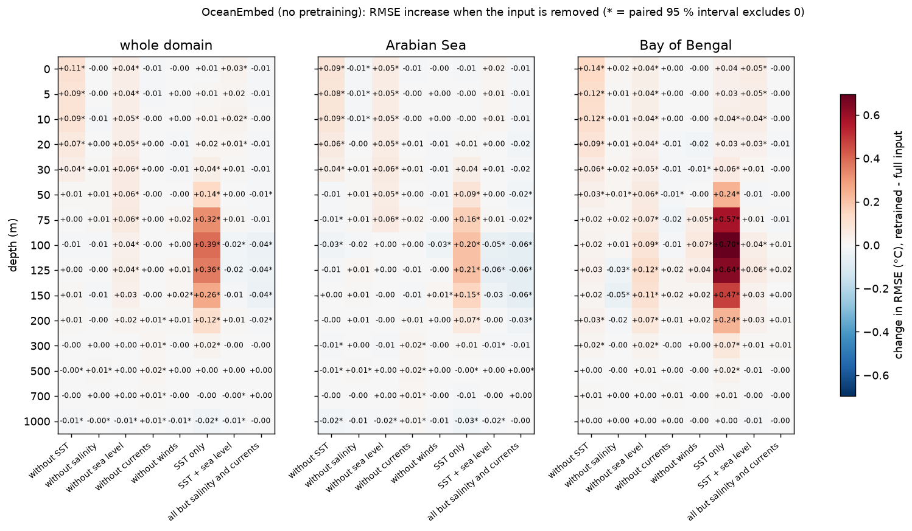

# R3 — which surface variable matters at which depth, and does history help?

Test year 2024 (350 days), reference GLORYS. Produced by `oceanembed research r3 --config configs/poc.yaml`
followed by `oceanembed research r3-report`; full tables in `outputs/poc/research/r3/summary.md`.

## What was run

All experiments use the headline model (CNN + Transformer, trained from scratch, 2 seeds) and the per-pixel MLP
(3 seeds), compared with the full-input models of R1 by paired block bootstrap (39-day blocks).

| Experiment | What changes |
|---|---|
| Retrain without one group | SST, salinity, sea level, currents (U, V) or winds (U, V) zeroed for every day, then retrained |
| Reduced input sets | SST only; SST + sea level; everything except salinity and currents |
| Permutation importance | on the trained R1 models, one group is shuffled between days of the same calendar month (no retraining) |
| Input history | the surface fields of the previous 2 or 6 days added as channels (k = 3, k = 7), scored on identical test days |

## Thermocline, 50 – 200 m: change in RMSE when a variable is removed and the model retrained

Positive = worse without it. `*` = paired interval excludes zero.

| Removed | Transformer, whole domain | Transformer, Bay of Bengal | Per-pixel MLP, whole domain | Per-pixel MLP, Bay of Bengal |
|---|---|---|---|---|
| SST | +0.002 | +0.024 | +0.008 | +0.002 |
| Salinity | +0.000 | −0.008 | −0.008 | −0.014 |
| **Sea level** | **+0.042 \*** | **+0.087 \*** | **+0.267 \*** | **+0.417 \*** |
| Currents | +0.002 | +0.002 | +0.009 \* | +0.020 |
| Winds | +0.008 | +0.037 \* | +0.005 | +0.010 |

Reduced input sets (pooled 50 – 200 m RMSE, full input = 1.066 for the Transformer seeds used, 1.094 for the MLP):

| Inputs | Transformer | Per-pixel MLP |
|---|---|---|
| SST only | 1.344 (+0.278 \*) | 1.385 (+0.290 \*) |
| SST + sea level | 1.060 (−0.006) | 1.088 (−0.006) |
| All except salinity and currents | **1.039 (−0.027 \*)** | 1.090 (−0.005) |

## By depth (Transformer, whole domain)

- **0 – 30 m: SST.** Removing it costs +0.10 °C at the surface, falling to +0.04 °C at 30 m and nothing below 50 m.
- **0 – 150 m: sea level.** Removing it costs +0.03 to +0.06 °C at every level from the surface to 125 m.
- **50 – 200 m with SST alone:** the error rises by up to +0.39 °C at 100 m; SST by itself carries almost no thermocline information.
- **Below 300 m:** no variable matters; changes are within ± 0.02 °C and no input set produces skill there.

## Input history

| History | Transformer, 50 – 200 m | Change vs one day | Per-pixel MLP, 50 – 200 m | Change vs one day |
|---|---|---|---|---|
| k = 3 days | 1.061 | −0.005 (not distinguishable from zero) | 1.106 | +0.011 (not distinguishable) |
| k = 7 days | 1.053 | −0.013 (not distinguishable) | 1.086 | −0.009 (not distinguishable) |

Skill at 500 – 1 000 m does not improve with history for either model, and near the surface the Transformer is
0.02 °C worse with history than without.

## Findings

1. **Sea level anomaly is the one indispensable input for the thermocline.** It is the only variable whose removal
   clearly hurts both models (for the per-pixel MLP, removing currents also costs a small 0.009 °C). The effect is
   largest in the Bay of Bengal.
2. **SST alone is not enough.** A model given only SST loses 0.28 – 0.29 °C over 50 – 200 m, most of the gain over
   climatology. SST matters in the top 30 m only.
3. **SST and sea level together reproduce the full seven-variable result.** Adding salinity, currents and winds on top
   of those two gives no measurable gain in the thermocline.
4. **Fewer inputs can be better.** Dropping salinity and currents improves the Transformer by 0.027 °C (established),
   mainly in the Arabian Sea, which points to over-fitting of weakly informative inputs with five training years.
5. **Salinity as an input adds nothing, even in the Bay of Bengal.** R5 showed that the spatial model's advantage is
   largest in fresh surface water; R3 shows that this advantage does not come from *using* the salinity field. Fresh
   regions are where spatial context helps, but the salinity map itself is not what the model exploits.
6. **A spatial model can replace missing sea level; a per-pixel model cannot.** Without sea level the per-pixel MLP
   degrades by 0.27 °C, the Transformer by only 0.04 °C. The likely reason is that surface currents are largely
   geostrophic, i.e. the horizontal gradient of sea level, which a model that sees the whole map can integrate. This is
   consistent with currents ranking second in the permutation test (+0.026 °C) while costing nothing to remove.
7. **Several days of input history do not help.** Neither 3 nor 7 days of surface history improves the thermocline
   (changes within the uncertainty) or brings any skill below 300 m, and history does not change the Bay of Bengal /
   Arabian Sea contrast.
8. **The two attribution methods agree on what matters and disagree on what is redundant**, as expected with correlated
   inputs: both rank sea level first; permutation ranks currents second, retraining shows they are replaceable.

## What this means

- A minimal operational version needs **SST and sea level only** (plus winds in the Bay of Bengal), which are also the
  two best-established, lowest-latency satellite products.
- The limit below ~300 m is a limit of the information in the surface fields on daily scales, not of the model or
  of missing temporal context.
- The Bay of Bengal advantage of the spatial model is tied to how it uses sea level and its spatial structure, not to
  salinity.

## Limits of R3

- Two seeds for the Transformer experiments (three for the MLP); the reference uses the R1 seeds.
- Removal is by zeroing a standardised input, and the remaining inputs are correlated with it, so "no effect when
  removed" means "replaceable", not "carries no information".
- Permutation within a calendar month measures sub-monthly information only.
- One test year, scores against GLORYS.
