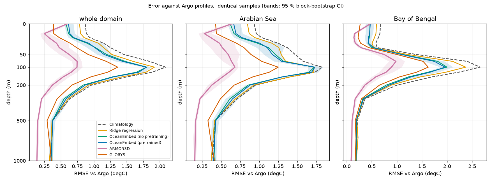
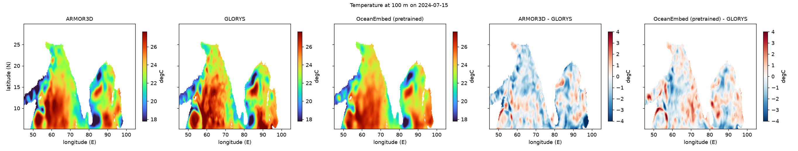

# R4 — external benchmark: the operational observation-based product (ARMOR3D)

Test year 2024 (350 days, 2024-01-01 to 2024-12-15). Produced by `oceanembed research r4 --config configs/poc.yaml`;
the full generated tables are in `outputs/poc/research/r4/summary.md`.

## What was run

| | |
|---|---|
| Product | ARMOR3D, Copernicus Marine `MULTIOBS_GLO_PHY_TSUV_3D_MYNRT_015_012`, variable `to` (temperature) |
| Dataset used | `cmems_obs-mob_glo_phy_my_0.125deg_P1D-m`, reprocessed ("my"), version 202511 |
| Grid and time | 0.125°, 50 levels (37 within 0–1 100 m), **daily**, 1993-01-01 to 2024-12-31 |
| Coverage of 2024 | complete: all 350 test days have a field. The near-real-time dataset only starts on 2024-09-08 and is not used, so the product does not change during the year |
| Download | 12 monthly subsets (5–30°N plus a 0.5° halo, 0–1 100 m), 754 MB on disk, about 20 minutes |
| Regridding | the GLORYS rules: linear in the vertical to the 15 standard depths, then a 2 × 2 block mean onto the 0.25° grid; no interpolation in time |

Two scorings, each on exactly the same samples for every product:

- **Against Argo.** The 40 059 profile levels (2 826 profiles) of `validate-argo`; ARMOR3D is read in the same cell, on the same
  day and at the same level. 40 052 levels have an ARMOR3D value and are kept for all products. Products: ARMOR3D, OceanEmbed
  (pretrained), OceanEmbed (no pretraining), ridge, climatology and GLORYS.
- **On the grid.** Per day and depth, every product against GLORYS, and against ARMOR3D, on the cells where the static mask,
  GLORYS and ARMOR3D are all defined.

Intervals are 95 % moving-block bootstrap over test days (blocks of 38 days, 2 000 replicates), as in R1; differences are paired.

**Not independent of Argo.** ARMOR3D is built from satellite data *and in-situ profiles*, Argo among them, so scoring it against
Argo is scoring it on part of its own input. GLORYS assimilates Argo too. OceanEmbed sees no in-situ data at prediction time, but
it is trained on GLORYS and so inherits GLORYS's errors.

## Against Argo, pooled 50–200 m

| Product | RMSE °C [95 % CI] | bias | anomaly correlation | skill vs climatology |
|---|---|---|---|---|
| **ARMOR3D** | **0.63 [0.57, 0.69]** | 0.09 | 0.92 | 0.86 |
| GLORYS | 1.08 [1.02, 1.15] | 0.49 | 0.80 | 0.58 |
| OceanEmbed (pretrained) | 1.41 [1.38, 1.47] | 0.64 | 0.61 | 0.28 |
| OceanEmbed (no pretraining) | 1.41 [1.39, 1.47] | 0.65 | 0.61 | 0.28 |
| Ridge regression | 1.53 [1.44, 1.60] | 0.68 | 0.51 | 0.16 |
| Climatology | 1.67 [1.55, 1.78] | 0.51 | – | 0 |

Same rows, per basin (RMSE °C): Arabian Sea ARMOR3D 0.58, GLORYS 1.00, OceanEmbed 1.38, climatology 1.52; Bay of Bengal
ARMOR3D 0.75, GLORYS 1.27, OceanEmbed 1.51, climatology 2.02.

## On the grid, pooled 50–200 m

| Product | vs GLORYS: RMSE °C | anomaly corr. | bias | vs ARMOR3D: RMSE °C | anomaly corr. |
|---|---|---|---|---|---|
| OceanEmbed (no pretraining) | **1.04 [1.00, 1.07]** | 0.67 | 0.04 | **1.15 [1.10, 1.18]** | 0.65 |
| OceanEmbed (pretrained) | 1.08 [1.03, 1.11] | 0.64 | 0.02 | 1.18 [1.13, 1.23] | 0.62 |
| Ridge regression | 1.15 [1.06, 1.21] | 0.56 | 0.06 | 1.19 [1.14, 1.24] | 0.61 |
| ARMOR3D / GLORYS (the other reference) | 1.20 [1.12, 1.27] | 0.68 | −0.47 | 1.20 [1.12, 1.27] | 0.68 |
| Climatology | 1.39 [1.32, 1.42] | – | −0.08 | 1.40 [1.32, 1.45] | – |

## Findings

1. **Against Argo, ARMOR3D is far better than every other product.** Its 50–200 m RMSE (0.63 °C) is 0.45 °C below GLORYS and
   0.79 °C below OceanEmbed (both paired intervals exclude zero, in both basins). It has the lowest RMSE at every level
   from 5 m to 1 000 m. This is the expected result for a product that ingests the profiles, so it is an upper
   bound on what an *independent* observation-based product would achieve, not a fair head-to-head.
2. **OceanEmbed is 0.34 °C worse than GLORYS against Argo** (1.41 against 1.08 °C; interval 0.29 to 0.40) and only 0.12 °C
   better than ridge regression (0.02 to 0.17). Its Argo error is mostly GLORYS's own error: the model reproduces GLORYS to about
   1.04 °C, and GLORYS sits about 0.5 °C warm of the floats in the thermocline (bias +0.77 °C at 100 m).
3. **The thermocline warm bias is shared.** At 100 m the bias against Argo is +1.06 °C for OceanEmbed, +0.77 °C for GLORYS and
   +0.14 °C for ARMOR3D. The 0.47 °C mean offset between ARMOR3D and GLORYS on the grid has the same sign and size. Whether the
   floats or the reanalysis are "right" is not decided here; the floats are a sample of where and when profiles exist.
4. **On the grid OceanEmbed is closer to GLORYS than ARMOR3D is** (1.04 to 1.08 against 1.20 °C, paired differences −0.12 to −0.16
   °C, intervals exclude zero), which is no surprise because it was trained to reproduce GLORYS. Against ARMOR3D as the
   reference, OceanEmbed (pretrained) is level with GLORYS for the whole domain (paired difference −0.016 °C, interval −0.058
   to 0.036), clearly closer in the Bay of Bengal (−0.115, −0.146 to −0.052) and not closer in the Arabian Sea (+0.036,
   −0.024 to 0.096).
5. **The two references disagree about as much as OceanEmbed disagrees with either.** ARMOR3D and GLORYS differ by 1.20 °C RMSE
   in the thermocline, so a reconstruction error of 1.0–1.1 °C against GLORYS is of the same order as the uncertainty in what the
   truth is.
6. **Near the surface the product is not better.** At 0 m ARMOR3D has an RMSE of 0.59 °C against Argo, about the same as
   OceanEmbed (0.58–0.62 °C) and worse than GLORYS (0.39 °C); at 5 m it is far better (0.25 °C). The cause was not
   investigated; the 0 m level is a poor comparison for every product, since the shallowest float level is typically a few metres down.
7. **Does ARMOR3D lean on nearby floats? No evidence either way.** Terciles of the number of other Argo profiles within ±3 days
   and ±2° show every product doing better where floats are dense. The ARMOR3D advantage over OceanEmbed is not clearly
   different between sparse and dense regions (difference of differences +0.07, interval −0.02 to 0.13) and its advantage over
   GLORYS is, if anything, smaller where floats are dense (+0.19, 0.12 to 0.27). This is a weak test: the matched profile itself is
   always an ARMOR3D input, and the density of *other* floats says little about it. The dependence on Argo is therefore stated, not
   measured.
8. **Where this leaves OceanEmbed.** It is a surface-only reconstruction trained on one reanalysis: it beats climatology (0.26 °C)
   and ridge regression against floats, but an operational product that uses subsurface observations is much closer to the
   floats. The honest framing is that OceanEmbed offers a cheap, in-situ-free estimate with a known error of about 1.4 °C against
   floats in the thermocline, not a competitor for ARMOR3D's accuracy.

## Limits of R4

- One year; intervals describe day sampling only.
- ARMOR3D is not independent of the floats (finding 1); the density check does not remove that.
- Argo levels are interpolated to 15 standard depths with the conservative `validate-argo` rule and compared with daily 0.25°
  cell means, so representativeness error is included for every product alike.
- OceanEmbed (the pretrained model) is the main run's single model; the no-pretraining model is the main run's single seed (not the
  R1 seed mean).
- The grid scores use cells where both GLORYS and ARMOR3D are defined, i.e. away from the coast; they are not the R1 numbers (which
  use all GLORYS cells), though they agree to within 0.01 °C for the same method.
- ARMOR3D's temporal behaviour (how much of the daily variability is independent of its weekly-scale in-situ analysis) was not
  examined.
