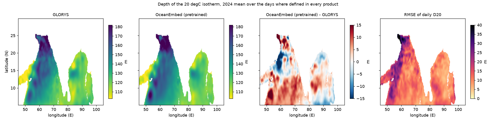

# R5 — physical metrics: isotherm depth, heat content and where the skill sits

Test year 2024 (350 days), reference GLORYS, North Indian Ocean. Produced by `oceanembed research r5 --config configs/poc.yaml`
from the existing daily predictions (no training, CPU only, about 100 s); the full generated tables are in
`outputs/poc/research/r5/summary.md`.

## What was run

Products: OceanEmbed (pretrained, the main run's model), OceanEmbed (no pretraining), ridge regression, climatology, and the
per-pixel MLP of R1 (seed 0, run again on the surface inputs; no retraining). The test year is streamed one day at a time.

| Quantity | Definition |
|---|---|
| D20, D23 | depth of the 20 / 23 °C isotherm: the **shallowest downward crossing** (`T_k ≥ level > T_{k+1}` between adjacent valid standard levels), linear in temperature between the two level depths; NaN if the surface is already colder, or the isotherm is not bracketed above the deepest valid level (shallow water, or warmer than the level everywhere) |
| Heat content 0–300 m | ρ·cp·∫T dz, ρ = 1 025 kg m⁻³, cp = 3 990 J kg⁻¹ K⁻¹, trapezoid over the 12 standard levels 0–300 m, only where all 12 are valid; the equivalent mean temperature is the same number divided by ρ·cp·300 m |
| Mean temperature 0–30 m | trapezoid mean over 0–30 m (mixed-layer proxy), only where all 5 levels are valid |

Every product goes through the same functions. A quantity is scored on the cells where **all** products and GLORYS have it defined
(D20: 81.4 % of ocean cell-days; D23: 82.1 %; heat content: 80.0 %; 0–30 m: 91.9 %), so every product has the same sample. Anomalies
are taken against the climatology's own derived quantity. Intervals are 95 % moving-block bootstrap over days (blocks of 41 days,
2 000 replicates), differences are paired.

Strata of the pooled 50–200 m temperature: season (winter monsoon Dec–Feb, pre-monsoon Mar–May, summer monsoon Jun–Sep,
post-monsoon Oct–Nov; the test data end on 15 December), basin, terciles of |SLA| per cell-day (domain-wide edges 0.083 and
0.158 m) and terciles of Bay of Bengal surface salinity per cell-day (edges 31.99 and 32.89), which is a **proxy** for
fresh-water stratification, not a measured barrier layer.

## Derived quantities, whole domain

| Product | D20 RMSE m | D20 anom. corr. | Heat content RMSE 10⁹ J m⁻² | (mean T 0–300 m, °C) | anom. corr. | 0–30 m RMSE °C |
|---|---|---|---|---|---|---|
| Climatology | 17.6 [16.2, 18.4] | – | 1.02 [0.96, 1.06] | 0.84 | – | 0.79 [0.73, 0.87] |
| Ridge regression | 15.0 [13.6, 15.7] | 0.55 | 0.81 [0.73, 0.86] | 0.66 | 0.61 | 0.72 [0.64, 0.81] |
| Per-pixel MLP | 14.1 [12.9, 14.8] | 0.63 | 0.73 [0.67, 0.77] | 0.59 | 0.70 | **0.51 [0.49, 0.54]** |
| OceanEmbed (no pretraining) | **13.8 [13.1, 14.3]** | 0.65 | **0.72 [0.69, 0.74]** | 0.59 | 0.71 | 0.57 [0.52, 0.64] |
| OceanEmbed (pretrained) | 14.6 [13.6, 15.2] | 0.61 | 0.76 [0.72, 0.78] | 0.62 | 0.68 | 0.58 [0.52, 0.65] |

By basin, D23 RMSE (m): Bay of Bengal 8.7 (no pretraining), 8.8 (pretrained), 10.2 (MLP), 11.0 (ridge), 14.9 (climatology);
Arabian Sea 13.9, 14.4, 13.7, 14.6, 17.3.

## Pooled 50–200 m RMSE by season (°C; no-pretraining model, MLP, climatology)

| Season | Whole domain | Arabian Sea | Bay of Bengal |
|---|---|---|---|
| Winter monsoon | 1.08 / 1.21 / 1.53 | 1.13 / 1.12 / 1.32 | **0.99 / 1.38 / 1.87** |
| Pre-monsoon | 1.05 / 1.06 / 1.36 | 1.13 / 1.03 / 1.29 | **0.90 / 1.13 / 1.49** |
| Summer monsoon | 1.00 / 0.97 / 1.29 | 1.00 / 0.95 / 1.25 | 0.99 / 1.01 / 1.37 |
| Post-monsoon | 1.07 / 1.22 / 1.44 | 1.10 / 1.28 / 1.47 | 1.00 / 1.09 / 1.39 |

## Findings

1. **The derived quantities inherit the skill, with the same ranking.** OceanEmbed (no pretraining) reduces the D20 RMSE from 17.6 m
   (climatology) to 13.8 m, the 0–300 m heat-content RMSE from 1.02 to 0.72 × 10⁹ J m⁻² (0.84 to 0.59 °C as mean temperature) and
   has an anomaly correlation of 0.65 for D20 and 0.71 for heat content. It is better than ridge regression for D20 by 1.15 m
   (paired interval −1.66 to −0.40) and for heat content (established).
2. **Against the per-pixel MLP there is no established difference in the whole-domain derived quantities** (D20: −0.26 m, interval
   −0.75 to +0.35; heat content: interval spans zero). This matches R1: most of the skill needs no spatial context.
3. **The pretrained model is again worse than the from-scratch one** (D20 +0.72 m, 0.48 to 0.98; heat content +3.9 × 10⁷ J m⁻²,
   established); pretraining brings nothing here either.
4. **In the top 30 m the MLP is best** (0.51 against 0.57 °C), repeating the R1 finding; the difference to the no-pretraining
   model has an interval just touching zero (0.059, −0.005 to 0.128).
5. **The Bay of Bengal advantage is real for the thermocline and seasonal.** The no-pretraining model beats the MLP by 0.17 °C
   (0.06 to 0.27) in the Bay of Bengal over the year, and by 0.39 °C in the winter monsoon (0.16 to 0.51), 0.23 °C pre-monsoon and
   0.09 °C post-monsoon; in the summer monsoon the two are level (−0.02, −0.10 to +0.04). In the Arabian Sea the MLP is as good or
   better (pre-monsoon and summer monsoon: the MLP is 0.10 and 0.05 °C better, intervals exclude zero). For D23 in the Bay of
   Bengal the gain over the MLP is 1.5 m (0.4 to 2.4); for D20 it is 0.5 m and not established.
6. **Eddy regime: the hypothesis is not supported.** Over the whole domain the gain over climatology is no larger in the highest
   |SLA| tercile than in the lowest (difference of gains +0.10 °C, interval −0.04 to 0.26), and the gains over ridge and the MLP
   are, if anything, smaller there (−0.06 to −0.08, not established). In the Bay of Bengal the gain over ridge regression is
   *larger* where |SLA| is small (pretrained model: high minus low −0.19, −0.25 to −0.03; no-pretraining model −0.21, −0.28 to 0.00). Only in the Arabian Sea does the gain over climatology
   rise with |SLA| (+0.27, 0.19 to 0.38), but that is because climatology itself gets worse there (RMSE 1.22 to 1.50 °C), and the
   gain over ridge and the MLP does not rise with it.
7. **Salinity stratification: supported, as a proxy.** In the Bay of Bengal the gain over the MLP is largest where surface salinity
   is lowest: 0.34 °C (0.15 to 0.49) in the freshest tercile for the no-pretraining model, 0.19 in the middle one and 0.04 (not
   established) in the saltiest; the difference of gains is −0.29 °C (−0.44 to −0.06). The MLP is worst exactly there (1.26 °C
   against 0.93 °C). Within each season the freshest tercile still shows the largest gain in winter, summer and post-monsoon (it is flat in the
   pre-monsoon, where the freshest tercile holds only 9 % of the samples), so it is not only a season effect. It could still be a latitude or
   river-plume effect: salinity is a stand-in, not a barrier-layer thickness.
8. **Mean biases are not removed by the model.** D20 is too deep by 2.7–3.2 m for every learned model (climatology +1.6 m), the 0–30 m
   temperature too cool by 0.24–0.43 °C. Heat content has almost no bias (below 0.07 × 10⁹ J m⁻²).

## Limits of R5

- One test year and one training run per OceanEmbed variant; the MLP is a single R1 seed. The no-pretraining model is the main run's
  seed, not the R1 seed mean.
- Seasons are sets of days; their intervals come from restricting full-year block-bootstrap replicates to the season's days, so the
  winter monsoon (Dec–Feb, split between the start and end of the year) is the least reliable.
- Terciles are of cell-days pooled over the domain; |SLA| and salinity correlate with latitude, season and basin, which the tables
  only partly separate. The salinity proxy says nothing about mixed-layer or barrier-layer depth itself.
- D20 and D23 are undefined in about 18 % of cell-days (shelves, warm shallow water, cold surface), exactly the cells where the models
  may behave differently; the scores describe the open ocean.
- Many comparisons were made (3 hypotheses, 5 products, 3 basins, 4 seasons); single intervals that just exclude zero should not be
  over-read.
- All scores are against GLORYS, not independent observations (see R4).
