# OceanEmbed report - run `final`

## 1. Setup

| item | value |
|---|---|
| data source | **real** |
| domain | 5.0-30.0 N, 45.0-105.0 E at 0.25 deg, daily |
| depth levels (m) | 0, 5, 10, 20, 30, 50, 75, 100, 125, 150, 200, 300, 500, 700, 1000 |
| period | 2011-01-01 to 2024-12-15 |
| train / val / test | 2011-01-01..2021-12-31 / 2022-01-01..2022-12-31 / 2023-01-01..2024-12-15 |
| evaluated split | test (2023-01-01 to 2024-12-15, 715 days; years 2023, 2024 also scored separately) |
| main model | trained from scratch |
| model inputs | sst, sla (not used: sss, currents, winds) |
| target | GLORYS reanalysis, harmonised to the 0.25 degree grid |
| climatology | harmonic fit (mean + annual + semi-annual) on the train split 2011-01-01..2021-12-31 |

Methods compared:

| key | method | details |
|---|---|---|
| `model` | OceanEmbed (no pretraining) | checkpoint `recon.pt`, epoch 3, val RMSE 0.686 degC |
| `model_pretrained` | OceanEmbed (pretrained encoder) | checkpoint `recon_pretrained.pt`, epoch 4, val RMSE 0.691 degC |
| `ridge` | Ridge regression | ridge.joblib |
| `mlp` | Per-pixel MLP | mlp.pt |
| `climatology` | Climatology | harmonic climatology fitted on the train split |

Metric conventions: bias = prediction - reference; `corr_raw` is the correlation of the temperatures themselves (inflated by seasonal, spatial and vertical gradients); `corr_anom` is the correlation of anomalies with the climatology removed from both fields (the meaningful day-to-day skill); skill = 1 - MSE / MSE_climatology.

## 2. Results against the GLORYS target

### RMSE (degC) by depth

| depth (m) | OceanEmbed (no pretraining) | OceanEmbed (pretrained encoder) | Ridge regression | Per-pixel MLP | Climatology |
|---|---|---|---|---|---|
| 0 | 0.47 | 0.47 | 0.73 | 0.48 | 0.81 |
| 5 | 0.47 | 0.47 | 0.72 | 0.49 | 0.81 |
| 10 | 0.48 | 0.48 | 0.72 | 0.48 | 0.81 |
| 20 | 0.55 | 0.53 | 0.75 | 0.54 | 0.84 |
| 30 | 0.64 | 0.64 | 0.83 | 0.64 | 0.94 |
| 50 | 0.82 | 0.84 | 1.05 | 0.84 | 1.22 |
| 75 | 1.01 | 1.04 | 1.35 | 1.08 | 1.62 |
| 100 | 1.12 | 1.11 | 1.45 | 1.17 | 1.76 |
| 125 | 1.12 | 1.10 | 1.35 | 1.14 | 1.65 |
| 150 | 1.02 | 1.00 | 1.18 | 1.03 | 1.41 |
| 200 | 0.74 | 0.73 | 0.81 | 0.74 | 0.93 |
| 300 | 0.50 | 0.50 | 0.50 | 0.50 | 0.53 |
| 500 | 0.35 | 0.35 | 0.34 | 0.34 | 0.34 |
| 700 | 0.35 | 0.35 | 0.34 | 0.34 | 0.34 |
| 1000 | 0.37 | 0.37 | 0.36 | 0.36 | 0.36 |

### Anomaly correlation by depth

| depth (m) | OceanEmbed (no pretraining) | OceanEmbed (pretrained encoder) | Ridge regression | Per-pixel MLP |
|---|---|---|---|---|
| 0 | 0.73 | 0.72 | 0.36 | 0.70 |
| 5 | 0.72 | 0.72 | 0.36 | 0.69 |
| 10 | 0.71 | 0.71 | 0.37 | 0.70 |
| 20 | 0.66 | 0.67 | 0.36 | 0.67 |
| 30 | 0.64 | 0.64 | 0.38 | 0.64 |
| 50 | 0.70 | 0.70 | 0.47 | 0.68 |
| 75 | 0.77 | 0.77 | 0.53 | 0.73 |
| 100 | 0.77 | 0.77 | 0.56 | 0.74 |
| 125 | 0.74 | 0.74 | 0.57 | 0.72 |
| 150 | 0.71 | 0.71 | 0.55 | 0.69 |
| 200 | 0.63 | 0.63 | 0.48 | 0.60 |
| 300 | 0.38 | 0.37 | 0.32 | 0.37 |
| 500 | 0.22 | 0.21 | 0.18 | 0.19 |
| 700 | 0.20 | 0.22 | 0.17 | 0.20 |
| 1000 | 0.15 | 0.15 | 0.10 | 0.15 |

### Skill vs climatology by depth

| depth (m) | OceanEmbed (no pretraining) | OceanEmbed (pretrained encoder) | Ridge regression | Per-pixel MLP |
|---|---|---|---|---|
| 0 | 0.67 | 0.67 | 0.21 | 0.65 |
| 5 | 0.66 | 0.66 | 0.20 | 0.63 |
| 10 | 0.64 | 0.65 | 0.21 | 0.64 |
| 20 | 0.57 | 0.60 | 0.21 | 0.59 |
| 30 | 0.53 | 0.53 | 0.21 | 0.54 |
| 50 | 0.55 | 0.53 | 0.26 | 0.53 |
| 75 | 0.61 | 0.59 | 0.30 | 0.55 |
| 100 | 0.59 | 0.60 | 0.33 | 0.56 |
| 125 | 0.54 | 0.55 | 0.33 | 0.52 |
| 150 | 0.47 | 0.50 | 0.30 | 0.46 |
| 200 | 0.36 | 0.38 | 0.23 | 0.36 |
| 300 | 0.10 | 0.10 | 0.10 | 0.13 |
| 500 | -0.01 | -0.01 | 0.04 | 0.03 |
| 700 | -0.03 | -0.01 | 0.04 | 0.05 |
| 1000 | -0.06 | -0.06 | 0.02 | 0.02 |

### Model detail by depth

| depth (m) | n | RMSE | bias | MAE | corr_raw | corr_anom | skill |
|---|---|---|---|---|---|---|---|
| 0 | 8570705 | 0.469 | -0.190 | 0.353 | 0.971 | 0.731 | 0.669 |
| 5 | 8570705 | 0.474 | -0.196 | 0.354 | 0.970 | 0.720 | 0.656 |
| 10 | 8319740 | 0.483 | -0.194 | 0.361 | 0.966 | 0.706 | 0.640 |
| 20 | 8103810 | 0.552 | -0.216 | 0.407 | 0.953 | 0.661 | 0.572 |
| 30 | 7877870 | 0.644 | -0.213 | 0.467 | 0.934 | 0.637 | 0.528 |
| 50 | 7540390 | 0.819 | -0.197 | 0.601 | 0.909 | 0.704 | 0.549 |
| 75 | 7242950 | 1.014 | -0.090 | 0.773 | 0.892 | 0.769 | 0.609 |
| 100 | 7057050 | 1.123 | 0.049 | 0.870 | 0.883 | 0.768 | 0.593 |
| 125 | 7013435 | 1.117 | 0.172 | 0.870 | 0.888 | 0.743 | 0.539 |
| 150 | 6977685 | 1.024 | 0.239 | 0.799 | 0.902 | 0.710 | 0.474 |
| 200 | 6915480 | 0.740 | 0.159 | 0.562 | 0.931 | 0.628 | 0.360 |
| 300 | 6855420 | 0.503 | 0.080 | 0.368 | 0.949 | 0.384 | 0.103 |
| 500 | 6754605 | 0.345 | 0.038 | 0.243 | 0.962 | 0.221 | -0.005 |
| 700 | 6665230 | 0.349 | 0.039 | 0.255 | 0.960 | 0.201 | -0.030 |
| 1000 | 6502925 | 0.373 | 0.029 | 0.269 | 0.932 | 0.151 | -0.056 |

### Summary by basin and pooled depth range

| method | region | RMSE all depths | RMSE 50-200 m | skill 50-200 m | corr_anom 50-200 m |
|---|---|---|---|---|---|
| OceanEmbed (no pretraining) | all | 0.717 | 0.983 | 0.547 | 0.733 |
| OceanEmbed (no pretraining) | arabian sea | 0.753 | 1.002 | 0.448 | 0.633 |
| OceanEmbed (no pretraining) | bay of bengal | 0.654 | 0.949 | 0.669 | 0.818 |
| OceanEmbed (pretrained encoder) | all | 0.713 | 0.979 | 0.550 | 0.733 |
| OceanEmbed (pretrained encoder) | arabian sea | 0.745 | 0.993 | 0.459 | 0.637 |
| OceanEmbed (pretrained encoder) | bay of bengal | 0.659 | 0.955 | 0.664 | 0.816 |
| Ridge regression | all | 0.904 | 1.218 | 0.303 | 0.534 |
| Ridge regression | arabian sea | 0.898 | 1.152 | 0.272 | 0.458 |
| Ridge regression | bay of bengal | 0.912 | 1.330 | 0.349 | 0.615 |
| Per-pixel MLP | all | 0.732 | 1.013 | 0.518 | 0.710 |
| Per-pixel MLP | arabian sea | 0.741 | 0.997 | 0.454 | 0.629 |
| Per-pixel MLP | bay of bengal | 0.713 | 1.041 | 0.601 | 0.780 |
| Climatology | all | 1.060 | 1.459 | 0.000 | - |
| Climatology | arabian sea | 1.037 | 1.350 | 0.000 | - |
| Climatology | bay of bengal | 1.107 | 1.649 | 0.000 | - |

### Results by test year (whole domain)

| period | method | RMSE all depths | RMSE 50-200 m | bias 50-200 m | skill 50-200 m | corr_anom 50-200 m |
|---|---|---|---|---|---|---|
| 2023 | OceanEmbed (no pretraining) | 0.707 | 0.974 | -0.020 | 0.589 | 0.761 |
| 2023 | OceanEmbed (pretrained encoder) | 0.698 | 0.964 | -0.070 | 0.598 | 0.767 |
| 2023 | Ridge regression | 0.923 | 1.280 | -0.125 | 0.290 | 0.530 |
| 2023 | Per-pixel MLP | 0.710 | 0.984 | -0.074 | 0.580 | 0.756 |
| 2023 | Climatology | 1.075 | 1.519 | -0.248 | 0.000 | - |
| 2024 | OceanEmbed (no pretraining) | 0.727 | 0.991 | 0.125 | 0.494 | 0.702 |
| 2024 | OceanEmbed (pretrained encoder) | 0.729 | 0.994 | 0.003 | 0.491 | 0.691 |
| 2024 | Ridge regression | 0.885 | 1.149 | 0.015 | 0.320 | 0.547 |
| 2024 | Per-pixel MLP | 0.754 | 1.043 | 0.139 | 0.440 | 0.657 |
| 2024 | Climatology | 1.045 | 1.394 | -0.251 | 0.000 | - |
| both years | OceanEmbed (no pretraining) | 0.717 | 0.983 | 0.051 | 0.547 | 0.733 |
| both years | OceanEmbed (pretrained encoder) | 0.713 | 0.979 | -0.034 | 0.550 | 0.733 |
| both years | Ridge regression | 0.904 | 1.218 | -0.056 | 0.303 | 0.534 |
| both years | Per-pixel MLP | 0.732 | 1.013 | 0.030 | 0.518 | 0.710 |
| both years | Climatology | 1.060 | 1.459 | -0.249 | 0.000 | - |

## 3. Validation against Argo profiles

5512 profiles (77388 profile-depth matchups) of 5518 loaded; dropped: 0 outside dates, 0 outside domain, 2 land, 0 outside period.

Interpolation rule: per standard depth z: exact level, else linear interpolation between bracketing levels if their spacing <= max(10 m, 0.2*z); for z <= 5 m the shallowest level is used if within 10 m; no extrapolation otherwise.

**Independence caveat.** Argo profiles are independent of the model's inputs (satellite surface fields) but GLORYS assimilates Argo and the model is trained on GLORYS, so this is not independent of the training target. GLORYS-vs-Argo is therefore a reference for the reanalysis's own consistency, not an independent error estimate.

### RMSE vs Argo (degC) by depth

| depth (m) | OceanEmbed (no pretraining) | OceanEmbed (pretrained encoder) | Ridge regression | Per-pixel MLP | Climatology | GLORYS reanalysis |
|---|---|---|---|---|---|---|
| 0 | 0.57 | 0.57 | 0.79 | 0.53 | 0.91 | 0.44 |
| 5 | 0.58 | 0.59 | 0.81 | 0.55 | 0.93 | 0.45 |
| 10 | 0.68 | 0.67 | 0.86 | 0.65 | 0.97 | 0.54 |
| 20 | 0.93 | 0.94 | 1.08 | 0.91 | 1.17 | 0.76 |
| 30 | 1.05 | 1.09 | 1.20 | 1.07 | 1.31 | 0.90 |
| 50 | 1.18 | 1.16 | 1.21 | 1.11 | 1.38 | 0.99 |
| 75 | 1.40 | 1.36 | 1.47 | 1.38 | 1.69 | 1.19 |
| 100 | 1.63 | 1.58 | 1.70 | 1.63 | 1.87 | 1.28 |
| 125 | 1.50 | 1.44 | 1.57 | 1.47 | 1.68 | 1.14 |
| 150 | 1.22 | 1.12 | 1.26 | 1.16 | 1.36 | 0.91 |
| 200 | 0.83 | 0.78 | 0.84 | 0.79 | 0.90 | 0.66 |
| 300 | 0.58 | 0.58 | 0.59 | 0.57 | 0.62 | 0.50 |
| 500 | 0.38 | 0.38 | 0.39 | 0.38 | 0.40 | 0.34 |
| 700 | 0.37 | 0.37 | 0.38 | 0.37 | 0.39 | 0.35 |
| 1000 | 0.31 | 0.31 | 0.29 | 0.28 | 0.30 | 0.33 |

### Bias vs Argo (method - Argo, degC) by depth

| depth (m) | OceanEmbed (no pretraining) | OceanEmbed (pretrained encoder) | Ridge regression | Per-pixel MLP | Climatology | GLORYS reanalysis |
|---|---|---|---|---|---|---|
| 0 | -0.18 | -0.16 | -0.43 | -0.13 | -0.54 | -0.01 |
| 5 | -0.23 | -0.21 | -0.47 | -0.18 | -0.58 | -0.04 |
| 10 | -0.19 | -0.17 | -0.41 | -0.13 | -0.53 | -0.00 |
| 20 | -0.08 | -0.05 | -0.28 | 0.01 | -0.41 | 0.12 |
| 30 | 0.02 | 0.00 | -0.19 | 0.07 | -0.32 | 0.20 |
| 50 | 0.21 | 0.13 | -0.01 | 0.19 | -0.18 | 0.30 |
| 75 | 0.59 | 0.46 | 0.40 | 0.53 | 0.16 | 0.50 |
| 100 | 0.95 | 0.88 | 0.77 | 0.86 | 0.49 | 0.66 |
| 125 | 0.94 | 0.86 | 0.77 | 0.83 | 0.50 | 0.60 |
| 150 | 0.74 | 0.61 | 0.55 | 0.59 | 0.33 | 0.42 |
| 200 | 0.41 | 0.34 | 0.27 | 0.29 | 0.14 | 0.23 |
| 300 | 0.22 | 0.20 | 0.14 | 0.17 | 0.09 | 0.07 |
| 500 | 0.06 | 0.05 | 0.00 | 0.03 | -0.02 | -0.00 |
| 700 | -0.02 | -0.05 | -0.06 | -0.05 | -0.09 | -0.05 |
| 1000 | 0.03 | 0.00 | -0.01 | 0.01 | -0.03 | -0.02 |

### Matchups per depth

| depth (m) | matchups (same sample for every method) |
|---|---|
| 0 | 5360 |
| 5 | 5368 |
| 10 | 5354 |
| 20 | 4567 |
| 30 | 4642 |
| 50 | 4590 |
| 75 | 5451 |
| 100 | 5454 |
| 125 | 5455 |
| 150 | 5448 |
| 200 | 5431 |
| 300 | 5393 |
| 500 | 5342 |
| 700 | 5304 |
| 1000 | 4229 |

### RMSE vs Argo by test year (whole domain)

| period | method | matchups | RMSE all depths | RMSE 50-200 m | bias 50-200 m | skill 50-200 m |
|---|---|---|---|---|---|---|
| 2023 | OceanEmbed (no pretraining) | 37329 | 0.960 | 1.232 | 0.520 | 0.283 |
| 2023 | OceanEmbed (pretrained encoder) | 37329 | 0.954 | 1.202 | 0.481 | 0.317 |
| 2023 | Ridge regression | 37329 | 1.020 | 1.276 | 0.328 | 0.230 |
| 2023 | Per-pixel MLP | 37329 | 0.912 | 1.153 | 0.409 | 0.371 |
| 2023 | Climatology | 37329 | 1.146 | 1.454 | 0.173 | 0.000 |
| 2023 | GLORYS reanalysis | 37329 | 0.808 | 1.022 | 0.414 | 0.506 |
| 2024 | OceanEmbed (no pretraining) | 40059 | 1.001 | 1.404 | 0.777 | 0.204 |
| 2024 | OceanEmbed (pretrained encoder) | 40059 | 0.955 | 1.330 | 0.634 | 0.286 |
| 2024 | Ridge regression | 40059 | 1.094 | 1.464 | 0.610 | 0.134 |
| 2024 | Per-pixel MLP | 40059 | 0.999 | 1.410 | 0.699 | 0.197 |
| 2024 | Climatology | 40059 | 1.189 | 1.573 | 0.328 | 0.000 |
| 2024 | GLORYS reanalysis | 40059 | 0.773 | 1.079 | 0.494 | 0.530 |
| both years | OceanEmbed (no pretraining) | 77388 | 0.981 | 1.322 | 0.651 | 0.240 |
| both years | OceanEmbed (pretrained encoder) | 77388 | 0.955 | 1.269 | 0.559 | 0.300 |
| both years | Ridge regression | 77388 | 1.059 | 1.375 | 0.472 | 0.177 |
| both years | Per-pixel MLP | 77388 | 0.958 | 1.291 | 0.557 | 0.276 |
| both years | Climatology | 77388 | 1.168 | 1.516 | 0.252 | 0.000 |
| both years | GLORYS reanalysis | 77388 | 0.790 | 1.051 | 0.455 | 0.519 |

## 4. Figures

**RMSE by depth (all methods)**

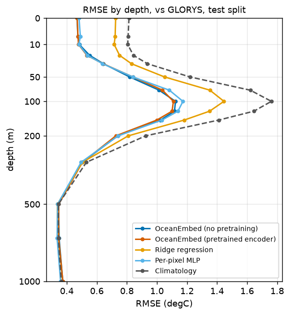

**Bias by depth**

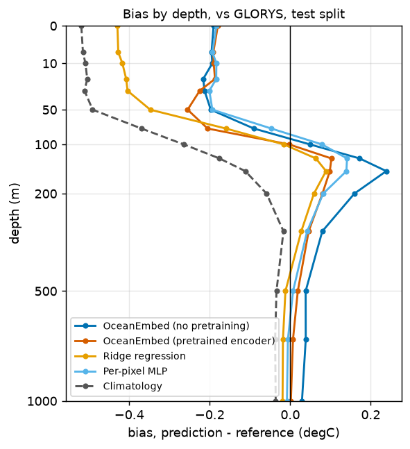

**Anomaly correlation by depth**

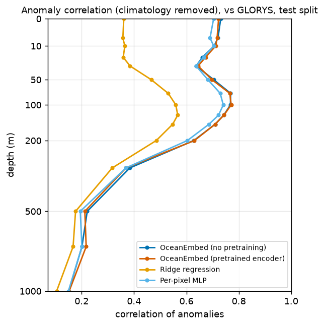

**Skill vs climatology by depth**

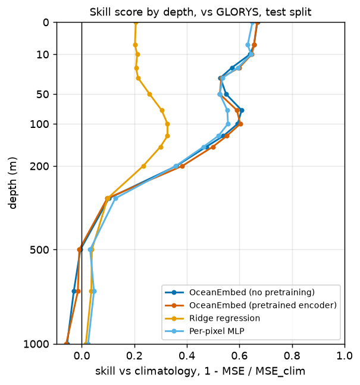

**RMSE by depth in the Arabian Sea and Bay of Bengal boxes**

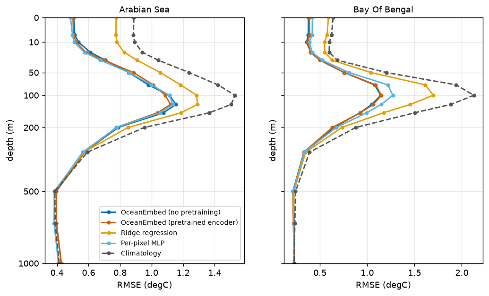

**RMSE maps at selected depths (model vs climatology)**

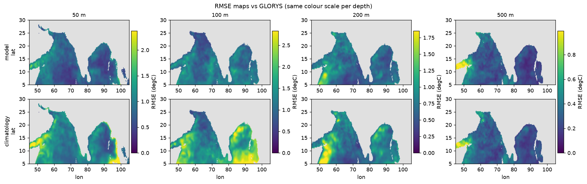

**Model bias maps**

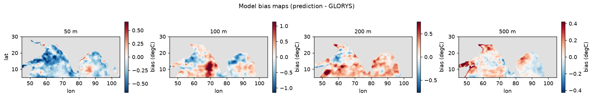

**Daily domain-mean RMSE time series**

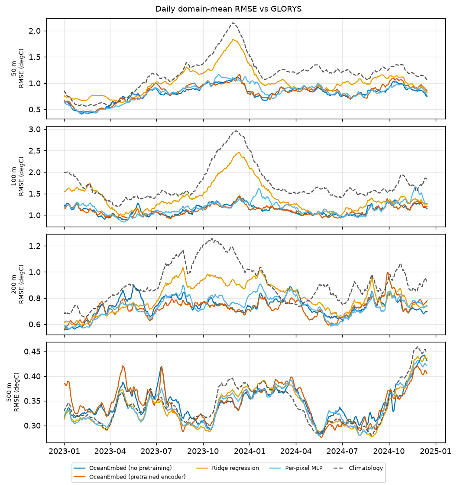

**Example day at 100 m: prediction, target, difference**

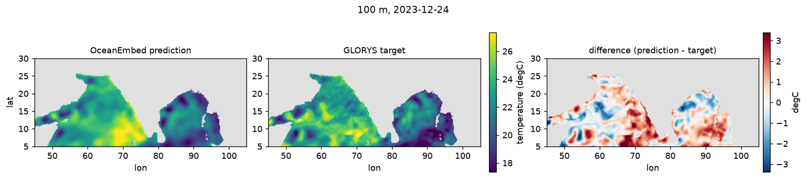

**Vertical section: prediction, target, difference**

**Argo scatter (observed vs model, coloured by depth) and RMSE by depth**

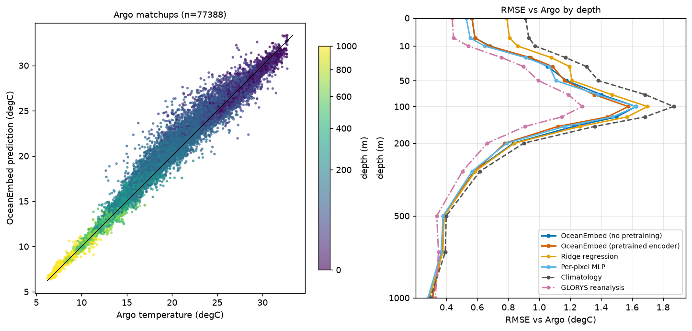

**Training curves**

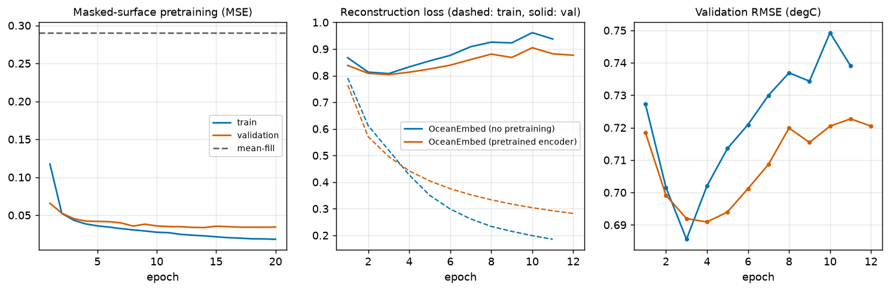

## 5. Limitations

- The target is a reanalysis (GLORYS), not observations: the model learns to reproduce a model product, including its errors. GLORYS assimilates Argo, so the Argo comparison is independent of the model inputs but not of the training target.
- Daily fields are regridded to 0.25 deg; mesoscale structure below that scale is not represented. Argo collocation uses the containing cell and the same day only.
- Skill below the thermocline is dominated by the climatology (small variability); `corr_raw` values are inflated by seasonal and vertical gradients - prefer `corr_anom` and the skill score.
- The scores are those of one training seed and carry no confidence intervals; the multi-seed, block-bootstrap study of the same models is in the research stage summaries (`research/r2`).
